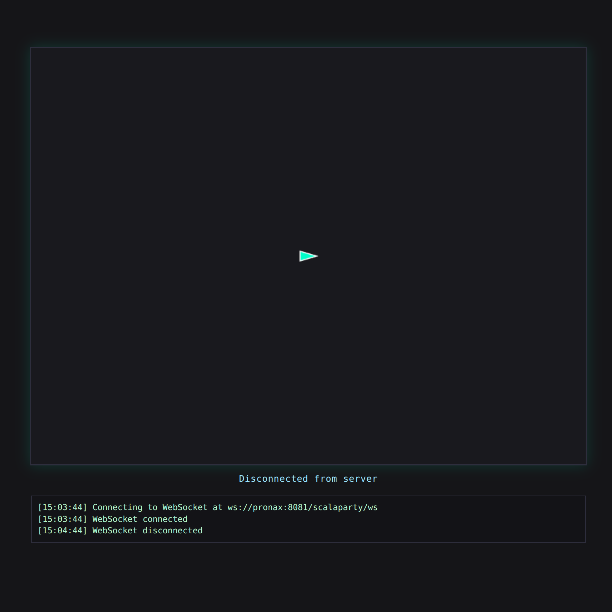

# 🚀 ScalaParty

Hi there!
Here you have **✨ScalaParty✨**: a distributed multiplayer space-arcade game built purely in Scala 3.

Basically, _ScalaParty_ is a remake of the legendary _Astro Party_, completely written in Scala3.
This game puts you in the cockpit of a spaceship with a catch: **you can't hit the brakes!**
Your ship moves forward constantly.
You can only control your rotation to dodge walls, blast your friends and be the last ship flying in the arena!

This game is developed as a simple academic project for the _Paradigmi di Programmazione e Sviluppo (PPS)_ course at the University of Bologna.

## 🎮 How to Play (Current Status)

We are currently at the end of **Sprint 1**, meaning the core infrastructure is laid out, but we are still warming up the engines!

To peek into the current state of the game, you can follow these steps:

1. Open the terminal and navigate to the project root directory.
2. Run the [jar file](scalaparty.jar) using:
   ```bash
   $ scala -jar scalaparty.jar
   ```
   or, if you don't have Scala installed:
   ```bash
   $ java -jar scalaparty.jar
   ```
3. Open your browser and navigate to [http://localhost:8081](http://localhost:8081) to verify the server is up and running. You should see a simple message saying that ScalaParty server is up and running.
4. Head over to [http://localhost:8081/scalaparty](http://localhost:8081/scalaparty) to connect to the game.

> [!NOTE]
> At this current version, you will be able to see the active WebSocket connection state in the web interface.
> The underlying ECS domain, spaceship movement, and rotation logic are implemented on the server side, but **it is not yet possible to actually start a match**.
> Matchmaking and visual synchronization will be hooked up in the upcoming sprints :)



## Authors

This project is proudly developed by:

- **Alessandro Martini**: @AlleMartins
- **Alessandro Torelli**: @aleToro7
- **Federico Diotallevi**: @DiottaNax
