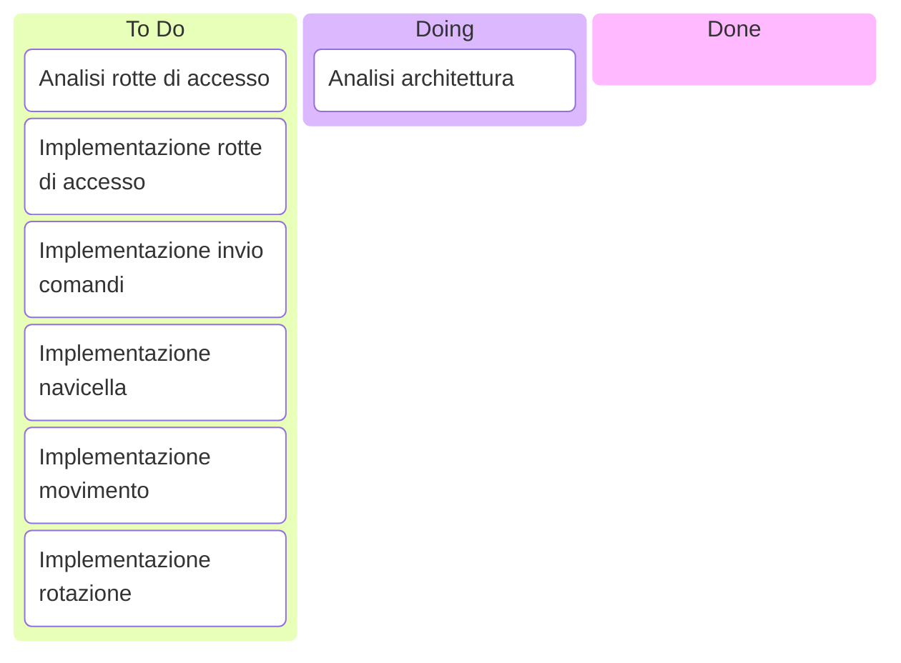

# Scala-Party
***Titolo:*** Scala Party - rivisitazione del gioco Astro Party

***Obiettivo:*** Implementazione in Scala di un gioco 2D multiplayer basato sulle meccaniche di Astro Party 

### Componenti Gruppo:

* Federico Diotallevi (federico.diotallevi@studio.unibo.it)

* Alessandro Martini (alessandro.martini10@studio.unibo.it)

* Alessandro Torelli (alessandro.torelli7@studio.unibo.it)

Deadline: 10/10/2026

## Taskboard

## Descrizione del processo

***Processo di sviluppo:*** Il gruppo intende adottare il processo di sviluppo consigliato nel punto P8 delle regole d’esame, seguendo una metodologia di sviluppo SCRUM basata su sprint iterativi, continuous integration e revisione periodica dell'architettura software.

***Divisione del lavoro:*** Durante il primo incontro verranno definiti i requisiti di sistema. Successivamente, in occasione di ogni sprint planning, questi saranno analizzati e suddivisi in task. Il gruppo adotterà sprint della durata di una settimana, con un carico di lavoro stimato di circa 15 ore a persona per sprint. Ad ogni task verrà assegnato un punteggio in base alla complessità e all'effort richiesto. Ad ogni componente del gruppo verranno assegnati task i cui punti sommati avranno un monte ore di sviluppo stimato pari alla durata dello Sprint.

***Descrizione del progetto:*** Il progetto consiste nello sviluppo di un server di gioco distribuito che gestisca scontri spaziali per più giocatori in simultanea. Il sistema permette a più utenti di connettersi simultaneamente alla stessa arena per sfidarsi, ogni giocatore controlla una navicella e deve tentare di distruggere quelle avversarie sparando e schivando gli ostacoli. Il server ha il compito di orchestrare l'intero ciclo di vita delle partite: gestisce la fisica dell'arena, rileva gli eventi di gioco (movimenti, collisioni e proiettili), aggiorna lo stato globale e sincronizza continuamente tutti i client connessi. Attraverso un'interfaccia di visualizzazione interattiva, i giocatori possono controllare la propria navicella, navigare nello spazio virtuale, interagire con gli ostacoli dell'ambiente e competere per la vittoria.

### Funzionalità obbligatorie:

***Sviluppo dell'Ambiente di Gioco e della Logica di Server:***

* Gestione della Partita e dello Stato di Gioco: Coordinamento del ciclo di simulazione dell'arena e aggiornamento costante del mondo virtuale in tempo reale.

* Gestione della Fisica d'Arena e delle Interazioni: Gestione delle meccaniche di movimento, accelerazione e rotazione delle navicelle, gestione del sistema di sparo e rilevamento delle collisioni tra le entità in gioco (navicelle, proiettili, ostacoli).

* Gestione della Rete e Sincronizzazione Multiplayer: Infrastruttura per la gestione delle connessioni dei giocatori, la ricezione dei comandi di input e la trasmissione periodica dello stato del gioco ai client.

***Interfaccia Utente e Visualizzazione:***

* Client di Gioco e Rendering: Sviluppo di un'interfaccia grafica per consentire ai giocatori di visualizzare l'arena in tempo reale, interagire tramite comandi di input e monitorare informazioni di gioco come punteggi e stato di salute.

### Funzionalità opzionali:

***Estensioni delle Dinamiche di Gioco:***

* Supporto per Stanze di Gioco e Matchmaking: Possibilità di creare più lobby o stanze indipendenti per permettere lo svolgimento di più partite in parallelo.

* Elementi Ambientali e Power-Up: Introduzione di oggetti collezionabili dinamici nell'arena (scudi, armi potenziate, modificatori di velocità) ed elementi ambientali distruttibili o mobili.

* Bot e Giocatori Virtuali: Introduzione di navicelle controllate dal server tramite logiche autonome per completare le partite in assenza di giocatori umani sufficienti.

* Sistema di Replay e Statistiche: Registrazione degli eventi principali della partita per generare statistiche conclusive (es. precisione di tiro, danni inflitti) o consentire la riproduzione degli incontri terminati.