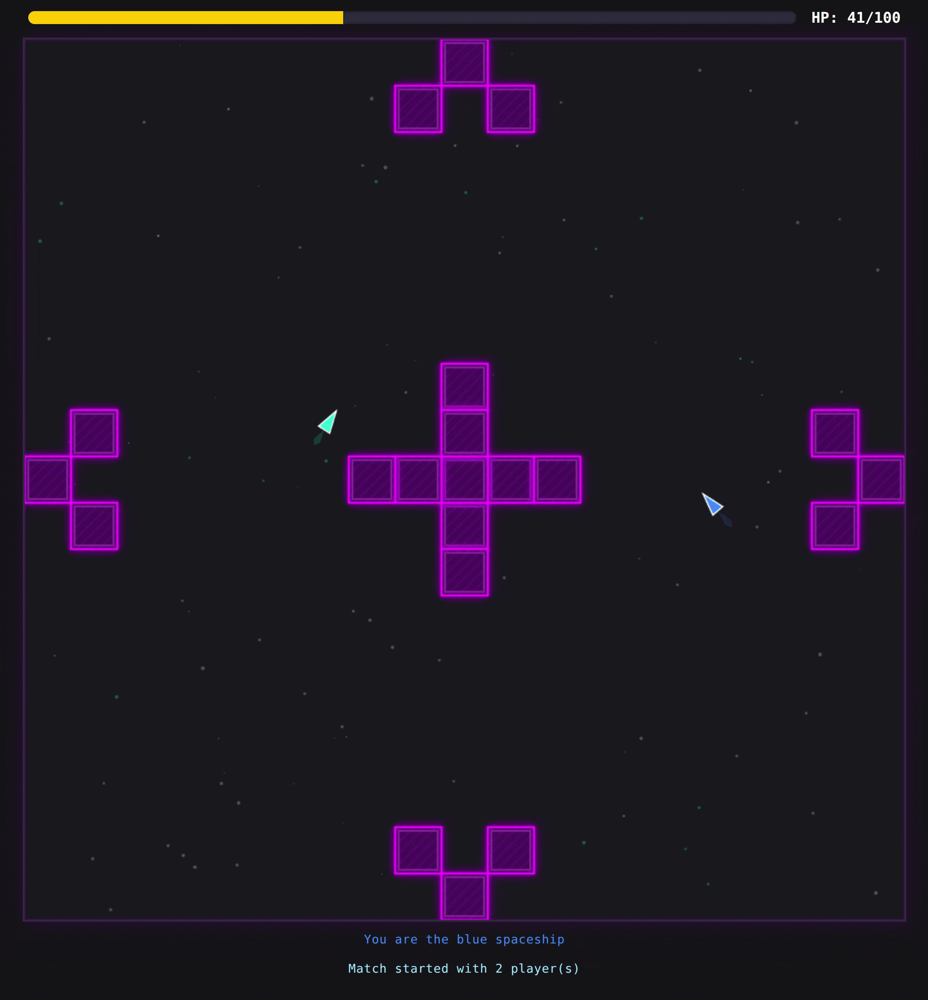

# 🚀 ScalaParty

Hi there!
Here you have **✨ScalaParty✨**: a distributed multiplayer space-arcade game built purely in Scala 3.

Basically, _ScalaParty_ is a remake of the legendary _Astro Party_, completely written in Scala3.
This game puts you in the cockpit of a spaceship with a catch: **you can't hit the brakes!**
Your ship moves forward constantly.
You can only control your rotation to dodge walls, blast your friends and be the last ship flying in the arena!

This game is developed as a simple academic project for the _Paradigmi di Programmazione e Sviluppo (PPS)_ course at the University of Bologna.

## 🎮 How to Play (Current Status)

The game is being released for the academic course, so it is still in development but it is already playable!
Currently it is possible to play the game in a local network with multiple players, and enjoy the basic features of the game.
You'll have no powerups, and will need to touch our code to configure the game to your liking, but it is already a fun experience!
Upcoming features will include powerups and a way to easily configure the game without touching the code.

To peek into the current state of the game, you can follow these steps:

1. Go to the [release page](https://github.com/aleToro7/PPS-26-Scala-Party/releases)
2. Download the latest jar file from the releases page.
3. Run the jar file using:
   ```bash
   $ scala -jar scalaparty.jar
   ```
   or, if you don't have Scala installed:
   ```bash
   $ java -jar scalaparty.jar
   ```
4. Open your browser and navigate to [http://localhost:8081](http://localhost:8081) to verify the server is up and running. You should see a simple message saying that ScalaParty server is up and running.
5. Head over to [http://localhost:8081/scalaparty](http://localhost:8081/scalaparty) to connect to the game.



## Authors

This project is proudly developed by:

- **Alessandro Martini**: @AlleMartins
- **Alessandro Torelli**: @aleToro7
- **Federico Diotallevi**: @DiottaNax
