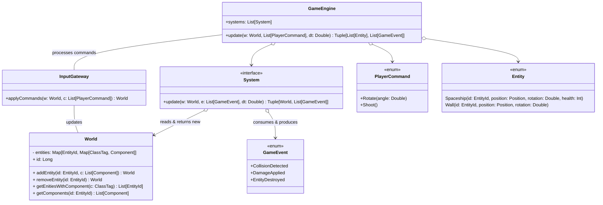
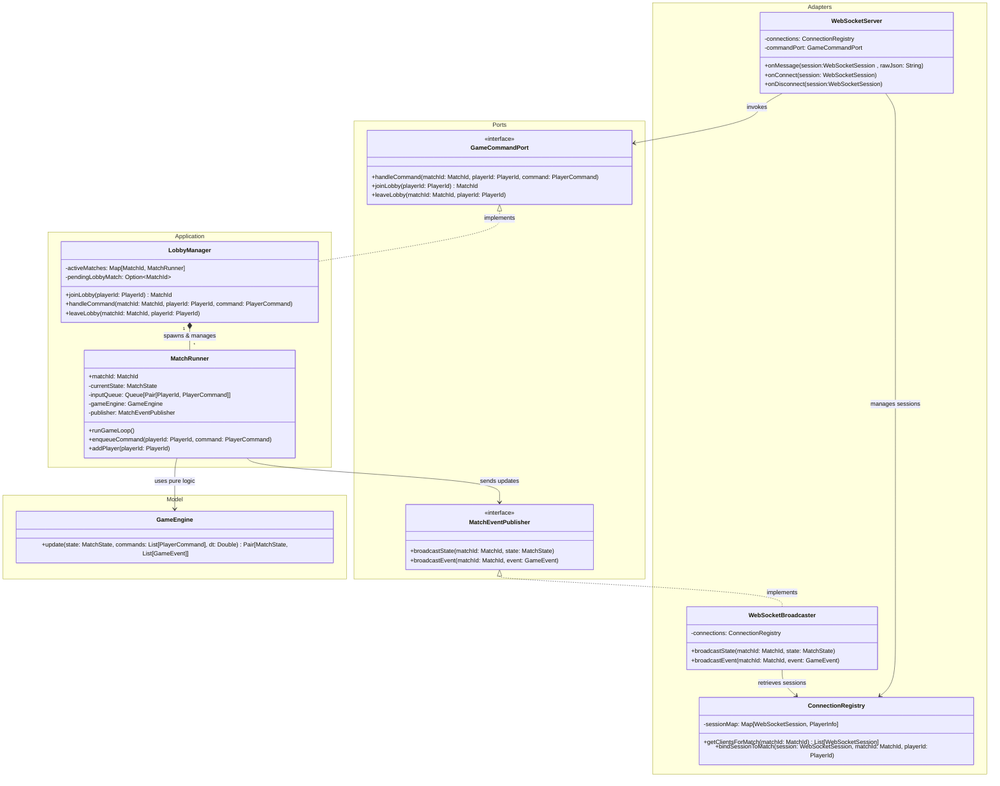

Architettura del Model:

```mermaid

classDiagram
    direction TB

    class GameEngine {
        +systems: List[System]
        +update(w: World, List[PlayerCommand], dt: Double) Tuple[List[Entity], List[GameEvent]]
    }

    class InputGateway {
        +applyCommands(w: World, c: List[PlayerCommand]) World
    }

    class World {
        - entities: Map[EntityId, Map[ClassTag, Component]]
        + id: Long
        + addEntity(id: EntityId, c: List[Component]) World
        + removeEntity(id: EntityId) World
        + getEnitiesWithComponent(c: ClassTag) List[EntityId]
        + getComponents(id: EntityId) List[Component]
    }

    class System {
        <<interface>>
        +update(w: World, e: List[GameEvent], dt: Double) Tuple[World, List[GameEvent]]
    }

    class GameEvent {
        <<enum>>
        +CollisionDetected
        +DamageApplied
        +EntityDestroyed
    }

    class PlayerCommand {
        <<enum>>
        +Rotate(angle: Double)
        +Shoot()
    }

    class Entity {
        <<enum>>
        Spaceship(id: EntityId, position: Position, rotation: Double, health: Int)
        Wall(id: EntityId, position: Position, rotation: Double)
    }

    %% Relazioni
    GameEngine o--> PlayerCommand
    GameEngine o--> System
    GameEngine o--> Entity
    GameEngine -- InputGateway : processes commands
    InputGateway -- World : updates
    System o--> World : reads & returns new
    System o--> GameEvent : consumes & produces

```

Architettura del Server:

```mermaid
classDiagram
    direction TB

    namespace Model {
        class GameEngine {
            +update(state: MatchState, commands: List[PlayerCommand], dt: Double) Pair[MatchState, List[GameEvent]]
        }
    }

    namespace Ports {
        class GameCommandPort {
            <<interface>>
            +handleCommand(matchId: MatchId, playerId: PlayerId, command: PlayerCommand)
            +joinLobby(playerId: PlayerId) MatchId
            +leaveLobby(matchId: MatchId, playerId: PlayerId)
        }

        class MatchEventPublisher {
            <<interface>>
            +broadcastState(matchId: MatchId, state: MatchState)
            +broadcastEvent(matchId: MatchId, event: GameEvent)
        }
    }

    namespace Application {
        class LobbyManager {
            -activeMatches: Map[MatchId, MatchRunner]
            -pendingLobbyMatch: Option~MatchId~
            +joinLobby(playerId: PlayerId) MatchId
            +handleCommand(matchId: MatchId, playerId: PlayerId, command: PlayerCommand)
            +leaveLobby(matchId: MatchId, playerId: PlayerId)
        }

        class MatchRunner {
            +matchId: MatchId 
            -currentState: MatchState
            -inputQueue: Queue[Pair[PlayerId, PlayerCommand]]
            -gameEngine: GameEngine
            -publisher: MatchEventPublisher
            +runGameLoop()
            +enqueueCommand(playerId: PlayerId, command: PlayerCommand)
            +addPlayer(playerId: PlayerId)
        }
    }

    namespace Adapters {
        class WebSocketServer {
            -connections: ConnectionRegistry
            -commandPort: GameCommandPort
            +onMessage(session:WebSocketSession , rawJson: String)
            +onConnect(session: WebSocketSession)
            +onDisconnect(session:WebSocketSession)
        }

        class WebSocketBroadcaster {
            -connections: ConnectionRegistry
            +broadcastState(matchId: MatchId, state: MatchState)
            +broadcastEvent(matchId: MatchId, event: GameEvent)
        }

        class ConnectionRegistry {
            -sessionMap: Map[WebSocketSession, PlayerInfo]
            +getClientsForMatch(matchId: MatchId) List[WebSocketSession]
            +bindSessionToMatch(session: WebSocketSession, matchId: MatchId, playerId: PlayerId)
        }
    }

    GameCommandPort <|.. LobbyManager : implements
    MatchEventPublisher <|.. WebSocketBroadcaster : implements

    LobbyManager "1" *-- "*" MatchRunner : spawns & manages
    MatchRunner --> GameEngine : uses pure logic
    MatchRunner --> MatchEventPublisher : sends updates

    WebSocketServer --> GameCommandPort : invokes
    WebSocketServer --> ConnectionRegistry : manages sessions
    WebSocketBroadcaster --> ConnectionRegistry : retrieves sessions
    

```

