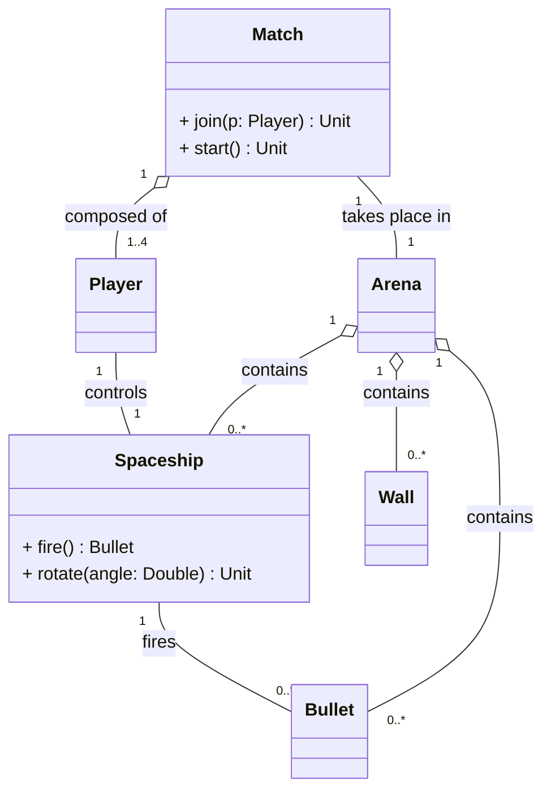

```mermaid
classDiagram 

    class Match {
        + join(p: Player) Unit
        + start() Unit
    }

    class Player

    class Spaceship {
        + fire() Bullet
        + rotate(angle: Double) Unit
    }

    class Wall

    class Bullet

    class Arena

    Match "1" o-- "1..4" Player: composed of
    Match "1" -- "1" Arena: takes place in
    Player "1" -- "1" Spaceship: controls
    Spaceship "1" -- "0..*" Bullet: fires
    Arena "1" o-- "0..*" Wall: contains
    Arena "1" o-- "0..*" Spaceship: contains
    Arena "1" o-- "0..*" Bullet: contains
```
