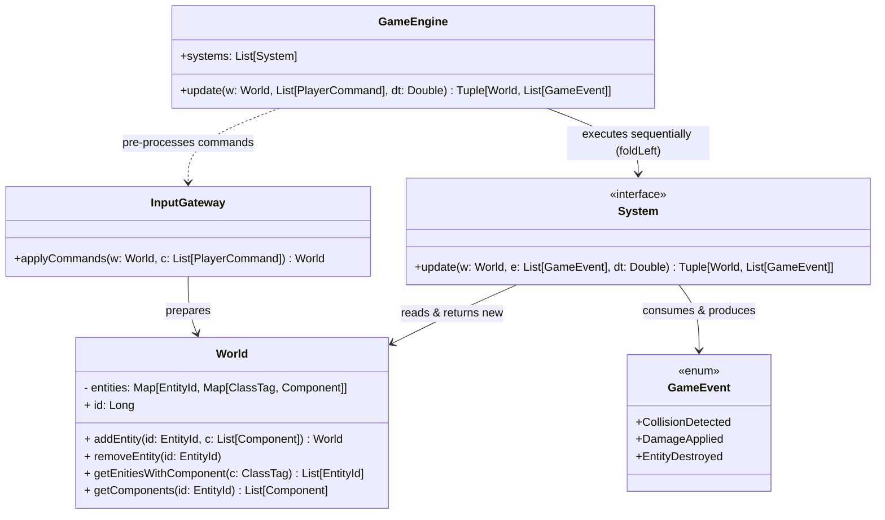

# Idee per architettura

Svilupperei il repository in una soluzione composta da due progetti:

- `core`: contenente la logica di gioco, le entità e i servizi di dominio, e le interfacce per l'accesso ai dati (DTO).
- `infrastructure`: contenente l'implementazione del server di gioco, che sfrutta il core per gestire le richieste dei client.

La struttura del progetto sarà dunque simile alla seguente:

```plaintext
project-root/
|
├── core/
│   ├── src/
│   └── tests/
├── infrastructure/
│   ├── src/
│   └── tests/
├── doc/
│   ├── backlog/
│   └── relazione.md
|
├── README.md
└── LICENSE
```

## Core

Il progetto core conterrà la logica di gioco, le entità e i servizi di dominio, e le interfacce per la condivisione dei dati (DTO).
L'idea è quella di un'architettura MVU (Elm Architecture), nella pratica sarà presente un `Mondo`/`Stato` che cambia in base agli eventi che arrivano di gioco e input del client.
Il `Mondo` dovrà essere aggiornato tramite funzioni pure che ricevono lo stato corrente e degli eventi, restituendo il nuovo stato:

$$Mondo_1 = update(Mondo_0, eventi, dt)$$

Questa logica permette di creare una partita completamente deterministica, in cui lo stato del gioco può essere ricostruito a partire da un insieme di eventi e dallo stato iniziale.

Inoltre, sarebbe carino utilizzare il pattern ECS (Entity-Component-System) rivisto in maniera funzionale (c'è qualche repo di esempio, Indigo Engine ed un paio di altri). In questo modo, le entità del gioco saranno composte da componenti che contengono dati e sistemi che operano su questi componenti.
Un pattern ECS funzionale si basa su `Componenti` e `Sistemi`. Un `Componente` è una struttura dati immutabile, che, rispetto ad un ECS tradizionale, non contiene alcuna logica.
Un `Sistema` è un oggetto generalmente singleton che contiene solo funzioni stateless di update, che ricevono in input lo stato del mondo e gli eventi, e restituiscono un nuovo stato del mondo aggiornato e dei nuovi eventi.
La comunicazione tra i sistemi avviene tramite eventi, che vengono generati dai sistemi stessi e consumati da altri sistemi.
Un'entità può essere modellata come una tripla di $(id, tipo, componenti)$, il mondo contiene strutture dati indicizzate per id che permettono di eseguire query per restituire le entità che hanno un certo componente.
A livello teorico direi che anche il tipo delle entità può essere modellato come un componente, ma è da valutare se conviene o meno dato che tutte le entità hanno un tipo.

Il seguente scehma è una buona base di partenza per la discussione dire:



### Considerazioni utili

Inviare l'intero stato del mondo ad ogni update è potenzialmente inefficiente, quindi bisogna valutare la possibile computazione di un diff tra lo stato precedente e quello attuale, in modo da inviare solo le modifiche al client.
Il diff può essere calcolato in modo efficiente tramite una sorta di dirty-bit, in cui ogni componente ha un flag che indica se è stato modificato o meno. In questo modo, il diff può essere calcolato in tempo lineare rispetto al numero di componenti modificate.

## Infrastructure

L'architettura del server dovrebbe essere simile ad un'architettura esagonale, il cui dominio è principalmente il core, con l'aggiunta di qualche concetto di distribuzione (ad esempio una Lobby di gioco ha senso indipendentemente dal core e non fa parte del cuore del dominio di gioco).
In generale una richiesta che arriva al server viene gestita da un `Controller` che la valida e la passa al `Service` che si occupa di eseguire la logica di gioco interagendo con il dominio (core) e restituendo una risposta al `Controller` che la invia al client.
È probabile che non serva alcuna persistenza inizialmente dato che i replay sono un requisito opzionale, quindi il server può essere completamente in-memory e non avere alcuna dipendenza da database o file system.
È chiaro che delle rotte serviranno per connettersi ad una partita (se ci sono lobby disponibili), una volta connessi si instaurerà una connessione WebSocket per ricevere gli eventi di gioco e inviare gli input del client.
Avremo dunque due pagine principali, una per menù e lobby, e una per il canvas della partita.
