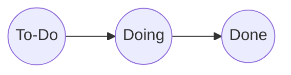
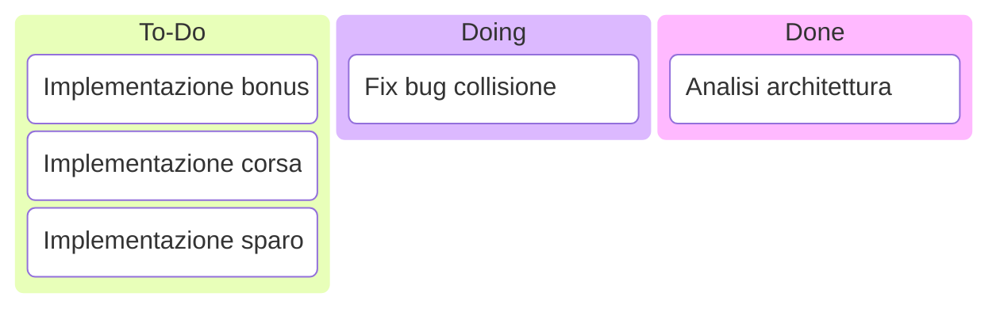
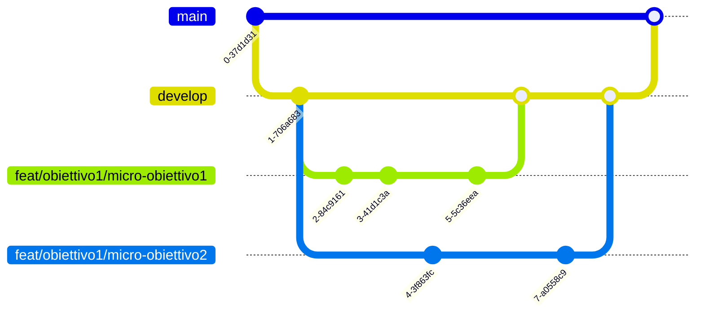

# Definizione del processo

Il processo di sviluppo del gioco seguirà un approccio agile, seguendo la metodologia Scrum.
Essendo un progetto universitario, il team è compsto da soli 3 membri, tutti sviluppatori.
Non sarà dunque presente un vero e proprio Scrum Master, ma il ruolo di Product Owner sarà ricoperto da uno dei membri del team, che si occuperà di gestire il backlog e le priorità del progetto.
Poiché il tempo di sviluppo previsto è di 60 ore, gli Sprint avranno cadenza settimanale, con una durata di 1 settimana ciascuno.
Ad ogni riunione di Sprint Planning, il team definirà gli obiettivi, la relativa priorità e la stima del tempo necessario per completare le attività.
Ogni obiettivo dello sprint sarà suddiviso in micro-obiettivi, che saranno assegnati ad ogni membro del team in base alla sua disponibilità.
Ognuno dei micro-obiettivi sarà tracciato tramite un task board, che permetterà di monitorare lo stato di avanzamento del lavoro e seguirà il flusso:

Appena definito un micro-obiettivo, esso sarà inserito nella colonna `To-Do` del task board.
Quando un membro del team inizierà a lavorare su un micro-obiettivo, creandone il relativo branch, esso sarà spostato nella colonna `Doing`.
Per completare un micro-obiettivo in modo che questo possa essere considerato `Done`, sarà necessario che:

- tutto il codice prodotto nel branch sia stato testato
- il task sia stato revisionato da almeno un altro membro del team
- ^[Questo requisito, per motivi di tempo ed esigenze concordate col team può essere rimandato. In tal caso si creerà un nuovo task di refactor da aggiungere ai To-Do della Sprint Board e il codice prodotto sarà rifattorizzato successivamente.] il codice prodotto sia stato rifattorizzato in modo da rispettare gli standard di qualità del progetto

Se il task è un task di analisi si può invece considerare consluso una volta prodotto un documento appropriato con eventuali schemi, letto ed approvato da **tutti** i componenti del gruppo.

Esempio di task board:

## Assegnazione dei micro-obiettivi

La stima di tempo per ogni task dello Sprint verrà espressa in punti, poiché ogni Sprint risulta essere piuttosto breve (15 ore) e si vogliono rendere i micro-obiettivi molto piccoli e separati, un punto Sprint corrisponde ad un'ora di lavoro di un componente.
Pertanto, ogni componente ha quindi a disposizione 15 punti Sprint.
Poiché il team non è abituato a lavorare insieme ed inoltre tutti i componenti hanno poca o nessuna esperienza in progetti di questo genere, i punti di ciascun micro-obiettivo assegnato ad un singolo membro devono avere somma strettamente minore di 12 punti.
Tale scelta è stata fatta tenendo conto delle stime poco accurate e dei ritardi di sviluppo ambedue dovuti principalmente alla poca esperienza nel settore.

Esempio di backlog:

| Obiettivo | Punti stimati | Assegnatario | Note |
| --------- | ------------- | ------------ | ---- |
| Un giocatore vede e controlla la sua navicella | - | - | - |
| Analisi | 1 | Diotallevi | Ale consiglia pattern ecs |
| Implementazione movimento | 2 | Martini | |
| Implementazione collisione | 3 | Torelli | Solo logica riguardante il movimento di risposta ad una collisione |

| Membro | Punti assegnati | Numero Task |
| ------ | --------------- | ----------- |
| Diotallevi | 1 | 1 |
| Martini | 2 | 1 |
| Torelli | 3 | 1 |

Inoltre è previsto un allineamento a metà dello Sprint tra i membri del team, in cui verranno aggiunte al backlog delle colonne riportanti lo stato attuale del lavoro, in particolare:

- i punti Sprint spesi per ogni task
- i punti Sprint rimanenti stimati per ogni task
- eventuali note aggiuntive e considerazioni varie

## Branching e obiettivi Sprint

Ognuno dei micro-obiettivi sarà sviluppato in un branch dedicato, il cui nome seguirà la convenzione `(feat|fix|refactor)/obiettivo/micro-obiettivo`.
Quando una feature sarà completata, il relativo branch sarà unito al branch `develop` tramite una pull request, che sarà revisionata da un altro membro del team.
Al termine di ogni sprint, il branch `develop` sarà unito al branch `main`, che conterrà la versione stabile del gioco.

Esempio di branching:

## Redazione backlog

Ciascun backlog sarà redatto come documento markdown riportante:

- stato dei lavori
- considerazioni dei membri
- 
