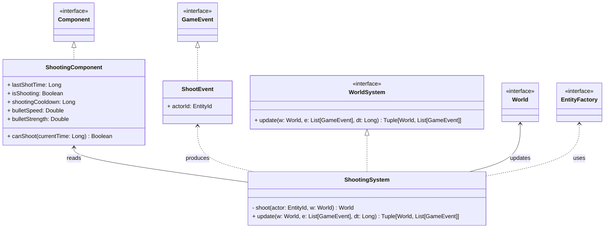

```mermaid
classDiagram
  direction BT

  class GameEvent { <<interface>> }
  
  class ShootEvent {
    + actorId: EntityId
  }

  class Component { <<interface>> }

  class ShootingComponent {
    + lastShotTime: Long
    + isShooting: Boolean
    + shootingCooldown: Long
    + bulletSpeed: Double
    + bulletStrength: Double
    + canShoot(currentTime: Long) Boolean
  }

  class WorldSystem {
    <<interface>>
    + update(w: World, e: List[GameEvent], dt: Long) Tuple[World, List[GameEvent]]
  }

  class ShootingSystem {
    - shoot(actor: EntityId, w: World) World
    + update(w: World, e: List[GameEvent], dt: Long) Tuple[World, List[GameEvent]]
  }

  class World { <<interface>> }
  class EntityFactory { <<interface>> }

  ShootEvent ..|> GameEvent
  ShootingSystem ..|> WorldSystem
  ShootingComponent ..|> Component

  ShootingSystem ..> EntityFactory : uses
  ShootingSystem --> World : updates
  ShootingSystem --> ShootingComponent : reads
  ShootingSystem ..> ShootEvent : produces
```
