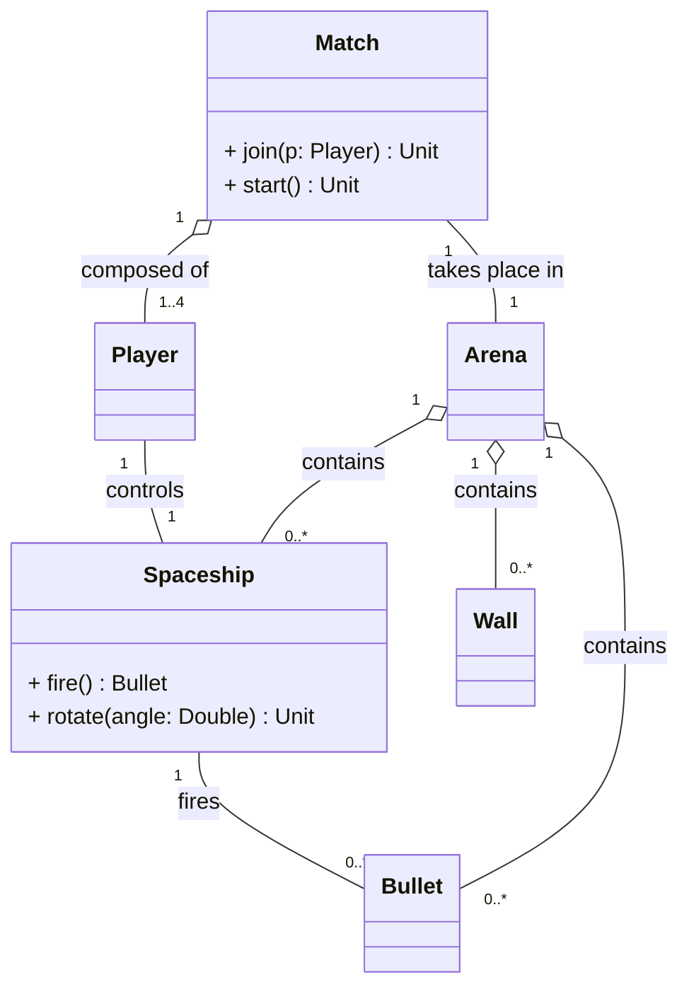

# Analisi dei requisiti

In questa sezione vengono descritti nel dettaglio il dominio ed i requisiti del progetto.

## Requisiti di business

L'obiettivo chiave del progetto è la realizzazione di **ScalaParty**: un videogioco multiplayer online di tipo arcade basato sul paradigma _last man standing_ in cui i giocatori competono all'interno di arene bidimensionali
Il gioco è fortemente ispirato al titolo _Astro Party_ di cui ne riprende pienamente le meccaniche di gioco.

Il sistema deve rispettare i seguenti vincoli di business:

- I giocatori competono all'interno di un'arena bidimensionale, controllando ciascuno una navicella spaziale in moto costante, di cui possono modificare la rotazione e sparare proiettili per colpire gli avversari.

- Il gioco deve essere fruibile direttamente tramite un comune browser web che permetta di accedere ad una partita e giocare con altri utenti.

- Nessuna registrazione deve essere richiesta, gli utenti si connetteranno e attenderanno che la prima lobby disponibile li inserisca automaticamente in una partita.
    
- Il sistema deve garantire la sincronizzazione in tempo reale dello stato della partita tra tutti i client connessi durante lo svolgimento del match.

## Modello del dominio

ScalaParty è un videogioco multigiocatore ambientato nello spazio.
Ogni partita comprende fino a quattro giocatori, ognuno dei quali controlla una propria navicella spaziale all'interno di un'arena delimitata.
Le navicelle si muovono costantemente nello spazio di gioco, poiché una navicella non può mai rimanere ferma: il giocatore può esclusivamente modificarne la direzione di rotazione.
Durante la partita, le navicelle possono sparare proiettili per colpire gli avversari.
Lo spazio di gioco è caratterizzato dalla presenza di muri fissi, che costituiscono ostacoli impenetrabili sia per le navicelle che per i proiettili.

Ogni navicella dispone di un livello di vita che diminuisce ad ogni danno subito, che può essere provocato dall'impatto diretto con un proiettile avversario o dallo scontro con un'altra navicella.
Quando i punti vita si azzerano, la navicella viene distrutta ed è eliminata dalla partita. L'ultimo giocatore a rimanere in vita si aggiudica la vittoria.

Gli elementi concettuali e le entità che compongono il dominio di gioco sono i seguenti:

- **Partita (Match):** Rappresenta l'istanza di gioco attiva, caratterizzata da un'arena con confini definiti, una durata e un insieme di giocatori partecipanti.
- **Giocatore (Player):** L'utente collegato alla sessione, che detiene il controllo di una navicella all'interno dell'arena.
- **Navicella (Spaceship)**: La navicella controllata dal giocatore che naviga all'interno dell'arena.
- **Muro (Wall)**: Ostacolo che impedisce il passaggio di navicelle e proiettili attraverso di esso.
- **Proiettile (Bullet)**: Colpo sparato da una nevicella che causa danno da contatto ad altre navicelle avversarie.
- **Arena**: Spazio di gioco limitato in cui si sfidano le navicelle spaziali.

## Requisiti funzionali

In questa sezione vengono riportate le interazioni consentite agli utenti e i comportamenti che il sistema deve garantire per soddisfare le regole di gioco di **Scala Party**. Sono riportati, per ogni sezione, due tipi di requisiti:
- Requisiti obbligatori: condizioni da soddisfare necessariamente per garantire l'uscita del videogioco.
- Requisiti opzionali: obiettivi previsti per release future, non strettamente necessari nella prima fase di rilascio.

### Requisiti Utente

I requisiti utente descrivono tutte le possibili interazione dell'utente con il sistema di gioco, sia prima che durante la partita.

##### Requisiti Utente Obbligatori

- **Accesso alla Piattaforma (RFU1):** L'utente deve potersi connettere al sistema di gioco tramite un comune browser web.
- **Partecipazione alla Partita (RFU 2):** L'utente deve potersi unire a una sessione di gioco online, condividendo la sessione con un numero massimo di quattro partecipanti complessivi.
- **Controllo della Navicella (RFU3):** Durante la partita, l'utente deve poter ruotare la propria navicella spaziale in tempo reale, modificandone la direzione.
- **Permanenza nell'Arena (RFU4):** L'utente deve avere pieno accesso alla visione dell'arena e di tutti gli elementi che ne fanno parte per l'intera durata della partita.
- **Sparo (RFU5):** L'utente deve poter azionare il comando di sparo per rilasciare un proiettile nella direzione corrente della navicella da lui controllata.

##### Requisiti Utente Opzionali

- **Visione Statistiche del Giocatore (RFU6):** Durante e dopo la partita, ciascun utente deve poter vedere statistiche sul suo comportamento durante la partita, riportanti: precisione, danni inflitti, colpi sparati nemici eliminati.
- **Visione Replay (RFU7):** Al termine della partita, l'utente può vedere la simulazione della stessa fino al momento a cui vi ha partecipato.

### Requisiti di Sistema

I requisiti di sistema descrivono le risposte automatiche, le regole di simulazione e la gestione dello stato eseguite dal software.

##### Requisiti Obbligatori

- **Movimento Continuo (RFS1):** Il sistema deve garantire che le navicelle si muovano costantemente nello spazio di gioco a una velocità prestabilita, impedendo che in qualsiasi momento possano fermarsi.
- **Gestione Multi-partita (RFS2):** Il sistema deve essere in grado di ospitare, isolare e gestire simultaneamente più sessioni di gioco distinte e indipendenti tra loro.
- **Gestione dei Confini e degli Ostacoli (RFS3):** Il sistema deve impedire alle navicelle e ai proiettili di superare i confini dell'arena o di attraversare i muri presenti al suo interno.
- **Rilevamento Collisioni e Danni (RFS4):** Il sistema deve rilevare gli impatti tra navicelle e proiettili o tra navicelle stesse, applicando la conseguente riduzione dei punti vita alle entità coinvolte o colpite.
- **Eliminazione Navicelle (RFS5):** Il sistema deve rimuovere permanentemente dall'arena le navicelle i cui punti vita si azzerano, decretando l'eliminazione del giocatore corrispondente.
- **Condizione di Vittoria (RFS6):** Il sistema deve monitorare continuamente lo stato della partita e dichiarare vincitore l'ultimo giocatore la cui navicella rimane in vita.
- **Sincronizzazione in Tempo Reale (RFS7):** Il sistema deve aggiornare e sincronizzare lo stato della partita in tempo reale tra tutti i giocatori connessi, garantendo coerenza visiva e interattiva durante lo svolgimento del match.

##### Requisiti Opzionali

- **Generazione di Bonus:** Il sistema deve poter generare casualmente all'interno dell'arena elementi bonus temporanei, in grado di conferire vantaggi speciali alle navicelle che li raccolgono.

### Requisiti Non Funzionali

I requisiti non funzionali definiscono le esigenze qualitative, le prestazioni e i vincoli operativi che il sistema deve soddisfare, focalizzandosi sul _come_ il software si comporta piuttosto che sulle specifiche funzioni di gioco che deve implementare.

- **Prestazioni e Scalabilità (RNF1):** Il sistema deve essere in grado di gestire un numero elevato di connessioni simultanee, garantendo tempi di risposta rapidi e una latenza minima durante le interazioni di gioco.
- **Pulizia del Codice e Manutenibilità (RNF2):** Il codice sorgente del sistema deve essere scritto in modo chiaro, modulare e documentato, facilitando la manutenzione e la correzione di eventuali bug.
- **Sicurezza e Protezione dei Dati (RNF3):** Il sistema non deve memorizzare alcun dato che possa identificare l'utente, garantendo la privacy e la sicurezza delle informazioni durante l'interazione con il gioco.
- **Estensibilità e Modularità (RNF4):** Il sistema deve essere progettato in modo modulare, consentendo l'aggiunta di nuove funzionalità con minime modifiche al codice esistente.
- **Testabilità e Verificabilità (RNF5):** Il sistema deve essere progettato per facilitare la scrittura di test automatici, consentendo la verifica del corretto funzionamento delle funzionalità implementate.