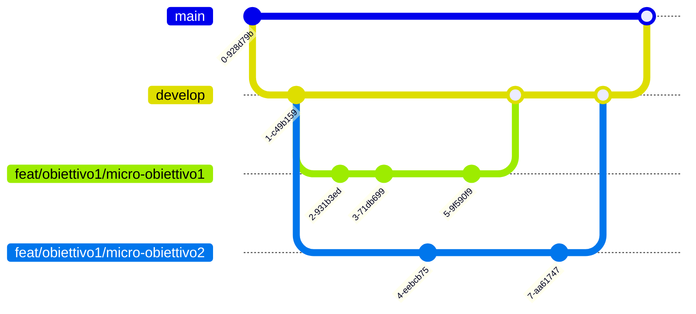
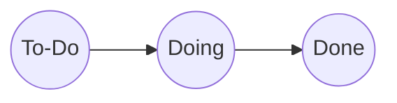

# Processo di sviluppo

Il processo di sviluppo adottato dal gruppo è un approccio agile, che mira a seguire la metodologia **SCRUM**.
Essendo un progetto universitario, il team è composto da soli 3 membri, tutti sviluppatori.
La scelta del product owner (Federico Diotallevi) è stata fatta sulla base dell'esperienza pregressa nell'utilizzo di questa metodologia; il suo compito è stato gestire il backlog e le priorità del progetto.
Poiché il tempo di sviluppo previsto è di 60 ore, gli Sprint hanno avuto una durata variabile tra una e due settimane, compatibilmente con gli impegni di ciascuno studente; l'ultimo Sprint è stato volutamente più breve, per lasciare spazio a una revisione complessiva prima della consegna.

## Modalità di divisione in itinere dei task
Inizialmente sono stati assegnati due componenti del gruppo per la parte **server** e uno per la parte **core**. Questa suddivisione iniziale è stata mantenuta per i primi due Sprint e poi abbandonata per assegnare i task successivi in base alle priorità, per avere sempre dei risultati tangibili nuovi ad ogni fine Sprint.
Una volta terminato il proprio task è stato compito dell'assegnatario collegare la pull request al task di riferimento in modo da mantenere costantemente aggiornato l'elenco con GitHub Projects.

### Branching e obiettivi Sprint

Ognuno dei micro-obiettivi è stato sviluppato in un branch dedicato, il cui nome segue la convenzione `(feat|fix|refactor)/obiettivo/micro-obiettivo`.
Al completamento di una feature, il relativo branch è stato unito al branch `develop` tramite una pull request, revisionata da un altro membro del team.
Al termine di ogni sprint, il branch `develop` è stato unito al branch `main`, che contiene la versione stabile del gioco.

Esempio di branching:

## Meeting e interazioni pianificate
- **Meeting iniziale:** analisi del dominio, stesura del product backlog e definizione dell'architettura di partenza.
- **Sprint Planning:** a inizio Sprint, per selezionare gli item del backlog, suddividerli in task, stimarli e assegnarli.
- **Sprint Review & Retrospective:** a fine Sprint, per verificare il raggiungimento (completo o parziale) dell'obiettivo e individuare cosa ha funzionato e cosa migliorare nello Sprint successivo.

## Product backlog e gestione degli obiettivi
In un meeting iniziale il gruppo ha cooperato realizzando il [product backlog](../../Gestione%20SCRUM/product-backlog.md) per l'analisi e la suddivisione preliminare del progetto, con lo scopo di definire l'architettura di partenza.
Ad ogni riunione di Sprint Planning, il team ha definito gli obiettivi, la relativa priorità e la stima del tempo necessario per completare le attività.
Ogni obiettivo dello sprint è stato suddiviso in micro-obiettivi, che sono stati assegnati ad ogni membro del team in base alla sua disponibilità.
Alla fine di ogni sprint sono stati raggiunti dei risultati tangibili, in modo da poter portare miglioramenti visibili continui al progetto.

Il lavoro è stato suddiviso per aree, sviluppo del dominio di gioco da una parte e infrastruttura/networking dall'altra, permettendo uno sviluppo in parallelo con conflitti di merge minimi.

## GitHub Projects
Il team per la pianificazione e gestione dei task ha scelto di utilizzare [GitHub Projects](https://github.com/users/aleToro7/projects/1/views/2), uno strumento nativo e integrato nell'ecosistema GitHub, che consente di collegare direttamente il tracciamento delle attività al codice sorgente, alle issue e alle pull request. Sono state inoltre predisposte diverse viste per poter organizzare e gestire al meglio tutti i task.
Ognuno dei micro-obiettivi è stato quindi tracciato, il che ha permesso di monitorare lo stato di avanzamento del lavoro secondo il seguente flusso:

Appena definito, ogni micro-obiettivo è stato inserito come issue all'interno della task table. Ogni issue ha una descrizione, un assegnatario, uno stato (inizialmente `To-Do`), lo sprint di riferimento, delle etichette (es. priorità e tipo di issue) e infine il collegamento alla pull request (al momento della sua apertura).
Quando un membro del team inizia a lavorare su un micro-obiettivo, creandone il relativo branch, lo stato dell'issue deve essere modificato in `Doing`.
Per completare un micro-obiettivo in modo che questo potesse essere considerato `Done`, era necessario superare con esito positivo i jobs di controllo e la revisione da parte di un altro membro del team.

## Modalità di revisione in itinere dei task
### GitHub Actions
Scelto dal gruppo come soluzione per automatizzare attività legate al ciclo di vita del software, come l'esecuzione dei test e la compilazione del codice, direttamente all'interno del repository, ottenendo anche una conferma di riproducibilità in un ambiente diverso.
Sono stati utilizzati tre jobs:
- **Build:** Per compilare il codice sorgente.
- **Test:** Per eseguire la suite di test e verificare il corretto funzionamento.
- **Linting:** Per verificare, tramite `scalafmtCheckAll`, che tutto il codice rispetti le regole di formattazione.

Ognuno di essi esegue una serie di _steps_ su una macchina virtuale dedicata (_runner_), per garantire la correttezza del codice sottoposto a pull request.
La pipeline viene avviata a ogni push e pull request verso `main` e `develop`; i tre job sono eseguiti in sequenza (Build → Test → Linting), per cui il fallimento di uno impedisce l'esecuzione dei successivi.

### Branch Protection Rules
Applicate ai branch `main` e `develop`:
- main: per il branch main è stato scelto di richiedere l'approvazione di tutti i membri non coinvolti nella pull request oltre al risultato positivo dei tre jobs (Build, Test e Linting) delle GitHub Actions.
- develop: a differenza del branch main, per fare il merge di una pull request su develop è richiesta una sola approvazione da parte degli altri membri del gruppo, rimangono quindi da superare con esito positivo le esecuzioni dei tre jobs.

Per tutti gli altri sotto-branch di sviluppo è stato invece consentito il merge diretto, per velocizzare il workflow del gruppo.

Queste regole hanno permesso una collaborazione ordinata, garantendo che ogni modifica importante sia documentata, discussa e validata prima di entrare a far parte della versione stabile del progetto.

### Revisione del processo
Oltre alla revisione del codice, il processo stesso è stato rivisto a ogni retrospettiva: ad esempio, dopo lo Sprint 2 il team ha rilevato la necessità di una comunicazione più costante tra chi sviluppava dominio e infrastruttura, e di una suddivisione iniziale dei task più accurata.

## Strumenti di test/build
Per lo sviluppo e la validazione del progetto, la scelta degli strumenti si è orientata verso standard consolidati dell'ecosistema Scala, con l'obiettivo di garantire robustezza, manutenibilità e una perfetta integrazione con la pipeline di Continuous Integration:
- **sbt** come build tool, con il plugin `sbt-assembly` per produrre il fat-jar eseguibile del server;
- **ScalaTest** come framework di test, affiancato da `cats-effect-testing-scalatest` per testare il codice basato su Cats Effect;
- **scalafmt** come formatter, con una configurazione derivata da quella ufficiale del team di Scala 3, così da mantenere uno stile uniforme e verificabile automaticamente dal job di Linting.
