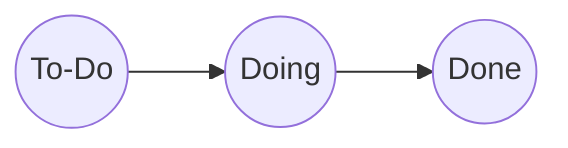

# Processo di sviluppo

Il processo di sviluppo adottato dal gruppo è un approccio agile, che mira a seguire la metodologia SCRUM.
Essendo un progetto universitario, il team è composto da soli 3 membri, tutti sviluppatori.
La scelta del product owner (Federico Diotallevi), è stata fatta sulla base dell'esperienza pregressa nell'utilizzo di questa metodologia, che si occuperà di gestire il backlog e le priorità del progetto.
Poiché il tempo di sviluppo previsto è di 60 ore, gli Sprint sono stati gestiti a cadenza settimanale, con una durata di circa 1 settimana ciascuno, compatibilmente con gli impegni di ciascuno studente.

## Product backlog e gestione degli obiettivi
Come prima fase, il gruppo ha cooperato realizzando il [product backlog](obsidian://open?vault=Universit%C3%A0&file=Paradigmi%20di%20Programmazione%20e%20Sviluppo%2FPPS-26-Scala-Party%2Fdoc%2FGestione%20SCRUM%2Fproduct-backlog) in un meeting iniziale per l'analisi e la suddivisione preliminare del progetto, con lo scopo di definire l'architettura di partenza.
Ad ogni riunione di Sprint Planning, il team ha definito gli obiettivi, la relativa priorità e la stima del tempo necessario per completare le attività.
Ogni obiettivo dello sprint è stato suddiviso in micro-obiettivi, che sono stati assegnati ad ogni membro del team in base alla sua disponibilità.
Alla fine di ogni sprint sono stati raggiunti dei risultati tangibili, in modo da poter portare miglioramenti visibili continui al progetto.

## GitHub Projects
Il team per la pianificazione e gestione dei task ha scelto di utilizzare [GitHub Projects](https://github.com/users/aleToro7/projects/1/views/2), uno strumento nativo e integrato nell'ecosistema GitHub, che consente di collegare direttamente il tracciamento delle attività al codice sorgente, alle issue e alle pull request. Sono state inoltre predisposte diverse viste per poter organizzare e gestire al meglio tutti i task.
Ognuno dei micro-obiettivi è stato quindi tracciato, il che ha permesso di monitorare lo stato di avanzamento del lavoro secondo il seguente flusso:

Appena definito un micro-obiettivo, esso sarà inserito come issue all'interno della task table. Ogni issue ha una descrizione, un assegnatario, uno stato (inizialmente `To-Do`), lo sprint di riferimento, delle etichette (es. priorità e tipo di issue) e infine il collegamento alla pull request (al momento della realizzazione della pr).
Quando un membro del team inizierà a lavorare su un micro-obiettivo, creandone il relativo branch, lo stato dell'issue sarà cambiato in `Doing`.
Per completare un micro-obiettivo in modo che questo possa essere considerato `Done`, è necessario superare con esito positivo i jobs di controllo e la revisione da parte di un altro membro del team.

## Modalità di revisione degli obiettivi completati
### GitHub Actions
Scelto dal gruppo come soluzione per automatizzare attività legate al ciclo di vita del software, come l'esecuzione dei test e la compilazione del codice, direttamente all'interno del repository, ottenendo anche una conferma di riproducibilità in un ambiente diverso.
Sono stati utilizzati tre jobs:
- **Build:** Per compilare il codice sorgente.
- **Test:** Per eseguire la suite di test e verificare il corretto funzionamento.
- **Linting:** Per analizzare lo stile del codice e individuare eventuali errori sintattici o di formattazione.

Ognuno di essi esegue una serie di _steps_ su una macchina virtuale dedicata (_runner_), per garantire la correttezza del codice sottoposto a pull request.

### Branch Protection Rules
Applicate a due branches del repository del progetto:
- main: per il branch main è stato scelto di richiedere l'approvazione di tutti i membri non coinvolti nella pull request oltre al risultato positivo dei tre jobs (Build, Test e Linting) delle GitHub Actions.
- develop: a differenza del branch main, per fare il merge di una pull request su develop è richiesta una sola approvazione da parte degli altri membri del gruppo, rimangono quindi da superare con esito positivo le esecuzioni dei tre jobs.
- per tutti gli altri sotto-branches di sviluppo è consentito il merge diretto per velocizzare il workflow del gruppo.

Queste regole hanno permesso una collaborazione ordinata, garantendo che ogni modifica importante sia documentata, discussa e validata prima di entrare a far parte della versione stabile del progetto.

## Branching e obiettivi Sprint

Ognuno dei micro-obiettivi sarà sviluppato in un branch dedicato, il cui nome seguirà la convenzione `(feat|fix|refactor)/obiettivo/micro-obiettivo`.
Quando una feature sarà completata, il relativo branch sarà unito al branch `develop` tramite una pull request, che sarà revisionata da un altro membro del team.
Al termine di ogni sprint, il branch `develop` sarà unito al branch `main`, che conterrà la versione stabile del gioco.

Esempio di branching:

## Strumenti di test/build
Per lo sviluppo e la validazione del progetto in ambiente Scala, la scelta degli strumenti si è orientata verso standard consolidati dell'ecosistema, con l'obiettivo di garantire robustezza, manutenibilità e una perfetta integrazione con la pipeline di Continuous Integration. Il gruppo ha quindi adottato scalatest per il testing e sbt come build tool.
