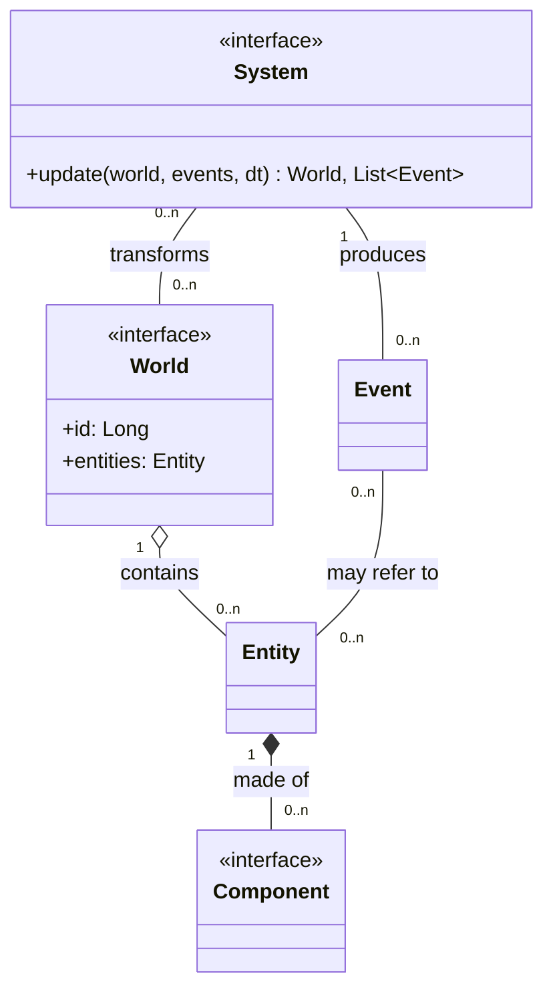
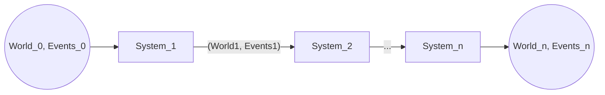

# Modulo Core

Il modulo _core_ costituisce il nucleo computazionale di ScalaParty. È stato ideato come modulo separato per essere completamente slegato da dipendenze esterne, operando come libreria pura ed indipendente, eseguibile utilizzando come unica dipendenza la libreria standard di Scala 3.

## Il mondo come macchina a stati

L'intero ciclo di vita di una partita è modellato attorno all'idea di un'evoluzione discreta nel tempo del mondo di gioco. Per "mondo" si intende lo stato corrente del gioco, cioè l'insieme di tutti le entità attive e degli eventi generati in quel preciso istante. Questa modellazione rappresenta il mondo a tutti gli effetti come una macchina a stati deterministica, la cui funzione di transizione è la seguente:

$$\text{World}_{t'} = \delta(\text{World}_t, \text{Input}, \Delta t)$$

Dove:

- $\text{World}_{t}$ rappresenta la fotografia del mondo di gioco all'istante $t$.
- $\text{Input}$ è l'elenco dei comandi inviati dai giocatori durante l'intervallo temporale.
- $\Delta t$ è l'intervallo di tempo trascorso tra $t$ e $t'$, ossia il tempo trascorso dall'ultimo aggiornamento.

La definizione dell'evoluzione del mondo come un insieme di stati determinati da input e tempo trascorso permette di definire l'intera partita come una pipeline su cui eseguono vari filtri che evolvono e trasformano il mondo. Questo approccio rende una partita completamente riproducibile: dato un mondo iniziale e la sequenza temporale dei comandi inviati, l'evoluzione del mondo è perfettamente deterministica.

## Entity component system

L'architettura che, dal nostro punto di vista, si adatta perfettamente alla definizione di un videogioco come pipeline di stati è descritta dal pattern _Entity component system_ (ECS). Questo pattern non solo è perfettamente in linea con l'idea di pipeline, ma massimizza l'estensibilità e la manutenibilità del gioco favorendo al contempo un moderno e pulito utilizzo del paradigma funzionale.

L'architettura ECS si fonda, come suggerito dal nome, su tre principali concetti:

- **Entità**: rappresenta un generico oggetto facente parte del mondo di gioco.
- **Componente**: cattura e astrae un aspetto o un comportamento caratterizzante di un'entità, detenendone i dati rappresentativi. Un facile esempio è un possibile _PositionComponent_, che incapsuli la posizione dell'entità all'interno del mondo.
- **Sistema**: un sistema si occupa di processare le entità per applicarvi un preciso effetto. Durante la sua esecuzione ogni sistema filtra le entità aventi dei particolari componenti necessari alla sua esecuzione. Un semplice esempio è un possibile _PhysicsSystem_ che filtri tutte le entità aventi posizione e velocità applicando lo spostamento.

### ECS come pipeline

L'esecuzione sequenziale dei sistemi si sposa nativamente con il pattern architetturale Pipe-and-Filter, dove i _filtri_ sono i singoli sistemi, ciascuno conforme al principio di singola responsabilità (SRP).
La Pipe è rappresentata dal flusso dei dati immutabili trasmessi da un filtro all'altro, ossia la coppia di mondo ed eventi prodotti.

Poiché ogni sistema aggiorna il mondo in modo indipendente, la comunicazione tra di essi è mediata dagli eventi: ogni sistema produce in output una nuova versione immutabile del mondo e un insieme di eventi verificatisi durante l'aggiornamento. In questo modo, qualsiasi sistema successivo nella pipeline può reagire a tali eventi.

Tale comunicazione è necessaria per garantire il principio di singola responsabilità sui sistemi, che possono occuparsi di una sola operazione delegando le correlate ad altri sistemi. Si pensi ad esempio ad un sistema di collisione: se non fosse in grado di comunicare eventi di collisione ad altri sistemi dovrebbe necessariamente essere lui a muovere le entità ed eventualmente applicare danni da collisioni.

### Motivazioni della scelta

La scelta di questo pattern ha molteplici motivazioni. Innanzitutto questo pattern è ben conosciuto, consolidato e studiato nella branca dello sviluppo dei videogiochi. La documentazione online è tantissima e permette uno studio ed un'analisi rapida e precisa, diminuendo il rischio di errori o complessità accidentale. Questo è particolarmente importante a fronte di un progetto con un budget di tempo limitato per la realizzazione. In secondo luogo i benefici che se ne traggono sono ben intuibili:

- **Superamento dell'ereditarietà**: la composizione è ormai spesso consigliata per superare la rigidità di un sistema basato su ereditarietà. Evitare gerarchie rigide impedisce il la proliferazione delle classi e semplifica l'introduzione di entità con combinazioni arbitrarie di comportamenti.
- **Estensibilità**: grazie alla composizione, aggiungere una nuova meccanica di gioco spesso richiede pochissime linee di codice. Se non esiste ancora un componente necessario al nuovo comportamento è sufficiente definirlo, implementare un sistema dedicato nella pipeline e l'implementazione è conclusa senza aver toccato nulla del codice preesistente.
- **Testabilità**: sfruttando il paradigma funzionale è possibile spostare l'intera logica di gioco all'interno dei sistemi. Ciò significa costruire sistemi come funzioni pure e prive di side-effect: se sappiamo l'input, l'output è perfettamente deterministico. Pertanto, se c'è un errore in un comportamento specifico, tale irregolarità è immediatamente riconducibile ad un preciso sistema e lo unit testing diventa banale ed affidabile.
- **Rapidità di sviluppo**: la consapevolezza che qualsiasi comportamento del gioco segua il medesimo flusso di sviluppo, beneficia fortemente non solo la struttura del codice, ma anche il team. Ogni nuova feature si sviluppa nella medesima metodologia: definiamo un componente, scriviamo un test del sistema di riferimento, lo implementiamo e, se i test passano, possiamo integrarlo alla pipeline.
