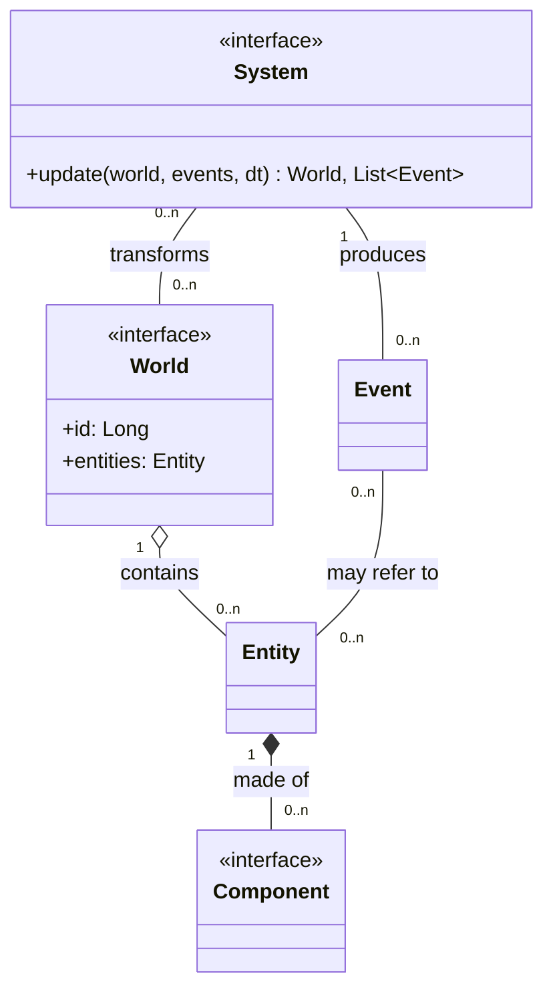
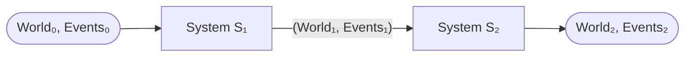

# Modulo Core

Il modulo _core_ costituisce il nucleo computazionale di ScalaParty. È stato ideato come modulo separato per essere completamente slegato da dipendenze esterne, operando come libreria pura ed indipendente, eseguibile utilizzando come unica dipendenza la libreria standard di Scala 3.

## Il mondo come macchina a stati

L'intero ciclo di vita di una partita è modellato attorno all'idea di un'evoluzione discreta nel tempo del mondo di gioco. Per "mondo" si intende lo stato corrente del gioco, cioè l'insieme di tutti le entità attive ed degli eventi generati in quel preciso istante. Questa modellazione rappresenta il mondo a tutti gli effetti come una macchina a stati deterministica, la cui funzione di transizione è la seguente:

$$\text{World}_{t'} = \delta(\text{World}_t, \text{Input}, \Delta t)$$

Dove:
- $\text{World}_{t}$ rappresenta la fotografia del mondo di gioco all'istante $t$.
- $\text{Input}$ è l'elenco degli inviate dei comandi inviati dai giocatori durante l'intervallo temporale.
- $\Delta t$ è l'intervallo di tempo trascorso tra $t$ e $t'$, ossia il tempo trascorso dall'ultimo aggiornamento.

La definizione dell'evoluzione come un insieme di stati determinati da input e tempo trascorso permette di definire l'intera partita come una pipeline su cui eseguono vari filtri che evolvono e trasformano il mondo. Questo approccio rende una partita completamente riproducibile: data un mondo iniziale e la sequenza temporale dei comandi inviati, l'evoluzione del mondo è perfettamente deterministica.

## Entity component system

L'architettura che, dal nostro punto di vista, si adatta perfettamente  alla definizione di un videogioco come pipeline di stati è descritta dal pattern _Entity component system_. Questo pattern  non solo è perfettamente in linea con l'idea di pipeline, ma massimizza l'estensibilità e la manutenibilità del gioco favorendo al contempo un moderno e pulito approccio funzionale.  

L'architettura ECS si fonda, come suggerito dal nome, su tre principali concetti:

- **Entità**: rappresenta un generico oggetto facente parte del mondo di gioco.
- **Componente**: cattura e astrae un aspetto o un comportamento caratterizzante di un entità, detenendone i dati rappresentativi. Un facile esempio è un possibile _PositionComponent_, che incapsuli la posizione dell'entità all'interno del mondo.
- **Sistema**: un sistema si occupa di processare le entità per applicarvi un preciso effetto. Durante la sua esecuzione ogni sistema filtra le entità aventi dei particolari componenti necessari alla sua esecuzione. Un semplice esempio è un possibile _PhysicsSystem_ che filtri tutte le entità aventi posizione e velocità applicando lo spostamento.

L'esecuzione dei sistemi in sequenza su un mondo che contiene tutte le entità coincide perfettamente con il sistema a pipeline descritto nella sezione precedente. Infatti ad ogni tick il mondo viene aggiornato tramite i sistemi che operano come filtri di una pipeline, filtrando e trasformando i componenti che fungono da semplici dati delle entità.

Poiché ogni sistema aggiorna il mondo in modo indipendente è necessario definire un modo per metterli in comunicazione. Cioè è semplice da modellare in un'architettura a pipeline semplicemente tramite degli eventi: ogni sistema produce in output una nuova versione del mondo e degli eventi che si sono verificati durante l'aggiornamento, in tal modo qualsiasi sistema successivo che operi sul mondo è a conoscenza di tali eventi.
Tale comunicazione è necessaria per garantire il principio di singola responsabilità sui sistemi, che possono occuparsi di una sola operazione delegando le correlate ad altri sistemi.
Si pensi ad esempio ad un sistema di collisione: se non fosse in grado di comunicare eventi di collisione ad altri sistemi dovrebbe necessariamente essere lui a muovere le entità ed eventualmente applicare danni da collisioni.

### Motivazioni della scelta

La scelta di questo pattern ha molteplici motivazioni. Innanzitutto questo pattern è ben conosciuto, consolidato e studiato nella branca dello sviluppo dei videogiochi. La documentazione online è tantissima e permette uno studio ed un'analisi rapida e precisa, diminuendo il rischio di errori, che costituisce un requisito fondamentale visto l'esiguo quantitativo di ore che abbiamo a disposizione per la realizzazione del progetto. In secondo luogo i benefici che se ne traggono sono ben intuibili:

- **Superamento dell'ereditarietà**: la composizione è ormai spesso consigliata per superare la rigidità di un sistema basato su ereditarietà. Ciò è vero in linea generale, non solo nello sviluppo di videogiochi, ma in questo caso possiamo subito capirne la motivazione. Se per ogni nuovo comportamento dovessimo creare un'entità diversa che possibilmente ne estende un'altra sarebbe un incubo di gerarchie e proliferazione di classi.
- **Estensibilità**: grazie alla composizione, aggiungere un comportamento su un'entità spesso richiede pochissime linee di codice. Se il componente non esiste già è sufficiente definirlo, aggiungere un sistema dedicato e l'implementazione è conclusa.
- **Testabilità**: sfruttando un approccio funzionale è possibile spostare l'intera logica di gioco all'interno dei sistemi. Spostando tale logica è possibile costruire sistemi come funzioni pure e prive di side-effect: se sappiamo l'input, l'output è perfettamente deterministico. Pertanto, se c'è un errore in un comportamento specifico, tale irregolarità è immediatamente riconducibile ad un preciso sistema.
- **Rapidità di sviluppo**: a sapere che qualsiasi comportamento del gioco segue il medesimo flusso di sviluppo, ne beneficia fortemente non solo la struttura del codice, ma anche lo sviluppatore. Ogni nuovo comportamento si sviluppa nella stessa maniera: definiamo un componente, scriviamo un test per il nuovo (o preesistente) sistema e implementiamo, se il sistema funziona possiamo integrarlo alla pipeline.