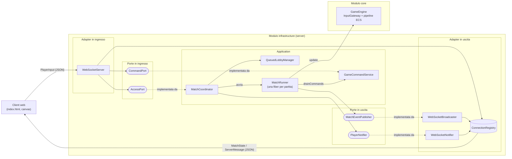
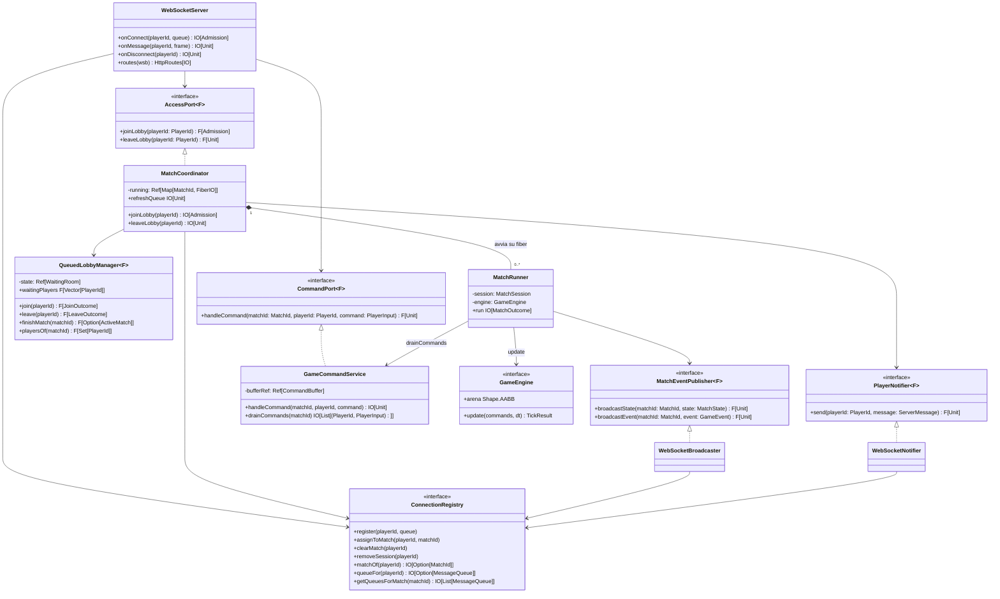
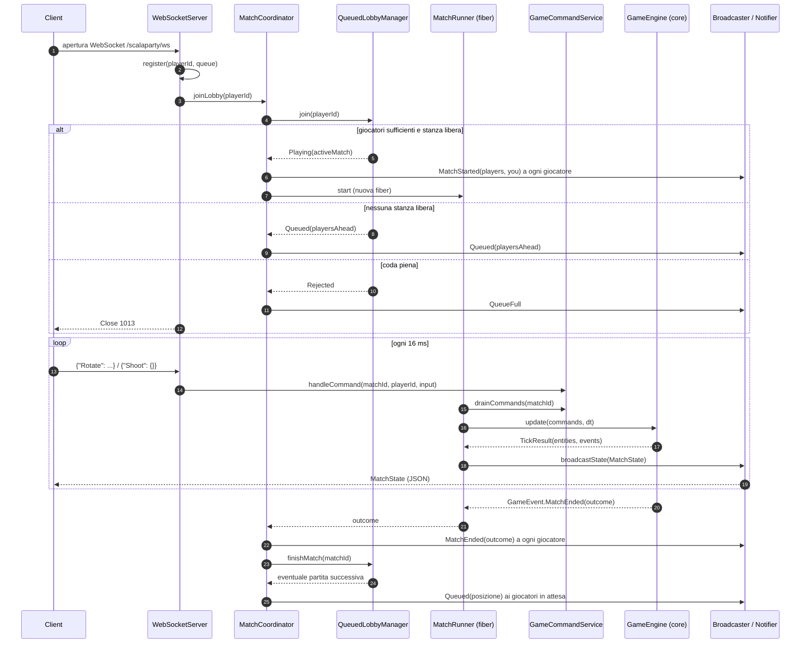

# Design di Dettaglio - Server

In questa sezione viene descritta l'implementazione della parte **server** di ScalaParty, contenuta nel modulo sbt `infrastructure`.
Il server ha il compito di accettare le connessioni dei giocatori, organizzarli in partite, eseguire la simulazione di ciascuna partita in modo autoritativo e sincronizzare in tempo reale lo stato di gioco con tutti i client connessi.
La logica di gioco vera e propria (movimento, collisioni, danni, condizione di vittoria) non è implementata nel server, ma nel modulo `core`, da cui `infrastructure` dipende. Il server usa il motore di gioco esclusivamente tramite l'interfaccia `GameEngine`.

Il server è scritto in Scala 3 secondo il paradigma funzionale e si appoggia all'ecosistema Typelevel:

- **cats-effect**: gestione degli effetti (`IO`), dello stato concorrente (`Ref`, `Deferred`, `Queue`) e delle fiber;
- **fs2**: stream per il game loop a frequenza fissa e per i flussi WebSocket;
- **http4s (Ember)**: server HTTP e WebSocket;
- **circe**: serializzazione e deserializzazione JSON del protocollo di rete;
- **log4cats / logback**: logging.

## Pattern architetturale utilizzato

### Ports & Adapters (Architettura esagonale)

Il server è strutturato secondo il pattern **Ports & Adapters**, noto anche come *architettura esagonale*.
L'idea alla base del pattern è separare la logica applicativa dalle tecnologie con cui comunica con l'esterno (rete, protocolli, formati di serializzazione):

- la logica applicativa sta al centro dell'esagono e interagisce con il mondo esterno solo attraverso delle **porte**, cioè interfacce che descrivono *cosa* serve, senza specificare *come* viene realizzato;
- le **porte in ingresso** (*driving ports*) espongono i casi d'uso che il mondo esterno può invocare;
- le **porte in uscita** (*driven ports*) descrivono i servizi che l'applicazione richiede all'esterno;
- gli **adapter** sono le implementazioni concrete che collegano una specifica tecnologia (nel nostro caso le WebSocket) alle porte.

Questa organizzazione si riflette direttamente nei package del modulo `infrastructure`:

| Package       | Ruolo nel pattern                 | Contenuto                                                                                                                   |
| ------------- | --------------------------------- | --------------------------------------------------------------------------------------------------------------------------- |
| `ports`       | Porte (interfacce)                | `AccessPort`, `CommandPort` (ingresso); `MatchEventPublisher`, `PlayerNotifier` (uscita)                                    |
| `application` | Logica applicativa (centro)       | `MatchCoordinator`, `QueuedLobbyManager`, `MatchRunner`, `GameCommandService`, `CommandAdapter`                             |
| `network`     | Adapter tecnologici               | `WebSocketServer` (adapter in ingresso), `WebSocketBroadcaster`, `WebSocketNotifier` (adapter in uscita), `ConnectionRegistry` |
| `network.dto` | Formato dei messaggi di rete      | `PlayerInput`, `ProtocolCodecs`                                                                                             |
| `model`       | Value object del server           | `PlayerId`, `MatchId`, `ActiveMatch`, `JoinOutcome`, `LeaveOutcome`, `Admission`, `ServerMessage`                           |
| (root)        | Composition root                  | `ServerApp`                                                                                                                 |

Le porte sono definite in stile **tagless final**, cioè sono parametrizzate su un generico tipo di effetto `F[_]`:

```scala
trait AccessPort[F[_]]:
  def joinLobby(playerId: PlayerId): F[Admission]
  def leaveLobby(playerId: PlayerId): F[Unit]

trait CommandPort[F[_]]:
  def handleCommand(matchId: MatchId, playerId: PlayerId, command: PlayerInput): F[Unit]

trait MatchEventPublisher[F[_]]:
  def broadcastState(matchId: MatchId, state: MatchState): F[Unit]
  def broadcastEvent(matchId: MatchId, event: GameEvent): F[Unit]

trait PlayerNotifier[F[_]]:
  def send(playerId: PlayerId, message: ServerMessage): F[Unit]
```

Le due porte in uscita sono state separate in base al **destinatario** del messaggio:

- `MatchEventPublisher` si rivolge a *tutti* i partecipanti di una partita e trasporta lo stato di gioco autoritativo;
- `PlayerNotifier` si rivolge a un *singolo* giocatore e trasporta le notifiche di lobby (posizione in coda, inizio e fine partita). Questa distinzione serve perché un giocatore in coda non appartiene ancora a nessuna partita e non può essere raggiunto tramite il broadcast.

Allo stesso modo, le porte in ingresso sono state separate per **fase del ciclo di vita** del giocatore: `AccessPort` gestisce l'ingresso e l'uscita dal gioco (matchmaking), mentre `CommandPort` gestisce i comandi impartiti durante una partita.

### Vantaggi del pattern

L'adozione dell'architettura esagonale ha portato i seguenti vantaggi, in linea con i requisiti non funzionali del progetto:

- **Isolamento della logica applicativa.** Il matchmaking, la gestione della coda e il ciclo di vita delle partite non dipendono da http4s né dal formato dei frame WebSocket. Il coordinatore delle partite conosce soltanto le porte `PlayerNotifier` e `MatchEventPublisher`, ignorando come i messaggi vengano effettivamente serializzati e consegnati.
- **Testabilità.** Poiché la logica applicativa dipende da interfacce, nei test le porte in uscita vengono sostituite da implementazioni fittizie che registrano i messaggi inviati (ad esempio `RecordingNotifier` e `CountingPublisher` in `MatchCoordinatorSpec`). In questo modo è possibile verificare l'intero ciclo coda → partita → fine partita senza aprire alcuna connessione di rete. Le regole di matchmaking, essendo funzioni pure su uno stato immutabile, sono verificabili in isolamento.
- **Sostituibilità degli adapter.** Cambiare il protocollo di trasporto (ad esempio passare a un altro framework o aggiungere un canale diverso) richiede di scrivere nuovi adapter che implementino le stesse porte, senza toccare la logica applicativa.
- **Evoluzione incrementale.** Durante lo sviluppo il gestore delle lobby è stato sostituito: il `LobbyManager` iniziale (un'unica lobby che si riempie fino a quattro giocatori) è stato rimpiazzato da `QueuedLobbyManager` + `MatchCoordinator` (coda FIFO e più stanze in parallelo). L'adapter WebSocket ha continuato a interagire con la stessa porta `AccessPort`, ed è stato necessario adattare solamente il contratto di `joinLobby` per poter restituire l'esito dell'ammissione.
- **Separazione delle responsabilità.** Ogni componente ha un compito ben circoscritto: chi gestisce le socket non conosce le regole del matchmaking, chi decide chi gioca non sa come far avanzare una partita, e chi fa avanzare la partita non conosce le regole del gioco, delegate al `core`.
- **Coerenza con il paradigma funzionale.** Combinato con il tagless final e con le primitive di cats-effect, il pattern consente di confinare gli effetti collaterali negli adapter e nella composition root, mantenendo pure le transizioni di stato del dominio applicativo (approccio *functional core, imperative shell*).

## Implementazione del server

### Composition root: `ServerApp`

`ServerApp` è il punto di ingresso dell'applicazione (`IOApp.Simple`) e funge da **composition root**: è l'unico punto in cui le implementazioni concrete vengono istanziate e collegate tra loro.
Non è utilizzato alcun framework di dependency injection: le dipendenze sono passate esplicitamente ai costruttori all'interno di una for-comprehension `IO`.

```scala
val run: IO[Unit] =
  for
    registry       <- ConnectionRegistry()
    lobby          <- QueuedLobbyManager.of[IO](
                        minPlayers = PlayersPerMatch,
                        maxPlayers = PlayersPerMatch,
                        maxMatches = MaxConcurrentMatches,
                        maxQueued  = MaxQueuedPlayers)
    commandService <- GameCommandService()
    notifier  = WebSocketNotifier(registry)
    publisher = WebSocketBroadcaster(registry)
    coordinator    <- MatchCoordinator(lobby, registry, commandService, notifier, publisher, GameSettings.default)
    wsServer  = WebSocketServer(registry, coordinator, commandService)
    _ <- EmberServerBuilder.default[IO] /* host, porta 8081, logger, routes */ .build.use(_ => IO.never)
  yield ()
```

Ogni componente con stato espone una factory che restituisce `IO[...]`. In questo modo la creazione dello stato mutabile condiviso (un `Ref`) è anch'essa un effetto, e non può avvenire in maniera implicita al di fuori del flusso controllato da cats-effect.

In `ServerApp` sono definiti anche i parametri di capacità del server: il numero di giocatori per partita, il numero massimo di partite giocate contemporaneamente e la dimensione massima della coda d'attesa.

Il server espone tre rotte HTTP:

| Rotta                 | Descrizione                                                     |
| --------------------- | --------------------------------------------------------------- |
| `GET /`               | Health check testuale ("Scala Party Server is up and running!") |
| `GET /scalaparty`     | Restituisce il client web (`public/index.html`)                 |
| `GET /scalaparty/ws`  | Endpoint WebSocket per il gioco                                 |

### Adapter in ingresso: `WebSocketServer`

`WebSocketServer` è l'adapter che traduce gli eventi fisici della connessione WebSocket in invocazioni delle porte in ingresso. Gestisce tre eventi:

- **Connessione (`onConnect`)**: alla richiesta su `/ws` viene generato un nuovo `PlayerId` (UUID) e creata una coda `Queue[IO, WebSocketFrame]` dedicata ai messaggi in uscita verso quel client. Il giocatore viene registrato nel `ConnectionRegistry` e viene invocato `AccessPort.joinLobby`. Se l'esito è `Admission.Rejected` (tutte le stanze occupate e coda piena), il server mette in coda un frame di chiusura con codice `1013 - Try Again Later` (RFC 6455) e rimuove subito la sessione.
- **Messaggio (`onMessage`)**: il frame di testo viene decodificato in un `PlayerInput`. La partita a cui il comando si riferisce viene ricavata dal registro **ad ogni messaggio** e non una volta per tutte alla connessione: un giocatore può infatti connettersi mentre è in coda ed essere assegnato a una partita solo successivamente. Gli input di un giocatore che non è ancora in partita vengono scartati, così come i JSON non validi.
- **Disconnessione (`onDisconnect`)**: la sessione viene rimossa dal registro e viene invocato `AccessPort.leaveLobby`, così da liberare il posto in coda o rimuovere la navicella dalla partita.

Il flusso dei frame verso il client è ottenuto unendo la coda dei messaggi del giocatore con un `Ping` inviato ogni 20 secondi:

```scala
def keptAlive(queue: MessageQueue): Stream[IO, WebSocketFrame] =
  Stream
    .fromQueueUnterminated(queue)
    .merge(Stream.awakeEvery[IO](keepAliveInterval).as(WebSocketFrame.Ping()))
```

Il ping si rende necessario perché Ember chiude le connessioni inattive per 60 secondi, mentre un giocatore in coda potrebbe non inviare alcun messaggio per un periodo prolungato.

### Registro delle connessioni: `ConnectionRegistry`

`ConnectionRegistry` mantiene, per ogni giocatore connesso, la sua coda di messaggi in uscita e la partita a cui è eventualmente assegnato:

```scala
private case class Session(matchId: Option[MatchId], queue: MessageQueue)
private type RegistryState = Map[PlayerId, Session]
```

Lo stato è racchiuso in un `Ref[IO, RegistryState]` e tutte le operazioni (`register`, `assignToMatch`, `clearMatch`, `removeSession`, `queueFor`, `getQueuesForMatch`, ...) sono aggiornamenti atomici dello stesso.
Una connessione sopravvive alla partita a cui partecipa: il giocatore è registrato senza partita al momento della connessione, viene associato a una partita quando questa inizia (`assignToMatch`) e ne viene sganciato quando termina (`clearMatch`).

### Matchmaking: `QueuedLobbyManager`

`QueuedLobbyManager` decide **chi gioca e chi attende**. I giocatori sono serviti secondo una politica *first-come-first-served*: non appena una stanza è libera e almeno `minPlayers` giocatori sono in attesa, fino a `maxPlayers` di essi vengono prelevati dalla testa della coda e inizia una nuova partita. Fino a `maxMatches` partite possono essere giocate contemporaneamente, e al massimo `maxQueued` giocatori possono attendere; chi arriva oltre viene rifiutato.

L'intero stato del matchmaking è rappresentato da un'unica struttura immutabile:

```scala
private final case class WaitingRoom(queue: Vector[PlayerId], active: Map[MatchId, ActiveMatch])
```

su cui sono definite le transizioni pure `enqueue`, `remove` e `startMatch`. La coda e le stanze attive condividono **un solo `Ref`** di proposito: liberare una stanza e scegliere chi la occupa deve essere un passo atomico, altrimenti due aggiornamenti concorrenti potrebbero selezionare gli stessi giocatori.

Le operazioni pubbliche applicano le transizioni tramite `Ref.modify` e restituiscono esiti espressi come ADT:

```scala
def join(playerId: PlayerId): F[JoinOutcome]           // Playing(activeMatch) | Queued(playersAhead) | Rejected
def leave(playerId: PlayerId): F[LeaveOutcome]         // partita sciolta e/o partita appena avviata
def finishMatch(matchId: MatchId): F[Option[ActiveMatch]] // partita avviata nella stanza appena liberata
```

L'identificativo della possibile nuova partita viene generato prima della `modify` (`withCandidateMatchId`), perché la funzione passata a `modify` deve essere pura; l'identificativo viene poi utilizzato solo se una partita inizia effettivamente.

La factory `QueuedLobbyManager.of` valida i parametri di configurazione (ad esempio `1 ≤ minPlayers ≤ maxPlayers ≤ 4`, `maxMatches ≥ 1`, coda sufficientemente capiente da poter raggiungere `minPlayers`) sollevando l'errore all'interno dell'effetto. Il componente è generico sull'effetto (`F[_]: Sync`).

### Coordinamento delle partite: `MatchCoordinator`

`MatchCoordinator` implementa la porta `AccessPort` e governa l'intero ciclo di vita di una partita, dalla coda all'ultimo tick. Mette in comunicazione `QueuedLobbyManager`, che decide *chi* gioca, e `MatchRunner`, che sa soltanto far avanzare una partita già esistente.

- **`joinLobby`**: inoltra la richiesta alla lobby e, in base al `JoinOutcome`, avvia la partita, notifica al giocatore la sua posizione in coda (`ServerMessage.Queued`) oppure lo informa che la coda è piena (`ServerMessage.QueueFull`).
- **`leaveLobby`**: rimuove il giocatore dalla lobby; se la partita è rimasta senza giocatori ne ferma la fiber, aggiorna la posizione di chi è in coda e, se si è liberata una stanza, avvia la partita successiva.
- **`startMatch`**: assegna a ogni giocatore un `EntityId` per la sua navicella, lo associa alla partita nel registro e gli invia `ServerMessage.MatchStarted(players, you)`, così che il client sappia quale navicella controlla. Avvia poi la partita su una **fiber dedicata**, registrata in un `Ref[IO, Map[MatchId, FiberIO[Unit]]]`.
- **`concludeMatch`**: al termine della partita sgancia i giocatori dalla partita, invia loro `ServerMessage.MatchEnded(outcome)`, dichiara conclusa la partita nella lobby e avvia immediatamente quella successiva, se ci sono abbastanza giocatori in attesa. In questo modo la coda avanza autonomamente.

Ogni partita è quindi eseguita su una propria fiber, isolata e indipendente dalle altre, e viene interrotta solo quando termina o quando tutti i giocatori l'hanno abbandonata.

Il coordinatore gestisce esplicitamente alcune **condizioni di corsa** che emergono dalla concorrenza tra fiber:

- la partita attende, tramite un `Deferred`, che la propria fiber sia stata registrata prima di iniziare: in caso contrario, una partita molto breve potrebbe concludersi prima della registrazione, lasciando nella mappa una fiber terminata che non verrebbe mai rimossa;
- dopo aver registrato la fiber, viene verificato che la partita sia ancora attiva: se l'ultimo giocatore è uscito durante l'avvio, la sua `leave` non ha trovato alcuna fiber da fermare, e la partita viene quindi fermata subito;
- in `concludeMatch` la fiber viene rimossa dalla mappa *prima* delle operazioni di pulizia, poiché questo codice è eseguito proprio all'interno di quella fiber: un giocatore che uscisse in quel momento la cancellerebbe a metà del lavoro.

### Game loop: `MatchRunner`

`MatchRunner` implementa il **ciclo autoritativo** di una singola partita. È realizzato come uno stream fs2 a frequenza fissa di circa 60 tick al secondo (`TickInterval = 16.millis`):

```scala
def run: IO[MatchOutcome] =
  Stream
    .fixedRate[IO](MatchRunner.TickInterval)
    .zipWithIndex
    .evalMapAccumulate(Set.empty[PlayerId]):   // giocatori già usciti
      case (departed, (_, tick)) =>
        for
          rawCommands <- commandQueue.drainCommands(session.matchId)
          present     <- roster
          ecsCommands   = rawCommands.flatMap((playerId, intent) => session.players.get(playerId).flatMap(intent.toDto))
          leaving       = session.players.keySet -- present -- departed
          leaveCommands = leaving.toList.flatMap(session.players.get).map(GameCommand.LeaveCommand(_))
          result        = engine.update(ecsCommands ++ leaveCommands, MatchRunner.TickInterval.toMillis)
          _ <- publisher.broadcastState(session.matchId, MatchState(tick, engine.arena, result.entities))
          ended = result.events.collectFirst { case GameEvent.MatchEnded(outcome) => outcome }
        yield (departed ++ leaving, ended)
    .collectFirst { case (_, Some(outcome)) => outcome }
    .compile
    .lastOrError
```

A ogni tick il runner:

1. **preleva** atomicamente tutti i comandi accumulati per la partita dal `GameCommandService`;
2. **traduce** gli input di rete (`PlayerInput`) in comandi di dominio (`GameCommand`) tramite la mappa `PlayerId → EntityId` della sessione (`CommandAdapter`);
3. **rileva i giocatori usciti** dall'ultimo tick confrontando i partecipanti iniziali con quelli ancora presenti nella lobby, e genera per ciascuno un `LeaveCommand` che rimuove la sua navicella dall'arena. La partita prosegue finché resta almeno un giocatore;
4. **fa avanzare il motore** di gioco (`GameEngine.update`), che applica i comandi ed esegue la pipeline dei sistemi ECS;
5. **pubblica** il nuovo stato autoritativo (`MatchState`) a tutti i partecipanti (RFS7);
6. **termina** non appena il motore emette l'evento `GameEvent.MatchEnded`, restituendo il `MatchOutcome` (`LastStanding(winner)`, `NoSurvivors` o `TimeUp`) al coordinatore (RFS6).

L'insieme dei giocatori già usciti, unica informazione che deve essere conservata tra un tick e il successivo, viene trasportato nell'accumulatore dello stream invece che in una variabile mutabile. L'elenco dei partecipanti ancora presenti è passato al runner come effetto (`roster: IO[Set[PlayerId]]`), così che il runner non dipenda direttamente dalla lobby.

### Buffer dei comandi: `GameCommandService`

`GameCommandService` implementa la porta `CommandPort`. Gli input dei giocatori arrivano in modo asincrono, uno per ciascun messaggio WebSocket, mentre la simulazione avanza a intervalli regolari: il servizio fa da **buffer** tra le due velocità.

```scala
type CommandBuffer = Map[MatchId, List[(PlayerId, PlayerInput)]]
```

- `handleCommand` accoda atomicamente l'input alla lista della partita corrispondente;
- `drainCommands` restituisce tutti gli input accumulati per una partita e svuota la lista in un'unica `Ref.modify`, così che nessun comando vada perso o venga processato due volte.

Il servizio instrada i comandi esclusivamente in base agli identificativi di partita e giocatore, senza interpretarli: la loro risoluzione in comandi di gioco avviene nel `MatchRunner` all'inizio di ogni tick.

### Adapter in uscita: `WebSocketBroadcaster` e `WebSocketNotifier`

I due adapter in uscita implementano le corrispondenti porte serializzando i messaggi in JSON e inserendoli nelle code dei destinatari, recuperate dal `ConnectionRegistry`:

- `WebSocketBroadcaster` (`MatchEventPublisher`) invia lo stato della partita a **tutti** i giocatori associati a quella partita;
- `WebSocketNotifier` (`PlayerNotifier`) invia una notifica di lobby a un **singolo** giocatore, ignorandola se questo non è più connesso.

Gli adapter non scrivono mai direttamente sulla socket: si limitano a un `offer` sulla coda del giocatore, che viene consumata dallo stream di invio della connessione. In questo modo la produzione dei messaggi (il game loop e il coordinatore) è disaccoppiata dalla velocità di trasmissione verso ciascun client.

### Protocollo di comunicazione: `ProtocolCodecs`

Client e server comunicano tramite messaggi JSON su un'unica connessione WebSocket. `ProtocolCodecs` raccoglie i codec circe necessari: alcuni sono scritti manualmente, come quelli di `Shape` e `Point2D` (che includono un campo `type` per distinguere `AABB`, `Circle` e `Polygon`) e di `EntityId` (serializzato come numero), mentre gli altri sono derivati semi-automaticamente (`deriveEncoder`).

| Direzione        | Messaggio                          | Esempio                                                     |
| ---------------- | ---------------------------------- | ----------------------------------------------------------- |
| Client → Server  | `PlayerInput.Rotate`               | `{"Rotate": {"angle": -2.0}}`                               |
| Client → Server  | `PlayerInput.Shoot`                | `{"Shoot": {}}`                                             |
| Server → Client  | `ServerMessage.Queued`             | `{"Queued": {"playersAhead": 0}}`                           |
| Server → Client  | `ServerMessage.QueueFull`          | `{"QueueFull": {}}`                                         |
| Server → Client  | `ServerMessage.MatchStarted`       | `{"MatchStarted": {"players": 2, "you": 7}}`                |
| Server → Client  | `ServerMessage.MatchEnded`         | `{"MatchEnded": {"outcome": {"LastStanding": {"winner": 7}}}}` |
| Server → Client  | `MatchState` (a ogni tick)         | `{"tick": 42, "arena": {...}, "entities": [{"Spaceship": {...}}, ...]}` |

Le notifiche di lobby sono rappresentate come oggetti etichettati con il nome del caso, mentre lo stato della partita è un oggetto semplice contenente il campo `entities`: questo permette al client di distinguere le due tipologie di messaggio sulla stessa connessione.

### Identificativi e modello del server

Gli identificativi di giocatori e partite sono definiti come **opaque type** su `UUID`:

```scala
opaque type PlayerId = UUID
opaque type MatchId  = UUID
```

In questo modo il compilatore impedisce di scambiare un `PlayerId` con un `MatchId` (o con un `UUID` qualsiasi), senza alcun costo a runtime. Inoltre, i `PlayerId` sono generati casualmente a ogni connessione e non sono legati ad alcuna informazione personale dell'utente.

Gli esiti delle operazioni sono modellati come **ADT** (`Admission`, `JoinOutcome`, `LeaveOutcome`, `ServerMessage`) invece che come valori booleani o eccezioni, rendendo esplicito e verificato dal compilatore ogni caso che il chiamante deve gestire.

### Logging: `ClientDisconnectionLogger`

`ClientDisconnectionLogger` è un *decorator* del `Logger[IO]` di log4cats passato a Ember. Il server, per impostazione predefinita, registra come errore (con stack trace completo) qualsiasi WebSocket che termini con un'eccezione, compresa la semplice chiusura della scheda del browser da parte del client. Il decorator riconosce questi casi ("Connection reset", "Broken pipe", anche quando aggregati in un `CompositeFailure`) e li declassa a livello `debug`, lasciando inalterati tutti gli altri messaggi.

### Gestione della concorrenza

Il server non utilizza lock, attori o variabili mutabili condivise: la concorrenza è gestita interamente tramite le primitive funzionali di cats-effect.

| Problema                                                | Soluzione adottata                                                                 |
| ------------------------------------------------------- | ---------------------------------------------------------------------------------- |
| Stato condiviso (lobby, registro, buffer, fiber attive) | `Ref` con aggiornamenti atomici (`update`/`modify`) di strutture immutabili        |
| Esecuzione di più partite in parallelo                  | Una fiber per partita, cancellabile con `FiberIO.cancel`                           |
| Avanzamento del tempo di gioco                          | `Stream.fixedRate` di fs2                                                          |
| Disaccoppiamento tra produttori di messaggi e socket    | Una `Queue` per client, consumata da `Stream.fromQueueUnterminated`                |
| Ordinamento tra avvio di una partita e sua registrazione | `Deferred`                                                                        |
| Mantenimento delle connessioni inattive                 | `merge` dello stream di invio con `Stream.awakeEvery` (ping periodico)             |
### Diagramma dei componenti



### Diagramma delle classi del server



### Ciclo di vita di una partita

Il seguente diagramma di sequenza riassume l'interazione tra i componenti, dalla connessione dei giocatori alla conclusione della partita.


