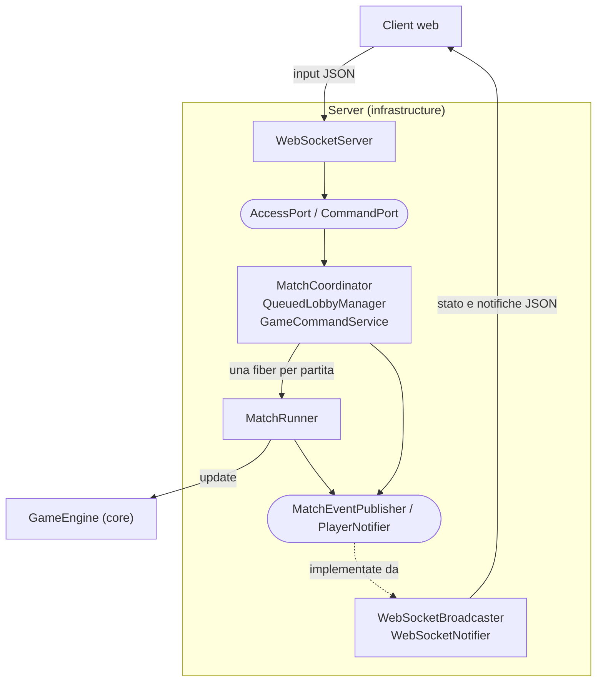
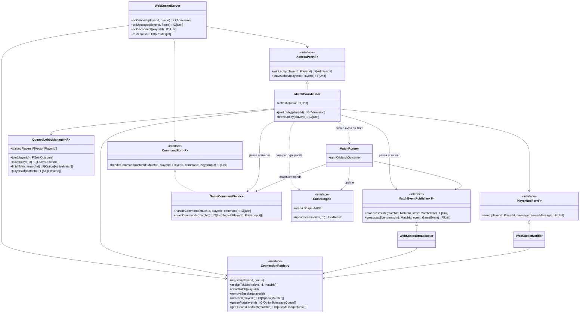
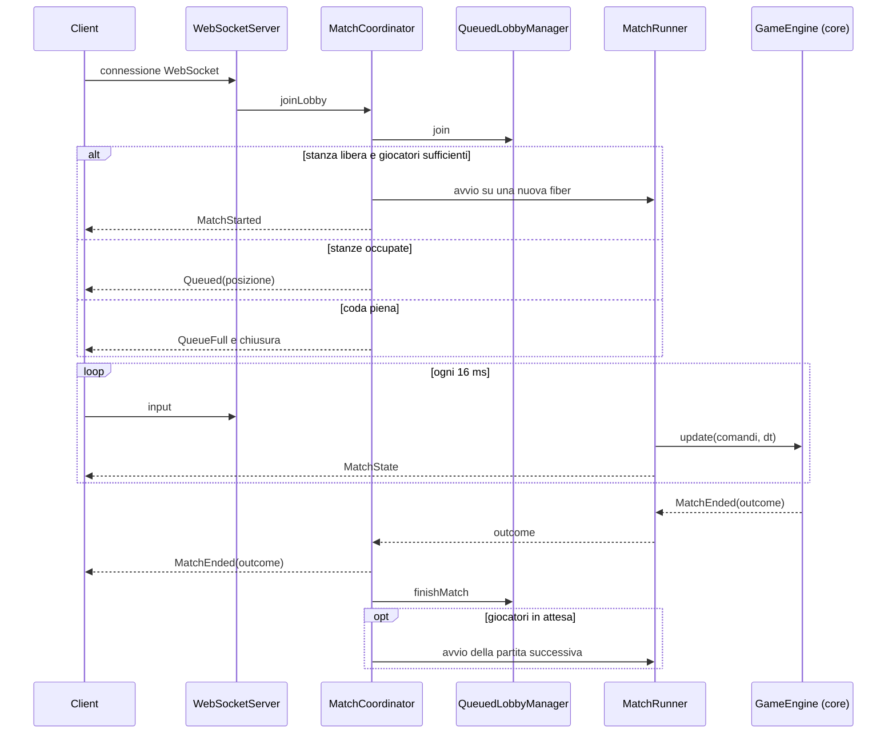

# Design architetturale - Server

In questa sezione viene descritto il design architetturale della parte **server** di ScalaParty, contenuta nel modulo sbt `infrastructure`.
Il server ha il compito di accettare le connessioni dei giocatori, organizzarli in partite, eseguire la simulazione di ciascuna partita in modo autoritativo e sincronizzare in tempo reale lo stato di gioco con tutti i client connessi.
La logica di gioco vera e propria (movimento, collisioni, danni, condizione di vittoria) non è implementata nel server, ma nel modulo `core`, da cui `infrastructure` dipende. Il server usa il motore di gioco esclusivamente tramite l'interfaccia `GameEngine`.

Il server è scritto in Scala 3 secondo il paradigma funzionale e si appoggia all'ecosistema Typelevel:

- **cats-effect**: gestione degli effetti e della concorrenza;
- **fs2**: stream per il game loop a frequenza fissa e per i flussi WebSocket;
- **http4s (Ember)**: server HTTP e WebSocket;
- **circe**: serializzazione e deserializzazione JSON del protocollo di rete;
- **log4cats / logback**: logging.

## Pattern architetturale utilizzato

### Ports & Adapters (Architettura esagonale)

Il server è strutturato secondo il pattern **Ports & Adapters**, noto anche come *architettura esagonale*.
L'idea alla base del pattern è separare la logica applicativa dalle tecnologie con cui comunica con l'esterno (rete, protocolli, formati di serializzazione):

- la logica applicativa sta al centro dell'esagono e interagisce con il mondo esterno solo attraverso delle **porte**, cioè interfacce che descrivono *cosa* serve, senza specificare *come* viene realizzato;
- le **porte in ingresso** (*driving ports*) espongono i casi d'uso che il mondo esterno può invocare;
- le **porte in uscita** (*driven ports*) descrivono i servizi che l'applicazione richiede all'esterno;
- gli **adapter** sono le implementazioni concrete che collegano una specifica tecnologia (nel nostro caso le WebSocket) alle porte.

Questa organizzazione si riflette direttamente nei package del modulo `infrastructure`:

| Package       | Ruolo nel pattern                 | Contenuto                                                                                                                   |
| ------------- | --------------------------------- | --------------------------------------------------------------------------------------------------------------------------- |
| `ports`       | Porte (interfacce)                | `AccessPort`, `CommandPort` (ingresso); `MatchEventPublisher`, `PlayerNotifier` (uscita)                                    |
| `application` | Logica applicativa (centro)       | `MatchCoordinator`, `QueuedLobbyManager`, `MatchRunner`, `GameCommandService`, `CommandAdapter`                             |
| `network`     | Adapter tecnologici               | `WebSocketServer` (adapter in ingresso), `WebSocketBroadcaster`, `WebSocketNotifier` (adapter in uscita), `ConnectionRegistry`, `ClientDisconnectionLogger` |
| `network.dto` | Formato dei messaggi di rete      | `PlayerInput`, `ProtocolCodecs`                                                                                             |
| `model`       | Value object del server           | `PlayerId`, `MatchId`, `ActiveMatch`, `JoinOutcome`, `LeaveOutcome`, `Admission`, `ServerMessage`                           |
| (root)        | Composition root                  | `ServerApp`                                                                                                                 |

Le porte sono definite in stile **tagless final**, cioè sono parametrizzate su un generico tipo di effetto `F[_]`:

```scala
trait AccessPort[F[_]]:
  def joinLobby(playerId: PlayerId): F[Admission]
  def leaveLobby(playerId: PlayerId): F[Unit]

trait CommandPort[F[_]]:
  def handleCommand(matchId: MatchId, playerId: PlayerId, command: PlayerInput): F[Unit]

trait MatchEventPublisher[F[_]]:
  def broadcastState(matchId: MatchId, state: MatchState): F[Unit]
  def broadcastEvent(matchId: MatchId, event: GameEvent): F[Unit]

trait PlayerNotifier[F[_]]:
  def send(playerId: PlayerId, message: ServerMessage): F[Unit]
```

Le due porte in uscita sono state separate in base al **destinatario** del messaggio:

- `MatchEventPublisher` si rivolge a *tutti* i partecipanti di una partita e trasporta lo stato di gioco autoritativo;
- `PlayerNotifier` si rivolge a un *singolo* giocatore e trasporta le notifiche di lobby (posizione in coda, inizio e fine partita). Questa distinzione serve perché un giocatore in coda non appartiene ancora a nessuna partita e non può essere raggiunto tramite il broadcast.

Allo stesso modo, le porte in ingresso sono state separate per **fase del ciclo di vita** del giocatore: `AccessPort` gestisce l'ingresso e l'uscita dal gioco (matchmaking), mentre `CommandPort` gestisce i comandi impartiti durante una partita.

### Vantaggi del pattern

L'adozione dell'architettura esagonale ha portato i seguenti vantaggi, in linea con i requisiti non funzionali del progetto:

- **Isolamento della logica applicativa.** Il matchmaking (`QueuedLobbyManager`) e il game loop (`MatchRunner`) non dipendono da http4s né dal formato dei frame WebSocket: inviano i messaggi verso l'esterno solo attraverso le porte in uscita, ignorando come questi vengano serializzati e consegnati. Allo stesso modo, l'adapter `WebSocketServer` conosce soltanto le porte `AccessPort` e `CommandPort`, senza sapere quali componenti le implementino. 
- **Testabilità.** Poiché le porte in uscita sono interfacce, nei test vengono sostituite da implementazioni fittizie che registrano i messaggi inviati (ad esempio `RecordingNotifier` e `CountingPublisher` in `MatchCoordinatorSpec`). In questo modo è possibile verificare l'intero ciclo coda → partita → fine partita senza aprire alcuna connessione di rete. Le regole di matchmaking, essendo funzioni pure su uno stato immutabile, sono verificabili in isolamento.
- **Sostituibilità degli adapter.** Un nuovo canale in uscita può essere aggiunto implementando `MatchEventPublisher` o `PlayerNotifier`, e un nuovo adapter in ingresso può invocare gli stessi casi d'uso tramite `AccessPort` e `CommandPort`, senza modificare il matchmaking né il game loop. 
- **Evoluzione incrementale.** Durante lo sviluppo il gestore delle lobby è stato sostituito: il `LobbyManager` iniziale (un'unica lobby che si riempie fino a quattro giocatori) è stato rimpiazzato da `QueuedLobbyManager` + `MatchCoordinator` (coda FIFO e più stanze in parallelo). Il contratto di `AccessPort` si è evoluto di conseguenza: `leaveLobby` non richiede più l'identificativo della partita, e `joinLobby` è passato dal restituire la partita assegnata (`MatchId`) al restituire l'esito dell'ammissione (`Admission`). Poiché l'adapter WebSocket dipendeva soltanto dalla porta, è stato sufficiente adeguarlo alle nuove firme, senza che dovesse conoscere il componente che la implementa.
- **Separazione delle responsabilità.** Ogni componente ha un compito ben circoscritto: chi gestisce le socket non conosce le regole del matchmaking, chi decide chi gioca non sa come far avanzare una partita, e chi fa avanzare la partita non conosce le regole del gioco, delegate al `core`.
- **Coerenza con il paradigma funzionale.** Combinato con il tagless final e con le primitive di cats-effect, il pattern consente di mantenere pure le parti che contengono le regole: le transizioni di stato del matchmaking (`WaitingRoom`) e l'intera logica di gioco del `core`. Gli effetti (fiber, stream, accesso alla rete) sono espressi come valori `IO` e concentrati nel coordinatore delle partite, nel game loop e negli adapter (approccio *functional core, imperative shell*).

I dettagli implementativi dei singoli componenti sono descritti nella sezione [[5-implementazione/martini/index|Implementazione - Martini]].

## Diagrammi del server

### Diagramma dei componenti



I nodi arrotondati sono le porte; le relazioni di dettaglio (incluso il `ConnectionRegistry`) sono riportate nel diagramma delle classi.

### Diagramma delle classi del server



### Ciclo di vita di una partita

Il seguente diagramma di sequenza riassume l'interazione tra i componenti, dalla connessione dei giocatori alla conclusione della partita.
Per semplicità i messaggi verso il client sono mostrati come diretti, anche se passano per gli adapter in uscita, e gli input sono raccolti dal `GameCommandService`, da cui il runner li preleva a ogni tick.


