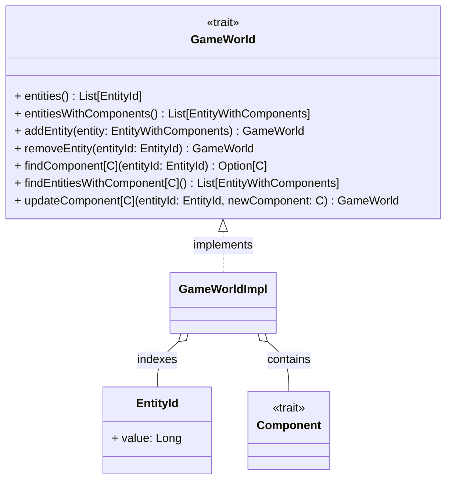
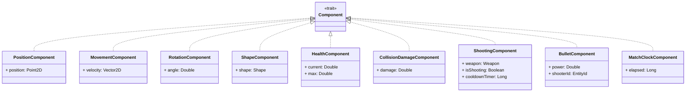
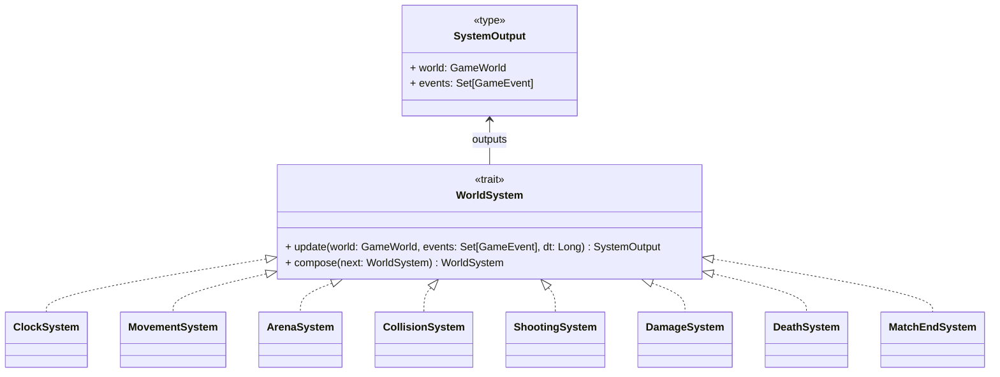
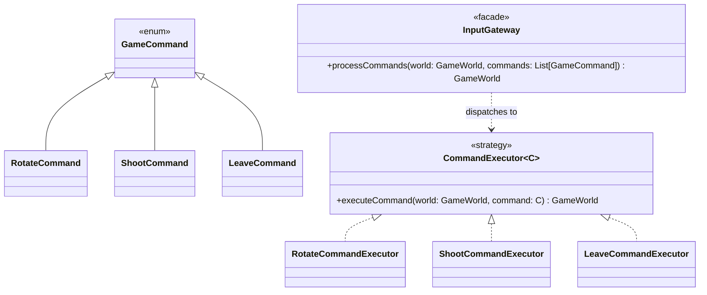

# Modulo Core

In questo capitolo viene approfondita la progettazione di dettaglio del modulo **core**, illustrando l'organizzazione modulare dei package, la modellazione delle strutture dati, i design pattern adottati e gli algoritmi matematici che governano la simulazione di gioco.

## Organizzazione del Codice e Struttura dei Package

Il modulo `core` è organizzato secondo una struttura in cui ciascun package racchiude una precisa area di responsabilità:

```text
com.unibo.scalaparty.core
├── dto
├── ecs
│   └── systems
├── engine
│   └── input
├── geometry
└── model
    └── map
```

La suddivisione risponde ai seguenti criteri di separazione delle responsabilità:

- **`core.engine`**: Contiene la facciata principale del motore di gioco e il sottosistema di elaborazione degli input (`core.engine.input`). Questo package è l'unico necessario per avviare la simulazione e aggiornare lo stato del mondo di gioco dall'esterno del modulo.
- **`core.ecs`**: Definisce il cuore del modello dell'Entity-Component-System: contiene l'astrazione del mondo, i componenti e le entità.
- **`core.ecs.systems`**: Raggruppa la famiglia dei sistemi che compongono la pipeline di simulazione, ciascuno specializzato su un singolo aspetto fisico o di gameplay.
- **`core.geometry`**: Fornisce le funzioni e le strutture dati matematiche necessarie per la modellazione della geometria 2D.
- **`core.model`**: Modella i concetti statici e le configurazioni del dominio come le impostazioni di gioco, gli eventi, la mappa di gioco e l'output della partita.
- **`core.dto`**: Definisce i contratti di trasferimento dati verso l'esterno.

## Modellazione del Mondo e dell'ECS

A livello di dettaglio, il pattern ECS si concretizza in una **struttura dati tabulare immutabile** che indicizza lo stato globale della partita.
L'entità non è modellata come una classe concreta come avverrebbe in un classico approccio orientato agli oggetti: sfruttando il paradigma funzionale, l'entità è rappresentata come un semplice identificatore numerico.
Essendo un semplice identificatore, un'entità non possiede né campi né metodi di logica: il suo unico ruolo di design è fungere da chiave primaria relazionale all'interno del mondo.

Il mondo di gioco (`GameWorld`) funge da contenitore immutabile che permette di effettuare query efficienti sui componenti associati alle entità.

- **Struttura a Dizionario**: Lo stato è organizzato in una tabella hash immutabile che mappa ciascun identificatore alla lista dei componenti ad esso associati. L'obiettivo è garantire l'accesso rapido e sicuro ai componenti di ciascuna entità.
- **Operazioni Immutabili**: L'aggiunta, rimozione o sostituzione di componenti restituiscono costantemente una nuova istanza di `GameWorld`, garantendo il determinismo e l'assenza di effetti collaterali nello stato condiviso.
- **Sistema di Query**: Per consentire ai sistemi di interrogare il mondo cercando solo i componenti rilevanti per la propria elaborazione, `GameWorld` espone query che permettono di filtrare i componenti in base al loro tipo, restituendo solo le entità che possiedono i componenti richiesti.

La struttura del mondo è in tutto e per tutto simile a un database relazionale, in cui le entità fungono da chiavi primarie e i componenti da colonne. Seppur non adottato nel progetto per motivi di tempo, è possibile estendere il modello con un motore di query simile a SQL o LINQ per interrogare il mondo in modo dichiarativo.



## Gerarchia dei Componenti e Invarianti di Dominio

Tutti i componenti del gioco sono modellati come strutture dati pure che estendono il trait `Component`. Ciascun componente modella una singola proprietà dell'entità, incapsulando i dati necessari per la realizzazione del comportamento desiderato.



### Dummy Entity e Componenti Logici

Tramite i componenti nel progetto sono state implementate anche delle _dummy entity_ che non rappresentano oggetti fisici nel mondo di gioco, ma servono a modellare concetti astratti come il tempo globale della partita. Ad esempio, il componente `MatchClockComponent` è associato a un'entità speciale che non ha forma geometrica né posizione nello spazio, ma serve a registrare il tempo trascorso dall'inizio della partita in modo da terminarla quando il timer scade.
Questa logica di modellazione consente di trattare uniformemente tutti i concetti del dominio come entità, senza la necessità di introdurre strutture dati speciali o gestioni separate per concetti astratti.

## Sistemi di Gioco e Combinator Pattern

Ogni regola della fisica o del gameplay è incapsulata in un oggetto conforme al trait `WorldSystem`, modellato concettualmente come una funzione di trasformazione pura:

$$\text{update} : (\text{GameWorld}, \text{Set}[\text{GameEvent}], \Delta t) \to (\text{GameWorld}, \text{Set}[\text{GameEvent}])$$



### Combinator Pattern e Pipeline Algebrica

Per consentire la composizione modulare dei sistemi, il trait `WorldSystem` implementa il **Combinator Pattern** mediante l'operatore compose (`>>`). La composizione inserisce l'output del primo sistema (mondo aggiornato e nuovi eventi generati) come input al sistema successivo:

$$\text{Pipeline} = \text{Clock} \gg \text{Movement} \gg \text{Arena} \gg \text{Collision} \gg \text{Shooting} \gg \text{Damage} \gg \text{Death} \gg \text{MatchEnd}$$

Questa composizione algebrica consente di costruire la pipeline di simulazione in modo dichiarativo, senza dover iterare manualmente su una lista di sistemi.
Inoltre, realizzare una pipeline come composizione di sistemi enfatizza ed impone il rispetto dell'ordine di esecuzione, che è fondamentale per la correttezza della simulazione.
Diversamente, sarebbe necessario utilizzare una lista ordinata, che in ogni caso renderebbe l'ordine di esecuzione implicito.

Di seguito sono elencati i sistemi che compongono la pipeline ordinata di simulazione, con una breve descrizione della loro responsabilità:

1. **ClockSystem**: Avanza il tempo globale registrato nel `MatchClockComponent`.
2. **MovementSystem**: Applica gli spostamenti $\vec{p}_{t+1} = \vec{p}_t + \vec{v} \cdot \Delta t$ per tutte le entità dotate di velocità.
3. **ArenaSystem**: Convalida il posizionamento spaziale rispetto al perimetro dell'arena: rimuove i proiettili che superano i bordi e riposiziona le navicelle che sconfinano all'interno dell'arena.
4. **CollisionSystem**: Rileva e risolve le collisioni tra entità, generando eventi di contatto per i sistemi successivi.
5. **ShootingSystem**: Gestisce il timer di ricarica delle armi e posiziona nello spazio i nuovi proiettili generati.
6. **DamageSystem**: Legge gli eventi di collisione e riduce la salute delle entità coinvolte, eliminando i proiettili che impattano ostacoli o bersagli.
7. **DeathSystem**: Rimuove dal mondo le entità la cui salute si azzera, notificando il rispettivo evento di morte.
8. **MatchEndSystem**: Valuta le condizioni terminali della partita (sopravvivenza dell'ultimo giocatore o scadenza del tempo) ed emette l'evento conclusivo di match terminato.

## Rilevamento e Risoluzione Collisioni

Il sottosistema di collisione scompone la risoluzione fisica degli urti in due problemi distinti:

1. **Rilevamento**: Determina se due entità collidono.
2. **Risoluzione**: Calcola lo spostamento necessario per separare le entità e applica lo spostamento minimo necessario per risolvere la collisione.

Tale distinzione è necessaria per ottimizzare le prestazioni, poiché la gestione delle collisioni è una delle operazioni più costose della simulazione. Pertanto, il semplice rilevamento deve essere ottimizzato per scartare rapidamente le coppie di entità che non collidono, evitando calcoli troppo complessi tra forme geometriche troppo distanti.

### Rilevamento: Separating Axis Theorem (SAT)

Poiché le navicelle sono rappresentate tramite triangoli, la risoluzione delle collisioni è implementata tramite il **Separating Axis Theorem (SAT)**, il quale stabilisce che due forme geometriche convesse non collidono se esiste almeno una retta (asse di separazione) su cui le proiezioni scalari delle due figure non si sovrappongono.

L'algoritmo opera a due fasi per massimizzare l'efficienza:

1. Test preliminare rapido di intersezione tra le bounding box delle entità: se non si sovrappongono, la coppia viene immediatamente scartata senza eseguire calcoli complessi.
2. Solo se i bounding box si intersecano, viene eseguito il test SAT completo, calcolando le proiezioni scalari delle forme geometriche sugli assi normali ai lati di ciascuna figura. Se tutte le proiezioni si sovrappongono le entità collidono, altrimenti la coppia viene scartata.

### Risoluzione: Minimum Translation Vector (MTV)

In assenza di assi separatori, l'asse con la minima sovrapposizione scalare definisce la direzione e il modulo del vettore di minima penetrazione (**MTV**).

La gestione di separazione distingue due strategie, in base allo stato di mobilità delle entità coinvolte:

- **Dinamico vs Statico** (Navicella vs Muro): La navicella assorbe interamente lo spostamento inverso lungo l'MTV:
  $$\Delta \vec{p}_{\text{actor}} = -\text{MTV}$$
- **Dinamico vs Dinamico** (Navicella vs Navicella): Entrambe le entità sono mobili; la separazione viene ripartita equamente al $50\%$ in direzioni opposte:
  $$\Delta \vec{p}_{\text{actor}} = -0.5 \cdot \text{MTV}, \qquad \Delta \vec{p}_{\text{target}} = +0.5 \cdot \text{MTV}$$

## Elaborazione Input

L'interazione dei giocatori con il mondo di gioco avviene tramite comandi discreti, che vengono accumulati in un buffer e processati in batch ad ogni frame.
Tali comandi devono essere eseguiti in modo deterministico e sequenziale, prima dell'esecuzione della pipeline di simulazione, per garantire che l'input dei giocatori sia correttamente applicato allo stato del mondo.

L'esecuzione dei comandi viene eseguita tramite un `InputGateway` che sfrutta il pattern _Strategy_ fungendo da semplice dispatcher e delegando l'elaborazione di ciascun comando al rispettivo `CommandExecutor`.
Ogni `CommandExecutor` è una funzione pura di elaborazione del mondo, che riceve in input lo stato del mondo e il comando da eseguire, restituendo un nuovo stato aggiornato in modo simile a quanto avviene per i sistemi di gioco.



---

## Livello DTO e Disaccoppiamento dal Rendering

A differenza del modello ECS classico, il modulo core non espone direttamente le entità del mondo all'esterno. Tale scelta di design è stata adottata per disaccoppiare il modello di dominio interno alla simulazione dalla rappresentazione visuale necessaria al rendering sul client web.

In questo modo, qualsiasi rendering engine può essere integrato senza dover conoscere la struttura interna del mondo di gioco, limitandosi a consumare i dati forniti dal modulo core.
Ciascun DTO è una struttura dati piatta e serializzabile che rappresenta tutti gli aspetti necessari al rendering di ogni singola entità, senza alcuna necessità di conoscere come il modulo gestisca l'aggiornamento di questi dati.
Il `GameEngine`, al termine di ciascun update della simulazione, genera un `TickResult` contenente il mondo serializzato in forma di DTO e l'insieme degli eventi generati durante il tick.
