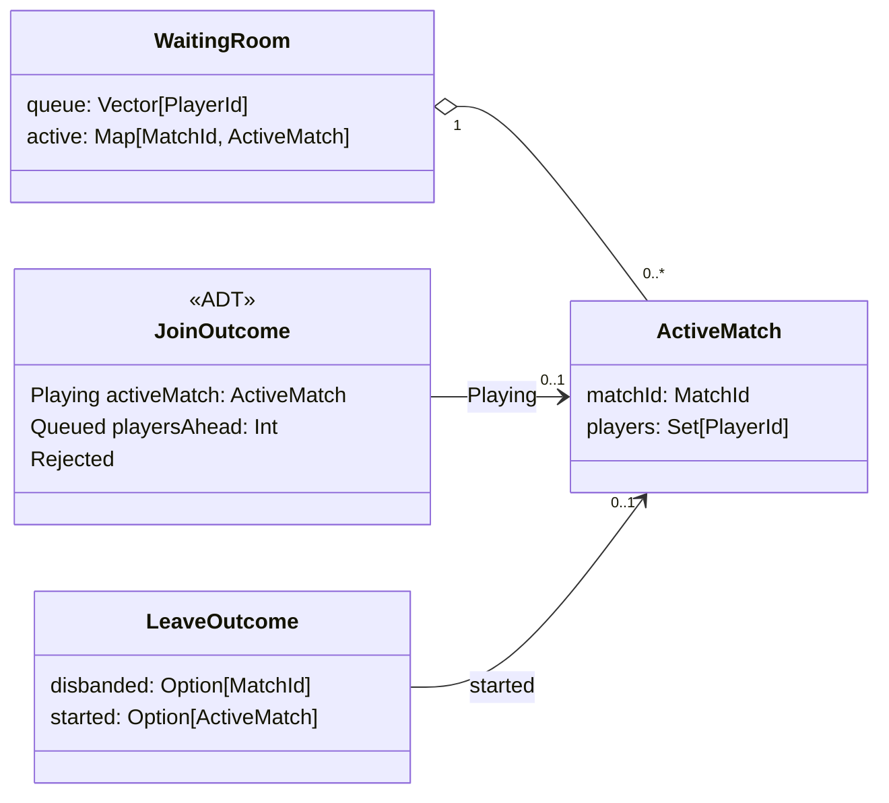

# Modulo Infrastructure

In questo capitolo viene approfondita la progettazione di dettaglio del modulo **infrastructure**, che realizza il server di gioco. Il capitolo illustra l'organizzazione dei package, la modellazione delle strutture dati e i design pattern adottati.
## Organizzazione del Codice e Struttura dei Package

Il modulo `infrastructure` è organizzato secondo una struttura in cui ciascun package racchiude una precisa area di responsabilità:

```text
com.unibo.scalaparty.infrastructure
├── ServerApp
├── application
├── model
├── network
│   └── dto
└── ports
```

La suddivisione risponde ai seguenti criteri di separazione delle responsabilità:

- **`infrastructure`** (radice): contiene soltanto `ServerApp`, il punto di ingresso del server. È la *composition root* dell'applicazione: qui vengono istanziati e collegati tra loro tutti i componenti che restano attivi per l'intera vita del server, e vengono definiti i parametri di capacità del server (giocatori per partita, partite giocate contemporaneamente, dimensione massima della coda).
- **`infrastructure.ports`**: definisce le interfacce che delimitano la logica applicativa. Le porte in ingresso sono `AccessPort` e `CommandPort`, quelle in uscita `MatchEventPublisher` e `PlayerNotifier`.
- **`infrastructure.application`**: raccoglie i servizi che realizzano i casi d'uso del server:
  - il matchmaking (`QueuedLobbyManager`);
  - il coordinamento delle partite (`MatchCoordinator`);
  - il game loop (`MatchRunner`);
  - il buffer dei comandi (`GameCommandService`);
  - la traduzione degli input di rete in comandi di gioco (`CommandAdapter`).

  Contiene inoltre `LobbyManager`, la prima versione del gestore delle lobby, non più utilizzata dal server.
- **`infrastructure.model`**: modella i concetti propri del server, indipendenti dal protocollo di rete: gli identificativi di giocatori e partite, le partite in corso, gli esiti delle operazioni di matchmaking e i messaggi di lobby destinati ai singoli giocatori.
- **`infrastructure.network`**: contiene gli adapter WebSocket (`WebSocketServer` in ingresso, `WebSocketBroadcaster` e `WebSocketNotifier` in uscita), il registro delle connessioni attive (`ConnectionRegistry`) e il logger che gestisce le disconnessioni dei client (`ClientDisconnectionLogger`).
- **`infrastructure.network.dto`**: definisce il formato dei messaggi scambiati con i client, cioè i comandi in ingresso (`PlayerInput`) e i codec JSON (`ProtocolCodecs`).

## Modellazione delle Strutture Dati

Le strutture dati del server sono **immutabili** (case class, enum e opaque type). Fanno eccezione le code dei messaggi in uscita (`Queue` di cats-effect), strutture concorrenti a cui più componenti aggiungono messaggi.
Il resto dello stato condiviso tra i componenti, che evolve nel tempo, è racchiuso in un `Ref` di cats-effect: un riferimento che contiene un valore immutabile e lo sostituisce in modo atomico a ogni aggiornamento.

### Identificativi

- **`PlayerId`** e **`MatchId`** sono *opaque type* definiti su `UUID`. Il compilatore li considera tipi distinti, mentre a runtime coincidono con un semplice `UUID`. Un `PlayerId` viene generato casualmente a ogni nuova connessione WebSocket. Un `MatchId` viene generato dal gestore della coda a ogni operazione che potrebbe avviare una partita, e viene effettivamente utilizzato solo se la partita inizia.
- **`PlayerEntityMapping`** associa ogni giocatore all'identificativo della navicella che controlla. Viene costruita all'avvio di ogni partita, e a ciascun giocatore viene comunicato l'identificativo della propria navicella.

### Stato del matchmaking

Lo stato del matchmaking è modellato da due strutture:

- **`ActiveMatch(matchId, players: Set[PlayerId])`**: una partita in corso con i giocatori che vi partecipano;
- **`WaitingRoom(queue: Vector[PlayerId], active: Map[MatchId, ActiveMatch])`**: la coda dei giocatori in attesa, in ordine di arrivo, insieme alle partite in corso.

`WaitingRoom` rispetta i seguenti invarianti:

- un giocatore non si trova mai contemporaneamente in coda e in una partita, né in più di una partita;
- le partite in corso non sono mai più di `maxMatches`, e i giocatori in coda non sono mai più di `maxQueued`;
- ogni partita inizia con esattamente `playersPerMatch` giocatori. Il gruppo è fissato all'avvio e può soltanto ridursi, per effetto delle disconnessioni.

La coda è un `Vector` perché le operazioni necessarie, cioè l'inserimento in fondo e il prelievo di un gruppo dalla testa (`splitAt`), sono efficienti su questa struttura. I partecipanti di una partita sono invece un `Set`, perché non hanno un ordine e lo stesso giocatore non può comparire due volte.

### Registro delle connessioni

Per ogni giocatore connesso, il `ConnectionRegistry` mantiene una `Session(matchId: Option[MatchId], queue: MessageQueue)`. L'intero stato del registro è una mappa `Map[PlayerId, Session]`.

- `MessageQueue = Queue[IO, WebSocketFrame]` è la coda dei messaggi in uscita verso quel client.
- Il campo `matchId` è opzionale perché una connessione non coincide con la partita. Il giocatore viene registrato senza partita al momento della connessione, viene associato a una partita quando questa inizia e ne viene sganciato quando termina, senza che la connessione venga chiusa.

### Sessione di partita e buffer dei comandi

- **`MatchSession`** raccoglie i dati con cui viene creato il runner di una partita: l'identificativo della partita e l'associazione tra giocatori e navicelle (`PlayerEntityMapping`).
- **`CommandBuffer = Map[MatchId, List[(PlayerId, PlayerInput)]]`** contiene, per ogni partita, i comandi ricevuti dai giocatori e non ancora elaborati, nell'ordine in cui sono arrivati.
- Il coordinatore delle partite tiene traccia delle fiber in esecuzione con una mappa `Map[MatchId, FiberIO[Unit]]`, che gli permette di fermare una partita quando tutti i suoi giocatori la abbandonano.

### Esiti e messaggi come ADT

Gli esiti delle operazioni e i messaggi scambiati con i client sono modellati come **tipi algebrici** (ADT). Quasi tutti sono enum con un caso per ogni situazione possibile, così che ogni caso sia esplicito: il compilatore segnala con un warning i `match` che non li gestiscono tutti. `LeaveOutcome` è invece una case class, che riporta insieme i due possibili effetti dell'uscita di un giocatore.

| Tipo            | Casi                                                                         | Utilizzo                                                     |
| --------------- | ---------------------------------------------------------------------------- | ------------------------------------------------------------ |
| `Admission`     | `Admitted`, `Rejected`                                                       | Risposta di `AccessPort.joinLobby` all'adapter WebSocket     |
| `JoinOutcome`   | `Playing(activeMatch)`, `Queued(playersAhead)`, `Rejected`                   | Esito dell'ingresso di un giocatore in `QueuedLobbyManager`  |
| `LeaveOutcome`  | campi `disbanded: Option[MatchId]` e `started: Option[ActiveMatch]`          | Effetti dell'uscita di un giocatore sulle partite            |
| `ServerMessage` | `Queued(playersAhead)`, `QueueFull`, `MatchStarted(players, you)`, `MatchEnded(outcome)` | Notifiche di lobby inviate a un singolo giocatore |
| `PlayerInput`   | `Rotate(angle)`, `Shoot`                                                     | Comandi inviati dal client durante la partita                |

`JoinOutcome` e `Admission` descrivono lo stesso evento a due livelli diversi.
`JoinOutcome` contiene tutte le informazioni necessarie al coordinatore. L'adapter WebSocket riceve invece soltanto `Admission`, perché l'unica cosa che deve sapere è se mantenere aperta la connessione oppure chiuderla. Tutto il resto (posizione in coda, inizio della partita) viene comunicato direttamente al giocatore tramite `PlayerNotifier`.



## Design Pattern Adottati

Oltre al pattern architetturale Ports & Adapters, il modulo adotta a livello di classe i seguenti design pattern.

### Tagless final

Le porte (`AccessPort[F[_]]`, `CommandPort[F[_]]`, `MatchEventPublisher[F[_]]`, `PlayerNotifier[F[_]]`) e `QueuedLobbyManager[F[_]: Sync]` sono parametrizzati sul tipo di effetto. Il contratto non vincola quindi l'implementazione a uno specifico runtime. Nel server il tipo di effetto è sempre `IO`, con cui sono implementati direttamente anche gli altri servizi applicativi.

### Smart constructor e factory con effetti

I componenti che possiedono uno stato mutabile vengono creati esclusivamente tramite factory che restituiscono un effetto: `QueuedLobbyManager.of`, `ConnectionRegistry()`, `GameCommandService()` e `MatchCoordinator(...)`. La creazione dello stato (`Ref.of`) avviene quindi all'interno del flusso controllato da cats-effect.
In `QueuedLobbyManager` e `ConnectionRegistry` il costruttore è inoltre nascosto: il primo ha un costruttore privato, il secondo è un `trait` la cui implementazione è una classe privata del suo companion object. In questo modo non è possibile ottenere un'istanza senza uno stato correttamente inizializzato. La factory di `QueuedLobbyManager` valida anche i parametri di configurazione, sollevando l'errore all'interno dell'effetto.

### Dependency injection tramite composition root

I componenti che restano attivi per l'intera vita del server non costruiscono da sé le proprie dipendenze, ma le ricevono tramite il costruttore. L'unico punto in cui le loro implementazioni concrete vengono scelte e collegate è `ServerApp`. Per sostituire una dipendenza dichiarata tramite un'interfaccia (le porte, `ConnectionRegistry` e il `Logger`), ad esempio con un'implementazione fittizia nei test, è quindi sufficiente passarne un'altra. Questo non vale per le dipendenze dichiarate come classi concrete: `MatchCoordinator` riceve `QueuedLobbyManager`, che non ammette sottoclassi né implementazioni alternative, e `GameCommandService`, sostituibile soltanto tramite una sottoclasse.
Fanno eccezione gli oggetti legati a una singola partita: è `MatchCoordinator` a costruire, all'avvio di ogni partita, la `MatchSession` e il `MatchRunner` che la esegue. Questi oggetti non vengono ricevuti dall'esterno e non possono quindi essere sostituiti, ad esempio nei test.

### Adapter

`WebSocketServer`, `WebSocketBroadcaster` e `WebSocketNotifier` adattano il protocollo WebSocket alle interfacce delle porte.
Allo stesso modo, `CommandAdapter` traduce l'intento ricevuto dalla rete (`PlayerInput`) nel comando da applicare alla navicella del giocatore. La traduzione avviene nel game loop, all'inizio di ogni tick: fino a quel momento i comandi restano nel formato di rete, che attraversa quindi la porta `CommandPort` e il buffer dei comandi del livello applicativo.

### Decorator

`ClientDisconnectionLogger` implementa la stessa interfaccia `Logger[IO]` del logger che avvolge, al quale delega tutti i messaggi. Modifica soltanto il trattamento degli errori dovuti alla disconnessione di un client, che vengono declassati da `error` a `debug`. In questo modo il comportamento del server HTTP cambia senza modificarne il codice.

### Publish–Subscribe

`MatchEventPublisher` pubblica lo stato di una partita senza conoscerne i destinatari. L'appartenenza di una connessione a una partita, registrata nel `ConnectionRegistry`, funge da sottoscrizione: `WebSocketBroadcaster` recapita ogni stato a tutte e sole le connessioni associate a quella partita.

### Una fiber per partita

Ogni partita viene eseguita su una propria fiber, cioè un thread leggero gestito da cats-effect. Le partite sono quindi isolate e procedono indipendentemente l'una dall'altra. Una partita abbandonata da tutti i giocatori viene interrotta cancellando la sua fiber, senza alcun effetto sulle altre.
