# Processo di sviluppo

Il processo di sviluppo adottato dal gruppo è un approccio agile, che mira a seguire la metodologia **SCRUM**.  Poiché il tempo di sviluppo previsto è di 60 ore, gli Sprint hanno avuto una durata variabile tra una e due settimane, compatibilmente con gli impegni di ciascuno studente. L'ultimo Sprint è stato volutamente più breve, per lasciare spazio a una revisione complessiva prima della consegna.

## Modalità di divisione in itinere dei task

Inizialmente sono stati assegnati due componenti del gruppo per la parte **server** e uno per la parte **core**. Questa suddivisione iniziale è stata mantenuta per i primi due Sprint e poi abbandonata per assegnare i task successivi in base alle priorità, per avere sempre dei risultati tangibili nuovi ad ogni fine Sprint.  Una volta terminato il proprio task è stato compito dell'assegnatario collegare la pull request al task di riferimento in modo da mantenere costantemente aggiornato l'elenco con GitHub Projects.

### Branching e obiettivi Sprint

Ognuno dei micro-obiettivi è stato sviluppato in un branch dedicato, il cui nome segue la convenzione `(feat|fix|refactor)/obiettivo/micro-obiettivo`.  Al completamento di una feature, il relativo branch è stato unito al branch `develop` tramite una pull request, revisionata da un altro membro del team. Al termine di ogni sprint, il branch `develop` è stato unito al branch `main`, che contiene la versione stabile del gioco.

Esempio di branching:

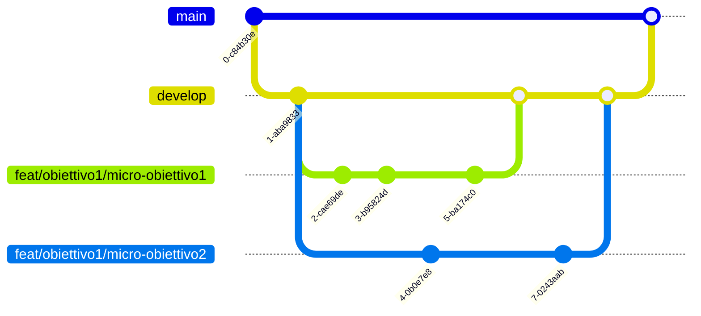

## Meeting e interazioni pianificate

- **Meeting iniziale:** analisi del dominio, stesura del product backlog e definizione dell'architettura di partenza.
- **Sprint Planning:** a inizio Sprint, per selezionare gli item del backlog, suddividerli in task, stimarli e assegnarli.
- **Sprint Review & Retrospective:** a fine Sprint, per verificare il raggiungimento (completo o parziale) dell'obiettivo e individuare cosa ha funzionato e cosa migliorare nello Sprint successivo.

## Product backlog e gestione degli obiettivi

In un meeting iniziale il gruppo ha cooperato realizzando il product backlog per l'analisi e la suddivisione preliminare del progetto, con lo scopo di definire l'architettura di partenza.  Ad ogni riunione di Sprint Planning, il team ha definito gli obiettivi, la relativa priorità e la stima del tempo necessario per completare le attività. Ogni obiettivo dello sprint è stato suddiviso in micro-obiettivi, che sono stati assegnati ad ogni membro del team in base alla sua disponibilità.  Alla fine di ogni sprint sono stati raggiunti dei risultati tangibili, in modo da poter portare miglioramenti visibili continui al progetto.

Il lavoro è stato suddiviso per aree, sviluppo del dominio di gioco da una parte e infrastruttura/networking dall'altra, permettendo uno sviluppo in parallelo con conflitti di merge minimi.

## GitHub Projects

Il team per la pianificazione e gestione dei task ha scelto di utilizzare [GitHub Projects](https://github.com/users/aleToro7/projects/1/views/2), uno strumento nativo e integrato nell'ecosistema GitHub, che consente di collegare direttamente il tracciamento delle attività al codice sorgente, alle issue e alle pull request. Sono state inoltre predisposte diverse viste per poter organizzare e gestire al meglio tutti i task.  Ognuno dei micro-obiettivi è stato quindi tracciato, il che ha permesso di monitorare lo stato di avanzamento del lavoro secondo il seguente flusso:

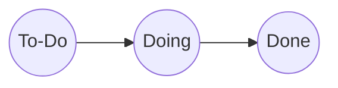

Appena definito, ogni micro-obiettivo è stato inserito come issue all'interno della task table. Ogni issue ha una descrizione, un assegnatario, uno stato (inizialmente `To-Do`), lo sprint di riferimento, delle etichette (es. priorità e tipo di issue) e infine il collegamento alla pull request (al momento della sua apertura).  Quando un membro del team inizia a lavorare su un micro-obiettivo, creandone il relativo branch, lo stato dell'issue deve essere modificato in `Doing`.  Per completare un micro-obiettivo in modo che questo potesse essere considerato `Done`, era necessario superare con esito positivo i jobs di controllo e la revisione da parte di un altro membro del team.

## Modalità di revisione in itinere dei task

### GitHub Actions

Scelto dal gruppo come soluzione per automatizzare attività legate al ciclo di vita del software, come l'esecuzione dei test e la compilazione del codice, direttamente all'interno del repository, ottenendo anche una conferma di riproducibilità in un ambiente diverso.  Sono stati utilizzati tre job:

- **Build:** Per compilare il codice sorgente.
- **Test:** Per eseguire la suite di test e verificare il corretto funzionamento.
- **Linting:** Per verificare, tramite `scalafmtCheckAll`, che tutto il codice rispetti le regole di formattazione.

Ognuno di essi esegue una serie di *step* sul proprio runner, per garantire la correttezza del codice sottoposto a pull request.  La pipeline viene avviata a ogni push e pull request verso `main` e `develop`; i tre job sono eseguiti in sequenza (Build → Test → Linting), per cui il fallimento di uno impedisce l'esecuzione dei successivi.

### Branch Protection Rules

Applicate ai branch `main` e `develop`:

- main: per il branch main è stato scelto di richiedere l'approvazione di tutti i membri non coinvolti nella pull request oltre al risultato positivo dei tre job (Build, Test e Linting) delle GitHub Actions.
- develop: a differenza del branch main, per fare il merge di una pull request su develop è richiesta una sola approvazione da parte degli altri membri del gruppo, rimangono comunque da superare con esito positivo le esecuzioni dei tre job.

Queste regole hanno permesso una collaborazione ordinata, garantendo che ogni modifica importante sia documentata, discussa e validata prima di entrare a far parte della versione stabile del progetto.

# Analisi dei requisiti

In questa sezione vengono descritti nel dettaglio il dominio ed i requisiti del progetto.

## Requisiti di business

L'obiettivo chiave del progetto è la realizzazione di **ScalaParty**: un videogioco multiplayer online di tipo arcade basato sul paradigma *last man standing* in cui i giocatori competono all'interno di arene bidimensionali  Il gioco è fortemente ispirato al titolo *Astro Party* di cui ne riprende pienamente le meccaniche di gioco.

Il sistema deve rispettare i seguenti vincoli di business:

- I giocatori competono all'interno di un'arena bidimensionale, controllando ciascuno una navicella spaziale in moto costante, di cui possono modificare la rotazione e sparare proiettili per colpire gli avversari.
- Il gioco deve essere fruibile direttamente tramite un comune browser web che permetta di accedere ad una partita e giocare con altri utenti.
- Nessuna registrazione deve essere richiesta, gli utenti si connetteranno e attenderanno che la prima lobby disponibile li inserisca automaticamente in una partita.
- Il sistema deve garantire la sincronizzazione in tempo reale dello stato della partita tra tutti i client connessi durante lo svolgimento del match.

## Modello del dominio

ScalaParty è un videogioco multigiocatore ambientato nello spazio. Ogni partita comprende fino a quattro giocatori, ognuno dei quali controlla una propria navicella spaziale all'interno di un'arena delimitata. Le navicelle si muovono costantemente nello spazio di gioco, poiché una navicella non può mai rimanere ferma: il giocatore può esclusivamente modificarne la direzione di rotazione.  
Durante la partita, le navicelle possono sparare proiettili per colpire gli avversari. Lo spazio di gioco è caratterizzato dalla presenza di muri fissi, che costituiscono ostacoli impenetrabili sia per le navicelle che per i proiettili.

Ogni navicella dispone di un livello di vita che diminuisce ad ogni danno subito, che può essere provocato dall'impatto diretto con un proiettile avversario o dallo scontro con un'altra navicella. Quando i punti vita si azzerano, la navicella viene distrutta ed è eliminata dalla partita. L'ultimo giocatore a rimanere in vita si aggiudica la vittoria.

Gli elementi concettuali e le entità che compongono il dominio di gioco sono i seguenti:

- **Partita (Match):** Rappresenta l'istanza di gioco attiva, caratterizzata da un'arena con confini definiti, una durata e un insieme di giocatori partecipanti.
- **Giocatore (Player):** L'utente collegato alla sessione, che detiene il controllo di una navicella all'interno dell'arena.
- **Navicella (Spaceship)**: La navicella controllata dal giocatore che naviga all'interno dell'arena.
- **Muro (Wall)**: Ostacolo che impedisce il passaggio di navicelle e proiettili attraverso di esso.
- **Proiettile (Bullet)**: Colpo sparato da una nevicella che causa danno da contatto ad altre navicelle avversarie.
- **Arena**: Spazio di gioco limitato in cui si sfidano le navicelle spaziali.

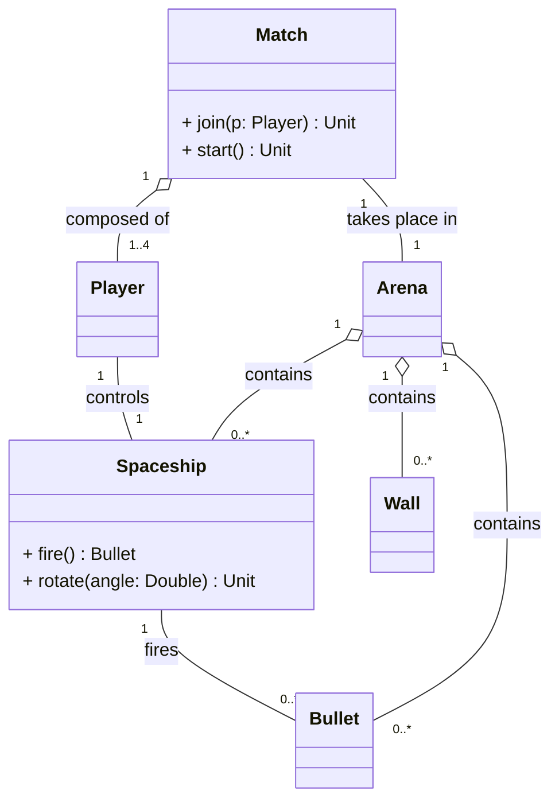

## Requisiti funzionali

In questa sezione vengono riportate le interazioni consentite agli utenti e i comportamenti che il sistema deve garantire per soddisfare le regole di gioco di **Scala Party**. Sono riportati, per ogni sezione, due tipi di requisiti:

- Requisiti obbligatori: condizioni da soddisfare necessariamente per garantire l'uscita del videogioco.
- Requisiti opzionali: obiettivi previsti per release future, non strettamente necessari nella prima fase di rilascio.

### Requisiti Utente

I requisiti utente descrivono tutte le possibili interazione dell'utente con il sistema di gioco, sia prima che durante la partita.

##### Requisiti Utente Obbligatori

- **Accesso alla Piattaforma (RFU1):** L'utente deve potersi connettere al sistema senza alcuna autenticazione tramite browser web, venendo accolto dal sistema di ingresso che ne gestisce l'accesso immediato o l'inserimento in una coda di attesa qualora le lobby attive o le stanze siano sature.
- **Partecipazione alla Partita (RFU2):** L'utente deve potersi unire a delle sessioni di gioco online, composte da un numero prefissato di partecipanti per match (fino a un massimo di quattro).
- **Controllo della Navicella (RFU3):** Durante la partita, l'utente deve poter ruotare la propria navicella spaziale in tempo reale, modificandone la direzione.
- **Permanenza nell'Arena (RFU4):** L'utente deve avere pieno accesso alla visione dell'arena e di tutti gli elementi che ne fanno parte per l'intera durata della partita.
- **Sparo (RFU5):** L'utente deve poter azionare il comando di sparo per rilasciare un proiettile nella direzione corrente della navicella da lui controllata. Il comando deve essere soggetto a un vincolo temporale di ricarica (cooldown) tra colpi consecutivi.

##### Requisiti Utente Opzionali

- **Visione Statistiche del Giocatore (RFU6):** Durante e dopo la partita, ciascun utente deve poter vedere statistiche sul suo comportamento durante la partita, riportanti: precisione, danni inflitti, colpi sparati nemici eliminati.
- **Visione Replay (RFU7):** Al termine della partita, l'utente può vedere la simulazione della stessa fino al momento a cui vi ha partecipato.

### Requisiti di Sistema

I requisiti di sistema descrivono le risposte automatiche, le regole di simulazione e la gestione dello stato eseguite dal software.

##### Requisiti Obbligatori

- **Movimento Continuo (RFS1):** Il sistema deve garantire che le navicelle si muovano costantemente inmoto rettilineo uniforme nello spazio di gioco a velocità prestabilita, impedendo che in qualsiasi momento possano fermarsi (a meno di collisioni che ne impediscano l'avanzamento).
- **Gestione Multi-partita (RFS2):** Il sistema deve essere in grado di ospitare, isolare e gestire simultaneamente più sessioni di gioco distinte e indipendenti tra loro.
- **Gestione dei Confini e degli Ostacoli (RFS3):** Il sistema deve confinare il moto delle entità entro il perimetro dell'arena e distruggere proiettili che impattano ostacoli o bordi, impedendo la compenetrazione dei muri.
- **Rilevamento Collisioni e Danni (RFS4):** Il sistema deve rilevare gli impatti tra tutte le entità presenti nell'arena, applicando, ove necessario, la conseguente riduzione degli eventuali punti vita alle entità coinvolte o colpite.
- **Eliminazione Navicelle (RFS5):** Il sistema deve rimuovere istantaneamente dall'arena le entità la cui salute si azzera o i cui giocatori interrompono la connessione/abbandonano il match.
- **Condizione di Vittoria (RFS6):** Il sistema deve monitorare costantemente le condizioni di arresto della simulazione e decretare la fine del match al verificarsi di uno dei seguenti esiti:
    - sopravvivenza di un unico vincitore
    - eliminazione simultanea di tutti i contendenti
    - esaurimento del tempo massimo limite stabilito e configurabile per la partita
- **Sincronizzazione in Tempo Reale (RFS7):** Il sistema deve aggiornare e sincronizzare lo stato della partita in tempo reale tra tutti i giocatori connessi, garantendo coerenza visiva e interattiva durante lo svolgimento del match.

##### Requisiti Opzionali

- **Generazione di Bonus (RFS8):** Il sistema deve poter generare casualmente all'interno dell'arena elementi bonus temporanei, in grado di conferire vantaggi speciali alle navicelle che li raccolgono.

### Requisiti Non Funzionali

I requisiti non funzionali definiscono le esigenze qualitative, le prestazioni e i vincoli operativi che il sistema deve soddisfare, focalizzandosi sul *come* il software si comporta piuttosto che sulle specifiche funzioni di gioco che deve implementare.

- **Prestazioni e Scalabilità (RNF1):** Il sistema deve garantire una frequenza fissa di avanzamento della simulazione di 60 tick al secondo (~16ms per tick)
- **Pulizia del Codice e Manutenibilità (RNF2):** Il codice sorgente del sistema deve essere scritto in modo chiaro, modulare e documentato, facilitando la manutenzione ed enfatizzando l'uso di pattern di progettazione e best practice consolidate.
- **Sicurezza e Protezione dei Dati (RNF3):** Il sistema non deve memorizzare né richiedere alcun dato identificativo personale o credenziale su supporti persistenti. Tutte le sessioni di gioco e le connessioni devono essere puramente volatili in memoria (zero data retention).
- **Estensibilità e Modularità (RNF4):** Il sistema deve essere progettato in modo altamente modulare, consentendo l'aggiunta di nuove funzionalità con minime modifiche al codice esistente.
- **Testabilità e Verificabilità (RNF5):** Il sistema deve essere progettato per facilitare la scrittura di test automatici, consentendo la verifica del corretto funzionamento delle funzionalità implementate. In particolare la copertura dei test unitari sulle linee di codice deve essere superiore al 90% del codice sorgente.
- **Tolleranza ai guasti di connessione (RNF6):** Il sistema deve isolare il ciclo di vita di ciascuna stanza di gioco: il rallentamento, l'errore o la disconnessione repentina di un client non devono propagare instabilità né degradare le prestazioni delle altre sessioni attive sul server.

### Requisiti di implementazione

- **Linguaggio e Compilatore (RI1):** Il sistema deve essere implementato interamente in **Scala 3** (target v3.3.x LTS)
- **Separazione dei moduli (RI2):** Il sistema deve essere strutturato in moduli separati per la logica di gioco e la gestione del server.
- **Assenza di Dipendenze nel modulo di logica (RI3):** Il modulo di logica deve essere quanto più possibile indipendente da librerie esterne.
- **Struttura del progetto (RI4):** Il progetto deve essere gestito tramite **sbt** e seguire una struttura multi-progetto esplicita, separando le configurazioni di dipendenze.

# Design Architetturale

In questo capitolo viene presentata l'architettura complessiva di ScalaParty, illustrando i principi guida che ne hanno determinato la struttura, i pattern architetturali adottati e la suddivisione del sistema in moduli indipendenti.

## Decomposizione in Moduli

Il progetto separa nettamente le responsabilità tra due macro-moduli principali, ciascuno con un ruolo ben definito:

1.  **`core`**: Rappresenta il nucleo computazionale e di dominio del videogioco. È progettato come una libreria pura e priva di dipendenze esterne. Racchiude lo stato del gioco, le entità, la fisica e la logica di simulazione.
2.  **`infrastructure`**: Costituisce il runtime del server, gestendo la comunicazione di rete, la concorrenza e l'orchestrazione dei match.

> **Nota**: Nel modulo `infrastructure` è presente anche il client web. Tale parte è a solo scopo di visualizzazione, ma non è in alcun modo parte del progetto universitario. Il client web è stato completamente generato, con largo uso di LLM, a partire dai DTO prodotti dal modulo `core` e non contiene alcuna logica di gioco.

## Relazione con l'Architettura Elm

In fase di progettazione concettuale, l'idea ispiratrice dell'architettura è stata l'**architettura Elm** (nota anche come pattern **Model-View-Update** o **MVU**), ampiamente diffusa nelle applicazioni funzionali.  Nel corso dello sviluppo, tuttavia, la classica architettura Elm è stata reinterpretata e adattata alle necessità di un videogioco multiplayer online in tempo reale.

L'essenza fondamentale del paradigma MVU è pienamente preservata all'interno del sistema:

- **Model**: È incarnato dallo stato del mondo nel modulo `core` (`GameWorld`) ed è rigorosamente immutabile: nessuna entità o componente viene mutata in-place durante la partita.
- **Update**: L'avanzamento del gioco è governato da una funzione di transizione pura incapsulata nel motore (`GameEngine.update`), priva di effetti collaterali.
- **Commands / Effetti**: Così come nel runtime di Elm gli effetti collaterali (I/O, timer, rete) sono segregati all'esterno del modello puro e gestiti tramite comandi asincroni, in ScalaParty ogni forma di side-effect è confinata nel modulo `infrastructure`.

### Variazioni Rispetto alla Classica Elm Architecture

Nonostante l'ispirazione concettuale, la nostra implementazione si discosta da una rigida architettura Elm per un paio di motivazioni tecniche principali, evidenziate dal confronto tra i due flussi orizzontali:

> **Flusso 1: Elm Architecture Classica**
> 
> ```mermaid
> flowchart LR
>     Msg["1. Evento Singolo<br/>(Msg discreto da UI)"] --"Model(t), msg"--> Update["2. Update Puro"]
>     Update --"Model(t+1)"--> View["3. Interfaccia utente<br/>(Model -> HTML)"]
> ```

> **Flusso 2: Architettura ScalaParty**
> 
> ```mermaid
> flowchart LR
>     Clock["1. Trigger Temporale"] --Tick Δt + Batch Comandi--> Pipeline["Pipeline di update"]
>     subgraph "2. Update del Modello"
>         direction LR
>         Pipeline --"Model(t), eventi"--> Adapter["Serializzatore DTO"]
>     end
>     Adapter --"DTO serializzati"--> Net["3.Broadcast sui client"]
> ```

- **Avanzamento a Tick Continuo**:
    - *In Elm classico*: l'applicazione evolve quasi esclusivamente in modo reattivo all'arrivo di singoli messaggi discreti (`Msg`) generati dall'utente.
    - *In ScalaParty*: trattandosi di un videogioco arcade con fisica e inerzia, il tempo ($\Delta t$) intercorso tra gli update rappresenta il fattore di avanzamento primario. Anche in assenza di input da parte dei giocatori, la simulazione deve progredire a frequenza fissa. L'`update` non riceve quindi un singolo evento isolato, ma un batch di comandi unito all'intervallo temporale trascorso.
- **Disaccoppiamento tramite DTO**:
    - *In Elm classico*: la funzione `view` risiede all'interno della medesima applicazione ed è una funzione pura che mappa direttamente lo stato in elementi grafici.
    - *In ScalaParty*: il sistema è distribuito, perciò il `core` non proietta direttamente l'interfaccia utente grafica. Invece, produce una rappresentazione intermedia serializzabile. Questa scelta disaccoppia completamente la simulazione interna da qualsiasi interfaccia utente, che sia un browser o un'interfaccia locale.

In sintesi, ScalaParty adotta una variante tick-based della Elm Architecture, che tenta di conservare ed adattare i vantaggi del paradigma MVU. Tali variazioni sono frutto di una scelta progettuale consapevole, fatta per garantire una totale separazione tra il modello e la sua rappresentazione.  Ad oggi, se si volesse realizzare un client nativo sarebbe sufficiente integrare un nuovo modulo di visualizzazione che si interfacci con il `core` esattamente come fa il modulo `infrastructure`, senza alcuna modifica al modello di dominio o alla logica di simulazione.

## Modulo Core

Il modulo *core* costituisce il nucleo computazionale di ScalaParty. È stato ideato come modulo separato per essere completamente slegato da dipendenze esterne, operando come libreria pura ed indipendente, eseguibile utilizzando come unica dipendenza la libreria standard di Scala 3.

### Il mondo come macchina a stati

L'intero ciclo di vita di una partita è modellato attorno all'idea di un'evoluzione discreta nel tempo del mondo di gioco. Per "mondo" si intende lo stato corrente del gioco, cioè l'insieme di tutti le entità attive e degli eventi generati in quel preciso istante. Questa modellazione rappresenta il mondo a tutti gli effetti come una macchina a stati deterministica, la cui funzione di transizione è la seguente:

$$
\text{World}_{t'} = \delta(\text{World}_t, \text{Input}, \Delta t)
$$

Dove:

- $\text{World}_{t}$ rappresenta la fotografia del mondo di gioco all'istante $t$.
- $\text{Input}$ è l'elenco dei comandi inviati dai giocatori durante l'intervallo temporale.
- $\Delta t$ è l'intervallo di tempo trascorso tra $t$ e $t'$, ossia il tempo trascorso dall'ultimo aggiornamento.

La definizione dell'evoluzione del mondo come un insieme di stati determinati da input e tempo trascorso permette di definire l'intera partita come una pipeline su cui eseguono vari filtri che evolvono e trasformano il mondo. Questo approccio rende una partita completamente riproducibile: dato un mondo iniziale e la sequenza temporale dei comandi inviati, l'evoluzione del mondo è perfettamente deterministica.

### Entity component system

L'architettura che, dal nostro punto di vista, si adatta perfettamente alla definizione di un videogioco come pipeline di stati è descritta dal pattern *Entity component system* (ECS). Questo pattern non solo è perfettamente in linea con l'idea di pipeline, ma massimizza l'estensibilità e la manutenibilità del gioco favorendo al contempo un moderno e pulito utilizzo del paradigma funzionale.

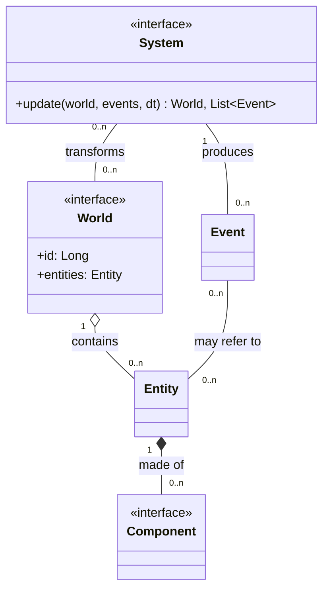

L'architettura ECS si fonda, come suggerito dal nome, su tre principali concetti:

- **Entità**: rappresenta un generico oggetto facente parte del mondo di gioco.
- **Componente**: cattura e astrae un aspetto o un comportamento caratterizzante di un'entità, detenendone i dati rappresentativi. Un facile esempio è un possibile *PositionComponent*, che incapsuli la posizione dell'entità all'interno del mondo.
- **Sistema**: un sistema si occupa di processare le entità per applicarvi un preciso effetto. Durante la sua esecuzione ogni sistema filtra le entità aventi dei particolari componenti necessari alla sua esecuzione. Un semplice esempio è un possibile *PhysicsSystem* che filtri tutte le entità aventi posizione e velocità applicando lo spostamento.

#### ECS come pipeline

L'esecuzione sequenziale dei sistemi si sposa nativamente con il pattern architetturale Pipe-and-Filter, dove i *filtri* sono i singoli sistemi, ciascuno conforme al principio di singola responsabilità (SRP).  La Pipe è rappresentata dal flusso dei dati immutabili trasmessi da un filtro all'altro, ossia la coppia di mondo ed eventi prodotti.

Poiché ogni sistema aggiorna il mondo in modo indipendente, la comunicazione tra di essi è mediata dagli eventi: ogni sistema produce in output una nuova versione immutabile del mondo e un insieme di eventi verificatisi durante l'aggiornamento. In questo modo, qualsiasi sistema successivo nella pipeline può reagire a tali eventi. Tale comunicazione è necessaria per garantire il principio di singola responsabilità sui sistemi, che possono occuparsi di una sola operazione delegando le correlate ad altri sistemi. Si pensi ad esempio ad un sistema di collisione: se non fosse in grado di comunicare eventi di collisione ad altri sistemi dovrebbe necessariamente essere lui a muovere le entità ed eventualmente applicare danni da collisioni.

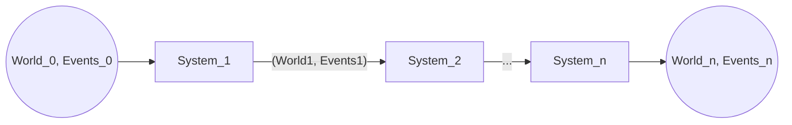

#### Motivazioni della scelta

La scelta di questo pattern ha molteplici motivazioni. Innanzitutto questo pattern è ben conosciuto, consolidato e studiato nella branca dello sviluppo dei videogiochi. La documentazione online è tantissima e permette uno studio ed un'analisi rapida e precisa, diminuendo il rischio di errori o complessità accidentale. Questo è particolarmente importante a fronte di un progetto con un budget di tempo limitato per la realizzazione. In secondo luogo i benefici che se ne traggono sono ben intuibili:

- **Superamento dell'ereditarietà**: la composizione è ormai spesso consigliata per superare la rigidità di un sistema basato su ereditarietà. Evitare gerarchie rigide impedisce il la proliferazione delle classi e semplifica l'introduzione di entità con combinazioni arbitrarie di comportamenti.
- **Estensibilità**: grazie alla composizione, aggiungere una nuova meccanica di gioco spesso richiede pochissime linee di codice. Se non esiste ancora un componente necessario al nuovo comportamento è sufficiente definirlo, implementare un sistema dedicato nella pipeline e l'implementazione è conclusa senza aver toccato nulla del codice preesistente.
- **Testabilità**: sfruttando il paradigma funzionale è possibile spostare l'intera logica di gioco all'interno dei sistemi. Ciò significa costruire sistemi come funzioni pure e prive di side-effect: se sappiamo l'input, l'output è perfettamente deterministico. Pertanto, se c'è un errore in un comportamento specifico, tale irregolarità è immediatamente riconducibile ad un preciso sistema e lo unit testing diventa banale ed affidabile.
- **Rapidità di sviluppo**: la consapevolezza che qualsiasi comportamento del gioco segua il medesimo flusso di sviluppo, beneficia fortemente non solo la struttura del codice, ma anche il team. Ogni nuova feature si sviluppa nella medesima metodologia: definiamo un componente, scriviamo un test del sistema di riferimento, lo implementiamo e, se i test passano, possiamo integrarlo alla pipeline.##

## Modulo Infrastructure

In questa sezione viene descritto il design architetturale della parte **server** di ScalaParty, contenuta nel modulo sbt `infrastructure`. Il server ha il compito di accettare le connessioni dei giocatori, organizzarli in partite, eseguire la simulazione di ciascuna partita in modo autoritativo e sincronizzare in tempo reale lo stato di gioco con tutti i client connessi.

### Architettura esagonale

Il server è strutturato secondo il pattern **Ports & Adapters**, noto anche come *architettura esagonale*.  L'idea alla base del pattern è separare la logica applicativa dalle tecnologie con cui comunica con l'esterno (rete, protocolli, formati di serializzazione):

- la logica applicativa sta al centro dell'esagono e interagisce con il mondo esterno solo attraverso delle **porte**, cioè interfacce che descrivono *cosa* serve, senza specificare *come* viene realizzato;
- le **porte in ingresso** (*driving ports*) espongono i casi d'uso che il mondo esterno può invocare;
- le **porte in uscita** (*driven ports*) descrivono i servizi che l'applicazione richiede all'esterno;
- gli **adapter** sono le implementazioni concrete che collegano una specifica tecnologia (nel nostro caso le WebSocket) alle porte.

Questa organizzazione si riflette direttamente nei package del modulo `infrastructure`:

| Package | Ruolo nel pattern | Contenuto |
| --- | --- | --- |
| `ports` | Porte (interfacce) | `AccessPort`, `CommandPort` (ingresso); `MatchEventPublisher`, `PlayerNotifier` (uscita) |
| `application` | Logica applicativa (centro) | `MatchCoordinator`, `QueuedLobbyManager`, `MatchRunner`, `GameCommandService`, `CommandAdapter` |
| `network` | Adapter tecnologici | `WebSocketServer` (adapter in ingresso), `WebSocketBroadcaster`, `WebSocketNotifier` (adapter in uscita), `ConnectionRegistry`, `ClientDisconnectionLogger` |
| `network.dto` | Formato dei messaggi di rete | `PlayerInput`, `ProtocolCodecs` |
| `model` | Value object del server | `PlayerId`, `MatchId`, `ActiveMatch`, `JoinOutcome`, `LeaveOutcome`, `Admission`, `ServerMessage` |
| (root) | Composition root | `ServerApp` |

Le porte sono definite in stile **tagless final**, cioè sono parametrizzate su un generico tipo di effetto `F[_]`:

```scala
trait AccessPort[F[_]]:
  def joinLobby(playerId: PlayerId): F[Admission]
  def leaveLobby(playerId: PlayerId): F[Unit]

trait CommandPort[F[_]]:
  def handleCommand(matchId: MatchId, playerId: PlayerId, command: PlayerInput): F[Unit]

trait MatchEventPublisher[F[_]]:
  def broadcastState(matchId: MatchId, state: MatchState): F[Unit]
  def broadcastEvent(matchId: MatchId, event: GameEvent): F[Unit]

trait PlayerNotifier[F[_]]:
  def send(playerId: PlayerId, message: ServerMessage): F[Unit]
```

Le due porte in uscita sono state separate in base al **destinatario** del messaggio:

- `MatchEventPublisher` si rivolge a *tutti* i partecipanti di una partita e trasporta lo stato di gioco autoritativo;
- `PlayerNotifier` si rivolge a un *singolo* giocatore e trasporta le notifiche di lobby (posizione in coda, inizio e fine partita). Questa distinzione serve perché un giocatore in coda non appartiene ancora a nessuna partita e non può essere raggiunto tramite il broadcast.

Allo stesso modo, le porte in ingresso sono state separate per **fase del ciclo di vita** del giocatore: `AccessPort` gestisce l'ingresso e l'uscita dal gioco (matchmaking), mentre `CommandPort` gestisce i comandi impartiti durante una partita.

### Vantaggi del pattern

L'adozione dell'architettura esagonale ha portato i seguenti vantaggi, in linea con i requisiti non funzionali del progetto:

- **Isolamento della logica applicativa.** Il matchmaking (`QueuedLobbyManager`) e il game loop (`MatchRunner`) non dipendono da http4s né dal formato dei frame WebSocket: inviano i messaggi verso l'esterno solo attraverso le porte in uscita, ignorando come questi vengano serializzati e consegnati. Allo stesso modo, l'adapter `WebSocketServer` conosce soltanto le porte `AccessPort` e `CommandPort`, senza sapere quali componenti le implementino.
- **Testabilità.** Poiché le porte in uscita sono interfacce, nei test vengono sostituite da implementazioni fittizie che registrano i messaggi inviati (ad esempio `RecordingNotifier` e `CountingPublisher` in `MatchCoordinatorSpec`). In questo modo è possibile verificare l'intero ciclo coda → partita → fine partita senza aprire alcuna connessione di rete. Le regole di matchmaking, essendo funzioni pure su uno stato immutabile, sono verificabili in isolamento.
- **Sostituibilità degli adapter.** Un nuovo canale in uscita può essere aggiunto implementando `MatchEventPublisher` o `PlayerNotifier`, e un nuovo adapter in ingresso può invocare gli stessi casi d'uso tramite `AccessPort` e `CommandPort`, senza modificare il matchmaking né il game loop.
- **Evoluzione incrementale.** Durante lo sviluppo il gestore delle lobby è stato sostituito: il `LobbyManager` iniziale (un'unica lobby che si riempie fino a quattro giocatori) è stato rimpiazzato da `QueuedLobbyManager` + `MatchCoordinator` (coda FIFO e più stanze in parallelo). Il contratto di `AccessPort` si è evoluto di conseguenza: `leaveLobby` non richiede più l'identificativo della partita, e `joinLobby` è passato dal restituire la partita assegnata (`MatchId`) al restituire l'esito dell'ammissione (`Admission`). Poiché l'adapter WebSocket dipendeva soltanto dalla porta, è stato sufficiente adeguarlo alle nuove firme, senza che dovesse conoscere il componente che la implementa.
- **Separazione delle responsabilità.** Ogni componente ha un compito ben circoscritto: chi gestisce le socket non conosce le regole del matchmaking, chi decide chi gioca non sa come far avanzare una partita, e chi fa avanzare la partita non conosce le regole del gioco, delegate al `core`.
- **Coerenza con il paradigma funzionale.** Combinato con il tagless final e con le primitive di cats-effect, il pattern consente di mantenere pure le parti che contengono le regole: le transizioni di stato del matchmaking (`WaitingRoom`) e l'intera logica di gioco del `core`. Gli effetti (fiber, stream, accesso alla rete) sono espressi come valori `IO` e concentrati nel coordinatore delle partite, nel game loop e negli adapter (approccio *functional core, imperative shell*).

### Diagrammi del server

#### Diagramma dei componenti

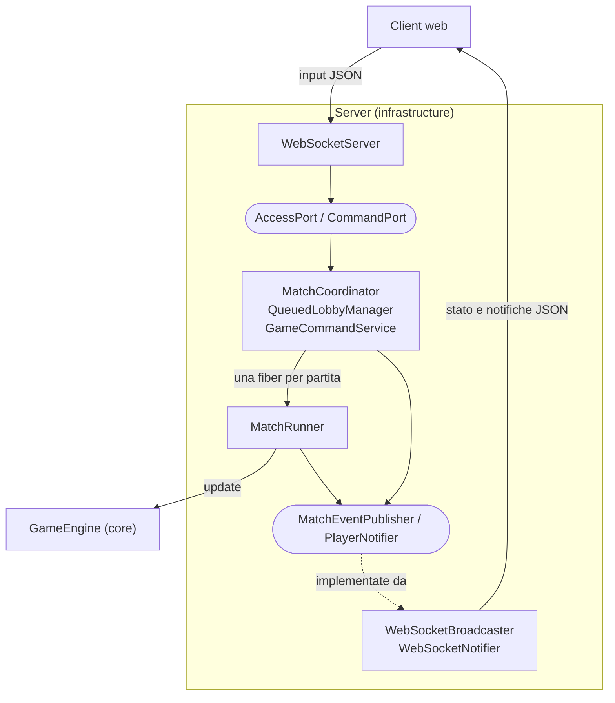

I nodi arrotondati sono le porte; le relazioni di dettaglio (incluso il `ConnectionRegistry`) sono riportate nel diagramma delle classi.

#### Diagramma delle classi del server

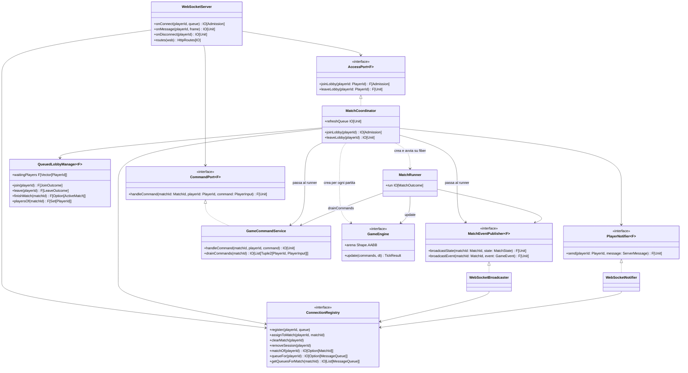

#### Ciclo di vita di una partita

Il seguente diagramma di sequenza riassume l'interazione tra i componenti, dalla connessione dei giocatori alla conclusione della partita.  Per semplicità i messaggi verso il client sono mostrati come diretti, anche se passano per gli adapter in uscita, e gli input sono raccolti dal `GameCommandService`, da cui il runner li preleva a ogni tick.

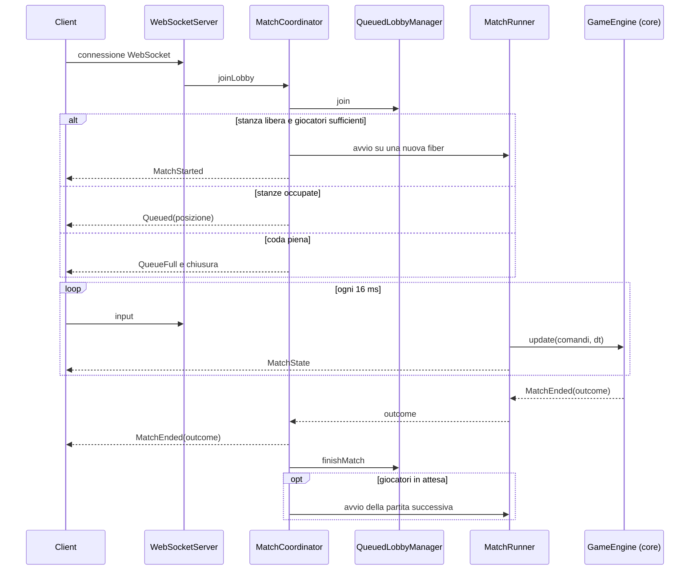

# Design di Dettaglio

In questo capitolo viene approfondita nel dettaglio la modellazione del sistema, declinando uno per volta tutti i concetti cardine descritti ad ad alto livello nel capitolo di design architetturale.  La trattazione è organizzata specularmente alla suddivisione del sistema nelle due sotto-sezioni principali, `core` e `infrastructure`, con l'obiettivo di fornire una visione completa della struttura interna del progetto.

## Modulo Core

In questo capitolo viene approfondita la progettazione di dettaglio del modulo **core**, illustrando l'organizzazione modulare dei package, la modellazione delle strutture dati, i design pattern adottati e gli algoritmi matematici che governano la simulazione di gioco.

### Organizzazione del Codice e Struttura dei Package

Il modulo `core` è organizzato secondo una struttura in cui ciascun package racchiude una precisa area di responsabilità:

```text
com.unibo.scalaparty.core
├── dto
├── ecs
│   └── systems
├── engine
│   └── input
├── geometry
└── model
    └── map
```

La suddivisione risponde ai seguenti criteri di separazione delle responsabilità:

- **`core.engine`**: Contiene la facciata principale del motore di gioco e il sottosistema di elaborazione degli input (`core.engine.input`). Questo package è l'unico necessario per avviare la simulazione e aggiornare lo stato del mondo di gioco dall'esterno del modulo.
- **`core.ecs`**: Definisce il cuore del modello dell'Entity-Component-System: contiene l'astrazione del mondo, i componenti e le entità.
- **`core.ecs.systems`**: Raggruppa la famiglia dei sistemi che compongono la pipeline di simulazione, ciascuno specializzato su un singolo aspetto fisico o di gameplay.
- **`core.geometry`**: Fornisce le funzioni e le strutture dati matematiche necessarie per la modellazione della geometria 2D.
- **`core.model`**: Modella i concetti statici e le configurazioni del dominio come le impostazioni di gioco, gli eventi, la mappa di gioco e l'output della partita.
- **`core.dto`**: Definisce i contratti di trasferimento dati verso l'esterno.

### Modellazione del Mondo e dell'ECS

A livello di dettaglio, il pattern ECS si concretizza in una **struttura dati tabulare immutabile** che indicizza lo stato globale della partita.  
L'entità non è modellata come una classe concreta come avverrebbe in un classico approccio orientato agli oggetti: sfruttando il paradigma funzionale, l'entità è rappresentata come un semplice identificatore numerico.  Essendo un semplice identificatore, un'entità non possiede né campi né metodi di logica: il suo unico ruolo di design è fungere da chiave primaria relazionale all'interno del mondo.

Il mondo di gioco (`GameWorld`) funge da contenitore immutabile che permette di effettuare query efficienti sui componenti associati alle entità.

- **Struttura a Dizionario**: Lo stato è organizzato in una tabella hash immutabile che mappa ciascun identificatore alla lista dei componenti ad esso associati. L'obiettivo è garantire l'accesso rapido e sicuro ai componenti di ciascuna entità.
- **Operazioni Immutabili**: L'aggiunta, rimozione o sostituzione di componenti restituiscono costantemente una nuova istanza di `GameWorld`, garantendo il determinismo e l'assenza di effetti collaterali nello stato condiviso.
- **Sistema di Query**: Per consentire ai sistemi di interrogare il mondo cercando solo i componenti rilevanti per la propria elaborazione, `GameWorld` espone query che permettono di filtrare i componenti in base al loro tipo, restituendo solo le entità che possiedono i componenti richiesti.

La struttura del mondo è in tutto e per tutto simile a un database relazionale, in cui le entità fungono da chiavi primarie e i componenti da colonne. Seppur non adottato nel progetto per motivi di tempo, è possibile estendere il modello con un motore di query simile a SQL o LINQ per interrogare il mondo in modo dichiarativo.

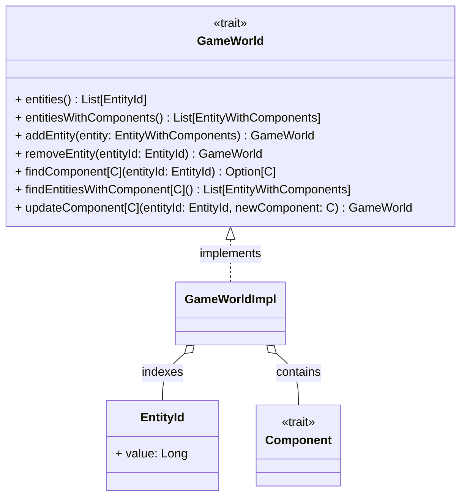

### Gerarchia dei Componenti e Invarianti di Dominio

Tutti i componenti del gioco sono modellati come strutture dati pure che estendono il trait `Component`. Ciascun componente modella una singola proprietà dell'entità, incapsulando i dati necessari per la realizzazione del comportamento desiderato.

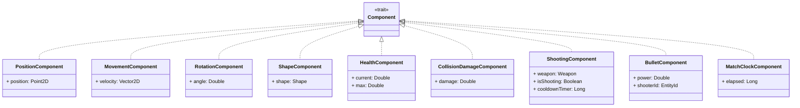

#### Dummy Entity e Componenti Logici

Tramite i componenti nel progetto sono state implementate anche delle *dummy entity* che non rappresentano oggetti fisici nel mondo di gioco, ma servono a modellare concetti astratti come il tempo globale della partita. Ad esempio, il componente `MatchClockComponent` è associato a un'entità speciale che non ha forma geometrica né posizione nello spazio, ma serve a registrare il tempo trascorso dall'inizio della partita in modo da terminarla quando il timer scade.  Questa logica di modellazione consente di trattare uniformemente tutti i concetti del dominio come entità, senza la necessità di introdurre strutture dati speciali o gestioni separate per concetti astratti.

### Sistemi di Gioco e Combinator Pattern

Ogni regola della fisica o del gameplay è incapsulata in un oggetto conforme al trait `WorldSystem`, modellato concettualmente come una funzione di trasformazione pura:

$$
\text{update} : (\text{GameWorld}, \text{Set}[\text{GameEvent}], \Delta t) \to (\text{GameWorld}, \text{Set}[\text{GameEvent}])
$$

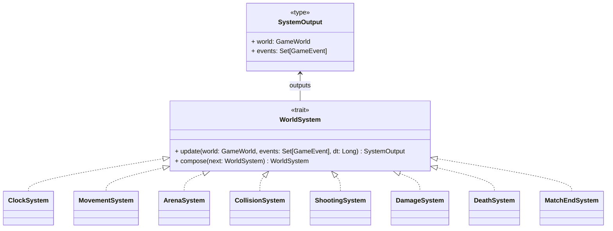

#### Combinator Pattern e Pipeline Algebrica

Per consentire la composizione modulare dei sistemi, il trait `WorldSystem` implementa il **Combinator Pattern** mediante l'operatore compose (`>>`). La composizione inserisce l'output del primo sistema (mondo aggiornato e nuovi eventi generati) come input al sistema successivo:

$$
\text{Pipeline} = \text{Clock} \gg \text{Movement} \gg \text{Arena} \gg \text{Collision} \gg \text{Shooting} \gg \text{Damage} \gg \text{Death} \gg \text{MatchEnd}
$$

Questa composizione algebrica consente di costruire la pipeline di simulazione in modo dichiarativo, senza dover iterare manualmente su una lista di sistemi.  Inoltre, realizzare una pipeline come composizione di sistemi enfatizza ed impone il rispetto dell'ordine di esecuzione, che è fondamentale per la correttezza della simulazione.  Diversamente, sarebbe necessario utilizzare una lista ordinata, che in ogni caso renderebbe l'ordine di esecuzione implicito.

Di seguito sono elencati i sistemi che compongono la pipeline ordinata di simulazione, con una breve descrizione della loro responsabilità:

1.  **ClockSystem**: Avanza il tempo globale registrato nel `MatchClockComponent`.
2.  **MovementSystem**: Applica gli spostamenti $\vec{p}_{t+1} = \vec{p}_t + \vec{v} \cdot \Delta t$ per tutte le entità dotate di velocità.
3.  **ArenaSystem**: Convalida il posizionamento spaziale rispetto al perimetro dell'arena: rimuove i proiettili che superano i bordi e riposiziona le navicelle che sconfinano all'interno dell'arena.
4.  **CollisionSystem**: Rileva e risolve le collisioni tra entità, generando eventi di contatto per i sistemi successivi.
5.  **ShootingSystem**: Gestisce il timer di ricarica delle armi e posiziona nello spazio i nuovi proiettili generati.
6.  **DamageSystem**: Legge gli eventi di collisione e riduce la salute delle entità coinvolte, eliminando i proiettili che impattano ostacoli o bersagli.
7.  **DeathSystem**: Rimuove dal mondo le entità la cui salute si azzera, notificando il rispettivo evento di morte.
8.  **MatchEndSystem**: Valuta le condizioni terminali della partita (sopravvivenza dell'ultimo giocatore o scadenza del tempo) ed emette l'evento conclusivo di match terminato.

### Rilevamento e Risoluzione Collisioni

Il sottosistema di collisione scompone la risoluzione fisica degli urti in due problemi distinti:

1.  **Rilevamento**: Determina se due entità collidono.
2.  **Risoluzione**: Calcola lo spostamento necessario per separare le entità e applica lo spostamento minimo necessario per risolvere la collisione.

Tale distinzione è necessaria per ottimizzare le prestazioni, poiché la gestione delle collisioni è una delle operazioni più costose della simulazione. Pertanto, il semplice rilevamento deve essere ottimizzato per scartare rapidamente le coppie di entità che non collidono, evitando calcoli troppo complessi tra forme geometriche troppo distanti.

#### Rilevamento: Separating Axis Theorem (SAT)

Poiché le navicelle sono rappresentate tramite triangoli, la risoluzione delle collisioni è implementata tramite il **Separating Axis Theorem (SAT)**, il quale stabilisce che due forme geometriche convesse non collidono se esiste almeno una retta (asse di separazione) su cui le proiezioni scalari delle due figure non si sovrappongono.

L'algoritmo opera a due fasi per massimizzare l'efficienza:

1.  Test preliminare rapido di intersezione tra le bounding box delle entità: se non si sovrappongono, la coppia viene immediatamente scartata senza eseguire calcoli complessi.
2.  Solo se i bounding box si intersecano, viene eseguito il test SAT completo, calcolando le proiezioni scalari delle forme geometriche sugli assi normali ai lati di ciascuna figura. Se tutte le proiezioni si sovrappongono le entità collidono, altrimenti la coppia viene scartata.

#### Risoluzione: Minimum Translation Vector (MTV)

In assenza di assi separatori, l'asse con la minima sovrapposizione scalare definisce la direzione e il modulo del vettore di minima penetrazione (**MTV**). La gestione di separazione distingue due strategie, in base allo stato di mobilità delle entità coinvolte:

- **Dinamico vs Statico** (Navicella vs Muro): La navicella assorbe interamente lo spostamento inverso lungo l'MTV:
    
    $$
    \Delta \vec{p}_{\text{actor}} = -\text{MTV}
    $$
    
- **Dinamico vs Dinamico** (Navicella vs Navicella): Entrambe le entità sono mobili; la separazione viene ripartita equamente al $50\%$ in direzioni opposte:
    
    $$
    \Delta \vec{p}_{\text{actor}} = -0.5 \cdot \text{MTV}, \qquad \Delta \vec{p}_{\text{target}} = +0.5 \cdot \text{MTV}
    $$
    

### Elaborazione Input

L'interazione dei giocatori con il mondo di gioco avviene tramite comandi discreti, che vengono accumulati in un buffer e processati in batch ad ogni frame. Tali comandi devono essere eseguiti in modo deterministico e sequenziale, prima dell'esecuzione della pipeline di simulazione, per garantire che l'input dei giocatori sia correttamente applicato allo stato del mondo.

L'esecuzione dei comandi viene eseguita tramite un `InputGateway` che sfrutta il pattern *Strategy* fungendo da semplice dispatcher e delegando l'elaborazione di ciascun comando al rispettivo `CommandExecutor`.  Ogni `CommandExecutor` è una funzione pura di elaborazione del mondo, che riceve in input lo stato del mondo e il comando da eseguire, restituendo un nuovo stato aggiornato in modo simile a quanto avviene per i sistemi di gioco.

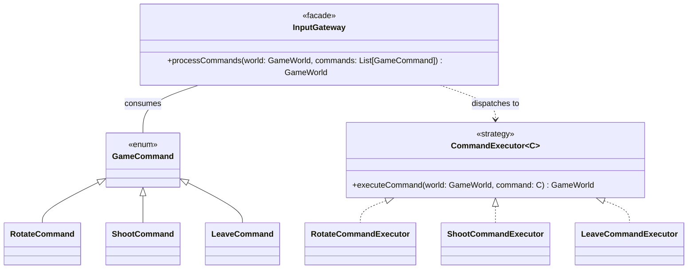

### Livello DTO e Disaccoppiamento dal Rendering

A differenza del modello ECS classico, il modulo core non espone direttamente le entità del mondo all'esterno. Tale scelta di design è stata adottata per disaccoppiare il modello di dominio interno alla simulazione dalla rappresentazione visuale necessaria al rendering sul client web.

In questo modo, qualsiasi rendering engine può essere integrato senza dover conoscere la struttura interna del mondo di gioco, limitandosi a consumare i dati forniti dal modulo core.  
Ciascun DTO è una struttura dati piatta e serializzabile che rappresenta tutti gli aspetti necessari al rendering di ogni singola entità, senza alcuna necessità di conoscere come il modulo gestisca l'aggiornamento di questi dati.  
Il `GameEngine`, al termine di ciascun update della simulazione, genera un `TickResult` contenente il mondo serializzato in forma di DTO e l'insieme degli eventi generati durante il tick.

## Modulo Infrastructure

In questo capitolo viene approfondita la progettazione di dettaglio del modulo **infrastructure**, che realizza il server di gioco. Il capitolo illustra l'organizzazione dei package, la modellazione delle strutture dati e i design pattern adottati.

### Organizzazione del Codice e Struttura dei Package

Il modulo `infrastructure` è organizzato secondo una struttura in cui ciascun package racchiude una precisa area di responsabilità:

```text
com.unibo.scalaparty.infrastructure
├── ServerApp
├── application
├── model
├── network
│   └── dto
└── ports
```

La suddivisione risponde ai seguenti criteri di separazione delle responsabilità:

- **`infrastructure`** (radice): contiene soltanto `ServerApp`, il punto di ingresso del server. È la *composition root* dell'applicazione: qui vengono istanziati e collegati tra loro tutti i componenti che restano attivi per l'intera vita del server, e vengono definiti i parametri di capacità del server (giocatori per partita, partite giocate contemporaneamente, dimensione massima della coda).
    
- **`infrastructure.ports`**: definisce le interfacce che delimitano la logica applicativa. Le porte in ingresso sono `AccessPort` e `CommandPort`, quelle in uscita `MatchEventPublisher` e `PlayerNotifier`.
    
- **`infrastructure.application`**: raccoglie i servizi che realizzano i casi d'uso del server:
    
    - il matchmaking (`QueuedLobbyManager`);
    - il coordinamento delle partite (`MatchCoordinator`);
    - il game loop (`MatchRunner`);
    - il buffer dei comandi (`GameCommandService`);
    - la traduzione degli input di rete in comandi di gioco (`CommandAdapter`).
    
    Contiene inoltre `LobbyManager`, la prima versione del gestore delle lobby, non più utilizzata dal server.
    
- **`infrastructure.model`**: modella i concetti propri del server, indipendenti dal protocollo di rete: gli identificativi di giocatori e partite, le partite in corso, gli esiti delle operazioni di matchmaking e i messaggi di lobby destinati ai singoli giocatori.
    
- **`infrastructure.network`**: contiene gli adapter WebSocket (`WebSocketServer` in ingresso, `WebSocketBroadcaster` e `WebSocketNotifier` in uscita), il registro delle connessioni attive (`ConnectionRegistry`) e il logger che gestisce le disconnessioni dei client (`ClientDisconnectionLogger`).
    
- **`infrastructure.network.dto`**: definisce il formato dei messaggi scambiati con i client, cioè i comandi in ingresso (`PlayerInput`) e i codec JSON (`ProtocolCodecs`).
    

### Modellazione delle Strutture Dati

Le strutture dati del server sono **immutabili** (case class, enum e opaque type). Fanno eccezione le code dei messaggi in uscita (`Queue` di cats-effect), strutture concorrenti a cui più componenti aggiungono messaggi.  Il resto dello stato condiviso tra i componenti, che evolve nel tempo, è racchiuso in un `Ref` di cats-effect: un riferimento che contiene un valore immutabile e lo sostituisce in modo atomico a ogni aggiornamento.

#### Identificativi

- **`PlayerId`** e **`MatchId`** sono *opaque type* definiti su `UUID`. Il compilatore li considera tipi distinti, mentre a runtime coincidono con un semplice `UUID`. Un `PlayerId` viene generato casualmente a ogni nuova connessione WebSocket. Un `MatchId` viene generato dal gestore della coda a ogni operazione che potrebbe avviare una partita, e viene effettivamente utilizzato solo se la partita inizia.
- **`PlayerEntityMapping`** associa ogni giocatore all'identificativo della navicella che controlla. Viene costruita all'avvio di ogni partita, e a ciascun giocatore viene comunicato l'identificativo della propria navicella.

#### Stato del matchmaking

Lo stato del matchmaking è modellato da due strutture:

- **`ActiveMatch(matchId, players: Set[PlayerId])`**: una partita in corso con i giocatori che vi partecipano;
- **`WaitingRoom(queue: Vector[PlayerId], active: Map[MatchId, ActiveMatch])`**: la coda dei giocatori in attesa, in ordine di arrivo, insieme alle partite in corso.

`WaitingRoom` rispetta i seguenti invarianti:

- un giocatore non si trova mai contemporaneamente in coda e in una partita, né in più di una partita;
- le partite in corso non sono mai più di `maxMatches`, e i giocatori in coda non sono mai più di `maxQueued`;
- ogni partita inizia con esattamente `playersPerMatch` giocatori. Il gruppo è fissato all'avvio e può soltanto ridursi, per effetto delle disconnessioni.

La coda è un `Vector` perché le operazioni necessarie, cioè l'inserimento in fondo e il prelievo di un gruppo dalla testa (`splitAt`), sono efficienti su questa struttura. I partecipanti di una partita sono invece un `Set`, perché non hanno un ordine e lo stesso giocatore non può comparire due volte.

#### Registro delle connessioni

Per ogni giocatore connesso, il `ConnectionRegistry` mantiene una `Session(matchId: Option[MatchId], queue: MessageQueue)`. L'intero stato del registro è una mappa `Map[PlayerId, Session]`.

- `MessageQueue = Queue[IO, WebSocketFrame]` è la coda dei messaggi in uscita verso quel client.
- Il campo `matchId` è opzionale perché una connessione non coincide con la partita. Il giocatore viene registrato senza partita al momento della connessione, viene associato a una partita quando questa inizia e ne viene sganciato quando termina, senza che la connessione venga chiusa.

#### Sessione di partita e buffer dei comandi

- **`MatchSession`** raccoglie i dati con cui viene creato il runner di una partita: l'identificativo della partita e l'associazione tra giocatori e navicelle (`PlayerEntityMapping`).
- **`CommandBuffer = Map[MatchId, List[(PlayerId, PlayerInput)]]`** contiene, per ogni partita, i comandi ricevuti dai giocatori e non ancora elaborati, nell'ordine in cui sono arrivati.
- Il coordinatore delle partite tiene traccia delle fiber in esecuzione con una mappa `Map[MatchId, FiberIO[Unit]]`, che gli permette di fermare una partita quando tutti i suoi giocatori la abbandonano.

#### Esiti e messaggi come ADT

Gli esiti delle operazioni e i messaggi scambiati con i client sono modellati come **tipi algebrici** (ADT). Quasi tutti sono enum con un caso per ogni situazione possibile, così che ogni caso sia esplicito: il compilatore segnala con un warning i `match` che non li gestiscono tutti. `LeaveOutcome` è invece una case class, che riporta insieme i due possibili effetti dell'uscita di un giocatore.

| Tipo | Casi | Utilizzo |
| --- | --- | --- |
| `Admission` | `Admitted`, `Rejected` | Risposta di `AccessPort.joinLobby` all'adapter WebSocket |
| `JoinOutcome` | `Playing(activeMatch)`, `Queued(playersAhead)`, `Rejected` | Esito dell'ingresso di un giocatore in `QueuedLobbyManager` |
| `LeaveOutcome` | campi `disbanded: Option[MatchId]` e `started: Option[ActiveMatch]` | Effetti dell'uscita di un giocatore sulle partite |
| `ServerMessage` | `Queued(playersAhead)`, `QueueFull`, `MatchStarted(players, you)`, `MatchEnded(outcome)` | Notifiche di lobby inviate a un singolo giocatore |
| `PlayerInput` | `Rotate(angle)`, `Shoot` | Comandi inviati dal client durante la partita |

`JoinOutcome` e `Admission` descrivono lo stesso evento a due livelli diversi. `JoinOutcome` contiene tutte le informazioni necessarie al coordinatore. L'adapter WebSocket riceve invece soltanto `Admission`, perché l'unica cosa che deve sapere è se mantenere aperta la connessione oppure chiuderla. Tutto il resto (posizione in coda, inizio della partita) viene comunicato direttamente al giocatore tramite `PlayerNotifier`.

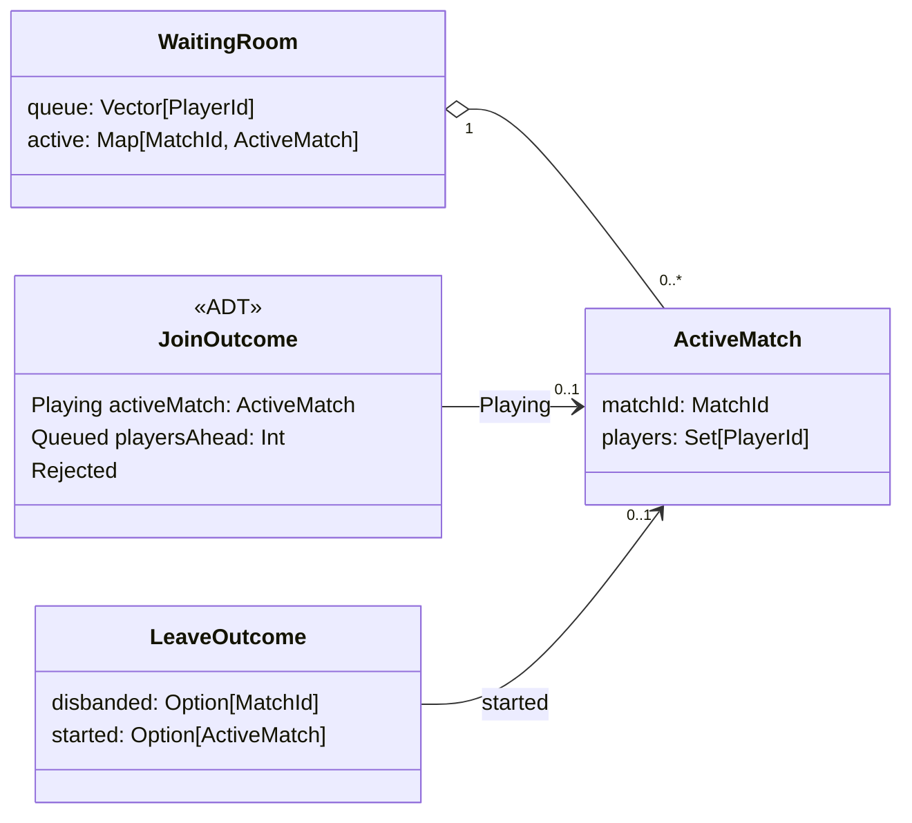

### Design Pattern Adottati

Oltre al pattern architetturale Ports & Adapters, il modulo adotta a livello di classe i seguenti design pattern.

#### Tagless final

Le porte (`AccessPort[F[_]]`, `CommandPort[F[_]]`, `MatchEventPublisher[F[_]]`, `PlayerNotifier[F[_]]`) e `QueuedLobbyManager[F[_]: Sync]` sono parametrizzati sul tipo di effetto. Il contratto non vincola quindi l'implementazione a uno specifico runtime. Nel server il tipo di effetto è sempre `IO`, con cui sono implementati direttamente anche gli altri servizi applicativi.

#### Smart constructor e factory con effetti

I componenti che possiedono uno stato mutabile vengono creati esclusivamente tramite factory che restituiscono un effetto: `QueuedLobbyManager.of`, `ConnectionRegistry()`, `GameCommandService()` e `MatchCoordinator(...)`. La creazione dello stato (`Ref.of`) avviene quindi all'interno del flusso controllato da cats-effect.  
In `QueuedLobbyManager` e `ConnectionRegistry` il costruttore è inoltre nascosto: il primo ha un costruttore privato, il secondo è un `trait` la cui implementazione è una classe privata del suo companion object. In questo modo non è possibile ottenere un'istanza senza uno stato correttamente inizializzato. La factory di `QueuedLobbyManager` valida anche i parametri di configurazione, sollevando l'errore all'interno dell'effetto.

#### Dependency injection tramite composition root

I componenti che restano attivi per l'intera vita del server non costruiscono da sé le proprie dipendenze, ma le ricevono tramite il costruttore. L'unico punto in cui le loro implementazioni concrete vengono scelte e collegate è `ServerApp`. Per sostituire una dipendenza dichiarata tramite un'interfaccia (le porte, `ConnectionRegistry` e il `Logger`), ad esempio con un'implementazione fittizia nei test, è quindi sufficiente passarne un'altra. Questo non vale per le dipendenze dichiarate come classi concrete: `MatchCoordinator` riceve `QueuedLobbyManager`, che non ammette sottoclassi né implementazioni alternative, e `GameCommandService`, sostituibile soltanto tramite una sottoclasse.  Fanno eccezione gli oggetti legati a una singola partita: è `MatchCoordinator` a costruire, all'avvio di ogni partita, la `MatchSession` e il `MatchRunner` che la esegue. Questi oggetti non vengono ricevuti dall'esterno e non possono quindi essere sostituiti, ad esempio nei test.

#### Adapter

`WebSocketServer`, `WebSocketBroadcaster` e `WebSocketNotifier` adattano il protocollo WebSocket alle interfacce delle porte.  
Allo stesso modo, `CommandAdapter` traduce l'intento ricevuto dalla rete (`PlayerInput`) nel comando da applicare alla navicella del giocatore. La traduzione avviene nel game loop, all'inizio di ogni tick: fino a quel momento i comandi restano nel formato di rete, che attraversa quindi la porta `CommandPort` e il buffer dei comandi del livello applicativo.

#### Decorator

`ClientDisconnectionLogger` implementa la stessa interfaccia `Logger[IO]` del logger che avvolge, al quale delega tutti i messaggi. Modifica soltanto il trattamento degli errori dovuti alla disconnessione di un client, che vengono declassati da `error` a `debug`. In questo modo il comportamento del server HTTP cambia senza modificarne il codice.

#### Publish–Subscribe

`MatchEventPublisher` pubblica lo stato di una partita senza conoscerne i destinatari. L'appartenenza di una connessione a una partita, registrata nel `ConnectionRegistry`, funge da sottoscrizione: `WebSocketBroadcaster` recapita ogni stato a tutte e sole le connessioni associate a quella partita.

#### Una fiber per partita

Ogni partita viene eseguita su una propria fiber, cioè un thread leggero gestito da cats-effect. Le partite sono quindi isolate e procedono indipendentemente l'una dall'altra. Una partita abbandonata da tutti i giocatori viene interrotta cancellando la sua fiber, senza alcun effetto sulle altre.

# Implementazione

In questo capitolo vengono illustrati i dettagli implementativi più significativi del sistema, con particolare enfasi sull'impiego avanzato dei costrutti e delle funzionalità offerte da Scala 3.Coerentemente con l'organizzazione del lavoro e la suddivisione delle responsabilità tra i membri del gruppo, la trattazione è articolata nelle sotto-sezioni individuali dei singoli componenti del team.

## Diotallevi

Questa sezione illustra i contributi individuali sviluppati da Federico Diotallevi all'interno del progetto, approfondendo le scelte implementative e l'applicazione dei meccanismi avanzati e idiomatici offerti da Scala 3.

### Panoramica dei Contributi Personali

Durante i quattro sprint del progetto, il lavoro svolto si è concentrato prevalentemente sullo sviluppo del modulo `core`, con particolare responsabilità per:

- Il motore matematico e geometrico 2D (`com.unibo.scalaparty.core.geometry`).
- L'algoritmo di rilevamento e risoluzione delle collisioni (`CollisionSystem`).
- Il design e l'implementazione del DSL per le mappe (`com.unibo.scalaparty.core.model.map`).
- L'architettura a combinatori della pipeline di simulazione (`WorldSystem`, `GameEngine`).
- La cinematica di movimento e confinamento nell'arena (`MovementSystem`, `ArenaSystem`).

Inoltre, in collaborazione con Torelli, ho contribuito alla realizzazione di:

- Il sottosistema di sparo e gestione dei proiettili (`ShootingSystem`, `BulletComponent`).
- La serializzazione dello stato verso l'esterno (`EntityAdapter`, `EntityDto`).

### Type-Level Programming nel Map DSL

Uno dei contributi più interessanti dello sviluppo è stata la realizzazione del DSL per le mappe di gioco, progettato per consentire una definizione grafica e leggibile delle arene garantendo la correttezza dimensionale **a tempo di compilazione**.

In una mappa basata su griglia di tile (muri, spawn, spazi vuoti), definire righe di lunghezze disuguali comporterebbe la creazione di mappe non rettangolari, non permesse dai requisiti e di difficile gestione. Un controllo tradizionale a runtime tramite eccezioni manifesterebbe l'errore solo all'avvio del match. L'obiettivo è stato quindi impedire a compile-time la creazione di mappe non rettangolari.

#### Soluzione Adottata

La soluzione sfrutta l'aritmetica a livello di tipi e i tipi opachi per garantire che tutte le righe della mappa abbiano la stessa lunghezza, senza introdurre overhead a runtime.

```scala
enum MapTile:
  case Empty
  case Wall
  case Spawn

object Dsl:
  val S: MapTile = MapTile.Spawn
  val W: MapTile = MapTile.Wall
  val / : MapTile = MapTile.Empty

  // Tipo opaco parametrizzato sulla lunghezza della riga N
  opaque type MapRow[N <: Int] <: Vector[MapTile] = Vector[MapTile]

  extension (firstTile: MapTile)
    // Combina il primo tile con il secondo producendo una riga di lunghezza esatta 2
    def |(secondTile: MapTile): MapRow[2] = Vector(firstTile, secondTile)

  extension [N <: Int](row: MapRow[N])
    // Aggiunge una tessera incrementando il tipo della dimensione a N + 1
    def |(tile: MapTile): MapRow[N + 1] = tiles :+ tile

    private def tiles: Vector[MapTile] = row
```

Grazie all'aritmetica type-level, è possibile eseguire addizioni sui tipi direttamente nel compilatore. Ogni invocazione dell'operatore `|` incrementa il parametro di tipo letterale `N` della riga (`MapRow[N + 1]`).  All'interno del modulo `Dsl`, `MapRow[N]` è trattato come un `Vector[MapTile]`, beneficiando di tutte le operazioni delle collezioni standard. All'esterno del modulo, il tipo concreto è completamente nascosto e viene esposto solo il vincolo di tipo `MapRow[N]`, garantendo zero-overhead a runtime e massima type safety.

Il costruttore `GameMap.fromGrid` è definito come:

```scala
def fromGrid[N <: Int](using tileSize: TileSize = TileSize(80))(grid: MapRow[N]*): GameMap
```

Il parametro di tipo `N` è inferito dal compilatore in base alla prima riga passata come argomento. Tutte le righe successive devono avere lo stesso tipo `MapRow[N]`, altrimenti il compilatore segnala un errore di type mismatch.

```scala
// Esempio: Compila regolarmente (tutte le righe sono MapRow[5])
GameMap.fromGrid(
  W | W | W | W | W,
  W | / | S | / | W,
  W | W | W | W | W
)

// Esempio: Errore a compile-time (la seconda riga è MapRow[4])
GameMap.fromGrid(
  W | W | W | W | W,
  W | / | S | /,     // Errore: Found MapRow[4], Required MapRow[5]
  W | W | W | W | W
)
```

Inoltre il parametro contestuale `TileSize` permette di definire la dimensione di ciascun tile in maniera totalmente trasparente e soltanto al bisogno. In assenza di un valore given, il sistema utilizza la dimensione consigliata come default per ogni tile.

### Modellazione Geometrica ed Extension Methods

Per implementare la fisica e il rilevamento delle collisioni senza inquinare l'ADT `Shape` con algoritmi complessi e senza ricorrere a classi utility statiche procedurali, la logica geometrica è stata realizzat in un modulo separato sfruttando gli extension methods:

```scala
extension (self: AABB)
  def intersects(other: AABB): Boolean = ...
  def penetratingVector(other: AABB): Option[Vector2D] = ...

extension (self: Polygon)
  def intersects(other: Polygon): Boolean = ...
  def penetratingVector(other: Polygon): Option[Vector2D] = ...

extension (self: Circle)
  def intersects(other: Polygon): Boolean = other.intersects(self) // Simmetria
  def penetratingVector(other: Polygon): Option[Vector2D] =
    other.penetratingVector(self).map(-_) // Anti-simmetria vettoriale
```

Quando il tipo concreto della forma non è noto staticamente (come all'interno dei componenti ECS), un'estensione su `Shape` gestisce il dynamic dispatch tramite pattern matching:

```scala
extension (self: Shape)
  def intersects(other: Shape): Boolean = (self, other) match
    case (p1: Polygon, p2: Polygon) => p1.intersects(p2)
    case (c: Circle, p: Polygon)    => c.intersects(p)
    case (a1: AABB, a2: AABB)       => a1.intersects(a2)
    case ...                        => ...

  def penetratingVector(other: Shape): Option[Vector2D] = ...
```

Questo approccio garantisce una sintassi naturale e leggibile (es. `actorShape.boundingBox intersects targetShape.boundingBox`). Inoltre, per migliorare l'espressività e la robustezza del modulo sono state utilizzate le conversioni implicite che permettono l'uso trasparente di tuple letterali nei test e nella configurazione senza overhead sintattico.

### Risoluzione Immutabile nel Collision System

Il `CollisionSystem` rappresenta il componente computazionale più articolato della simulazione. Esso combina il rilevamento in due fasi (broad-phase con AABB e narrow-phase con SAT) con la risoluzione cinematica degli urti.

#### Deduplicazione delle Collisioni

In una simulazione fisica con molteplici corpi in movimento, due entità che collidono vengono rilevate sia dalla prospettiva di $A$ rispetto a $B$, sia da quella di $B$ rispetto ad $A$. Per evitare di applicare due volte il rimbalzo fisico o di generare eventi di collisione duplicati, è stato introdotto il tipo `CollisionPair`:

```scala
type CollisionPair = (EntityId, EntityId)

object CollisionPair:
  def apply(a: EntityId, b: EntityId): CollisionPair =
    if a.value < b.value then (a, b) else (b, a)
```

Normalizzando la coppia in base all'ID numerico, il sistema raggruppa ed elimina le intersezioni ridondanti in modo funzionale:

```scala
val uniqueCollisions = detectedCollisions
  .groupBy((actor, target, _) => CollisionPair(actor, target))
  .values
  .flatMap(_.headOption) // Prende solo la prima collisione di ciascuna coppia
```

Ciò permette di rendere le tuple facilmente confrontabili senza dover introduurre un nuovo tipo di dato mantenendo la semplicità di una tupla `(EntityId, EntityId)`.

### Uso della for-comprehension

In tutto il modulo è stato ampiamente utilizzato il costrutto for-comprehension per la gestione dei valori opzionali e delle collezioni, migliorando la leggibilità e riducendo la complessità del codice.  Un esempio semplice ed elegante è la rilevazione delle collisioni tra entità all'interno del `CollisionSystem`:

```scala
private def detectCollisions(
    movingEntitiesWithShapes: Iterable[EntityWithShape],
    entitiesWithShapes: Iterable[EntityWithShape]
): Iterable[(EntityId, EntityId, Vector2D)] =
  for
    (actor, actorShape)   <- movingEntitiesWithShapes
    (target, targetShape) <- entitiesWithShapes
    if actor != target
    if actorShape.boundingBox intersects targetShape.boundingBox
    mtv <- actorShape.penetratingVector(targetShape)
  yield (actor, target, mtv)
```

La for-comprehension consente di esprimere in maniera chiara e concisa la logica di filtraggio e trasformazione dei dati.  In modo totalmente chiaro e conciso, in poche righe di codice viene eseguito un algoritmo complesso come SAT per il rilevamento delle collisioni tra entità, senza dover ricorrere a cicli annidati o a condizioni multiple. Semplicemente leggendo il codice, è possibile comprendere la logica di rilevamento delle collisioni tra entità, senza dover analizzare dettagli implementativi complessi.

### Reflection

In Scala, le informazioni sui tipi generici vengono cancellate a runtime a causa della JVM. Per consentire a `GameWorld.findComponent[C]` di cercare componenti per tipo senza perdere la type safety.  È stato necessario sfruttare la reflection di scala attraverso il meccanismo dei `ClassTag`, attraverso il quale è possibile ottenere informazioni sul tipo generico `C` a runtime, consentendo di filtrare i componenti in base al loro tipo concreto mentendo la type safety a compile-time.

```scala
def findComponent[C <: Component: ClassTag](entityId: EntityId): Option[C] =
  findComponents(entityId).getOrElse(Nil).collectFirstOfClass[C]
```

## Martini

In questa sezione vengono descritti i dettagli implementativi sviluppati da Alessandro Martini in ScalaParty. Il contributo personale ha toccato quasi tutte le parti dell'infrastructure dell'applicazione in collaborazione con il mio collega Alessandro Torelli:

- Implementazione dell'infrastruttura base del server (in collaborazione con Torelli)
- Implementazione del livello di rete WebSocket (in collaborazione con Torelli)
- Implementazione del MatchRunner (in collaborazione con Torelli)
- Implementazione invio notifica di lobby a un singolo giocatore (WebSocketNotifier)
- Implementazione Coda di Gioco (QueuedLobbyManager)
- Implementazione MatchCoordinator

Nei capitoli successivi vengono riportati gli aspetti più fondamentali delle parti sviluppate in cooperazione e singolarmente.

#### Sviluppo Collaborativo

##### Composition root: `ServerApp`

`ServerApp` è il punto di ingresso dell'applicazione (`IOApp.Simple`) e funge da **composition root**: è l'unico punto in cui le implementazioni concrete vengono istanziate e collegate tra loro.  Non è utilizzato alcun framework di dependency injection: le dipendenze sono passate esplicitamente ai costruttori all'interno di una for-comprehension `IO`.

```scala
val run: IO[Unit] =
  for
    registry       <- ConnectionRegistry()
    lobby          <- QueuedLobbyManager.of[IO](
                        playersPerMatch = playersPerMatch,
                        maxMatches      = maxConcurrentMatches,
                        maxQueued       = maxQueuedPlayers)
    commandService <- GameCommandService()
    notifier  = WebSocketNotifier(registry)
    publisher = WebSocketBroadcaster(registry)
    coordinator    <- MatchCoordinator(lobby, registry, commandService, notifier, publisher, GameSettings.default)
    wsServer  = WebSocketServer(registry, coordinator, commandService)
    _ <- EmberServerBuilder.default[IO] /* host, porta 8081, logger, routes */ .build.use(_ => IO.never)
  yield ()
```

Ogni componente con stato espone una factory che restituisce `IO[...]`. In questo modo la creazione dello stato mutabile condiviso (un `Ref`) è anch'essa un effetto, e non può avvenire in maniera implicita al di fuori del flusso controllato da cats-effect.  La for-comprehension è una composizione **monadica** di `IO` (tradotta in `flatMap`/`map`), mentre le rotte HTTP sono definite tramite **pattern matching** sugli estrattori di http4s (`case GET -> Root / ...`).

Il server espone tre rotte HTTP:

| Rotta | Descrizione |
| --- | --- |
| `GET /` | Health check testuale ("Scala Party Server is up and running!") |
| `GET /scalaparty` | Restituisce il client web (`public/index.html`) |
| `GET /scalaparty/ws` | Endpoint WebSocket per il gioco |

##### Adapter in ingresso: `WebSocketServer`

`WebSocketServer` è l'adapter che traduce gli eventi fisici della connessione WebSocket in invocazioni delle porte in ingresso. Gestisce tre eventi:

- **Connessione (`onConnect`)**: alla richiesta su `/ws` viene generato un nuovo `PlayerId` (UUID) e creata una coda `Queue[IO, WebSocketFrame]` dedicata ai messaggi in uscita verso quel client. Il giocatore viene registrato nel `ConnectionRegistry` e viene invocato `AccessPort.joinLobby`. Se l'esito è `Admission.Rejected` (tutte le stanze occupate e coda piena), il server mette in coda un frame di chiusura e rimuove subito la sessione.
- **Messaggio (`onMessage`)**: il frame di testo viene decodificato in un `PlayerInput`. La partita a cui il comando si riferisce viene ricavata dal registro **ad ogni messaggio** e non una volta per tutte alla connessione: un giocatore può infatti connettersi mentre è in coda ed essere assegnato a una partita solo successivamente. Gli input di un giocatore che non è ancora in partita vengono scartati, così come i JSON non validi.
- **Disconnessione (`onDisconnect`)**: la sessione viene rimossa dal registro e viene invocato `AccessPort.leaveLobby`, così da liberare il posto in coda o rimuovere la navicella dalla partita.

`onConnect` e `onDisconnect` sono for-comprehension su `IO`, cioè composizioni **monadiche** di effetti. In `onMessage` il **pattern matching** è annidato: sul tipo di frame (`WebSocketFrame.Text`), sull'`Either` della decodifica JSON e sull'`Option` della partita. L'esito `Admission` viene scomposto con un `match`.

Il flusso dei frame verso il client è ottenuto unendo la coda dei messaggi del giocatore con un `Ping` inviato ogni 20 secondi:

```scala
def keptAlive(queue: MessageQueue): Stream[IO, WebSocketFrame] =
  Stream
    .fromQueueUnterminated(queue)
    .merge(Stream.awakeEvery[IO](keepAliveInterval).as(WebSocketFrame.Ping()))
```

Il ping si rende necessario perché Ember chiude le connessioni inattive per 60 secondi, mentre un giocatore in coda potrebbe non inviare alcun messaggio per un periodo prolungato.

##### Registro delle connessioni: `ConnectionRegistry`

`ConnectionRegistry` mantiene, per ogni giocatore connesso, la sua coda di messaggi in uscita e la partita a cui è eventualmente assegnato:

```scala
private case class Session(matchId: Option[MatchId], queue: MessageQueue)
private type RegistryState = Map[PlayerId, Session]
```

Lo stato è racchiuso in un `Ref[IO, RegistryState]` e tutte le operazioni (`register`, `assignToMatch`, `clearMatch`, `removeSession`, `queueFor`, `getQueuesForMatch`, ...) sono aggiornamenti atomici dello stesso.  Una connessione sopravvive alla partita a cui partecipa: il giocatore è registrato senza partita al momento della connessione, viene associato a una partita quando questa inizia (`assignToMatch`) e ne viene sganciato quando termina (`clearMatch`).

##### Game loop: `MatchRunner`

`MatchRunner` implementa il **ciclo autoritativo** di una singola partita. È realizzato come uno stream fs2 a frequenza fissa di circa 60 tick al secondo (`tickInterval = 16.millis`):

```scala
def run: IO[MatchOutcome] =
  Stream
    .fixedRate[IO](MatchRunner.tickInterval)
    .zipWithIndex
    .evalMapAccumulate(Set.empty[PlayerId]):   // giocatori già usciti
      case (departed, (_, tick)) =>
        for
          rawCommands <- commandQueue.drainCommands(session.matchId)
          present     <- roster
          ecsCommands   = rawCommands.flatMap((playerId, intent) => session.players.get(playerId).flatMap(intent.toDto))
          leaving       = session.players.keySet -- present -- departed
          leaveCommands = leaving.toList.flatMap(session.players.get).map(GameCommand.LeaveCommand(_))
          result        = engine.update(ecsCommands ++ leaveCommands, MatchRunner.tickInterval.toMillis)
          _ <- publisher.broadcastState(session.matchId, MatchState(tick, engine.arena, result.entities))
          ended = result.events.collectFirst { case GameEvent.MatchEnded(outcome) => outcome }
        yield (departed ++ leaving, ended)
    .collectFirst { case (_, Some(outcome)) => outcome }
    .compile
    .lastOrError
```

Lo stato del mondo di gioco è conservato tra un tick e il successivo dal `GameEngine`, che lo aggiorna a ogni invocazione di `update`. L'unica informazione che il runner deve mantenere in proprio, l'insieme dei giocatori già usciti, viene invece trasportata nell'accumulatore dello stream anziché in una variabile mutabile. L'elenco dei partecipanti ancora presenti è passato al runner come effetto (`roster: IO[Set[PlayerId]]`), così che il runner non dipenda direttamente dalla lobby. Il corpo del tick è una for-comprehension **monadica** che alterna passi con effetti (`<-`) e definizioni pure (`=`). Il **pattern matching** destruttura l'accumulatore (`case (departed, (_, tick))`) e, tramite `collectFirst`, estrae l'esito dall'evento `GameEvent.MatchEnded`.

##### Adapter in uscita: `WebSocketBroadcaster` e `WebSocketNotifier`

I due adapter in uscita implementano le corrispondenti porte serializzando i messaggi in JSON e inserendoli nelle code dei destinatari, recuperate dal `ConnectionRegistry`:

- `WebSocketBroadcaster` (`MatchEventPublisher`) invia lo stato della partita a **tutti** i giocatori associati a quella partita;
- `WebSocketNotifier` (`PlayerNotifier`) invia una notifica di lobby a un **singolo** giocatore, ignorandola se questo non è più connesso.

Gli adapter non scrivono mai direttamente sulla socket: si limitano a un `offer` sulla coda del giocatore, che viene consumata dallo stream di invio della connessione. In questo modo la produzione dei messaggi (il game loop e il coordinatore) è disaccoppiata dalla velocità di trasmissione verso ciascun client.

#### Sviluppo Individuale

##### Matchmaking: `QueuedLobbyManager`

`QueuedLobbyManager` decide **chi gioca e chi attende**. I giocatori sono serviti secondo una politica *first-come-first-served*: non appena una stanza è libera e almeno `playersPerMatch` giocatori sono in attesa, esattamente `playersPerMatch` di essi vengono prelevati dalla testa della coda e inizia una nuova partita. Fino a `maxMatches` partite possono essere giocate contemporaneamente, e al massimo `maxQueued` giocatori possono attendere; chi arriva oltre viene rifiutato.

L'intero stato del matchmaking è rappresentato da un'unica struttura immutabile:

```scala
private final case class WaitingRoom(queue: Vector[PlayerId], active: Map[MatchId, ActiveMatch])
```

su cui sono definite le transizioni pure `enqueue`, `remove` e `startMatch`. La coda e le stanze attive condividono **un solo `Ref`** di proposito: liberare una stanza e scegliere chi la occupa deve essere un passo atomico, altrimenti due aggiornamenti concorrenti potrebbero selezionare gli stessi giocatori.

Le operazioni pubbliche applicano le transizioni tramite `Ref.modify` e restituiscono esiti espressi come ADT:

```scala
def join(playerId: PlayerId): F[JoinOutcome]           // Playing(activeMatch) | Queued(playersAhead) | Rejected
def leave(playerId: PlayerId): F[LeaveOutcome]         // partita sciolta e/o partita appena avviata
def finishMatch(matchId: MatchId): F[Option[ActiveMatch]] // partita avviata nella stanza appena liberata
```

L'identificativo della possibile nuova partita viene generato prima della `modify` (`withCandidateMatchId`), perché la funzione passata a `modify` deve essere pura; l'identificativo viene poi utilizzato solo se una partita inizia effettivamente.

La factory `QueuedLobbyManager.of` valida i parametri di configurazione (`playersPerMatch ≥ 1`, `maxMatches ≥ 1` e una coda capace di contenere almeno `playersPerMatch - 1` giocatori, senza la quale una partita non potrebbe mai raccogliere abbastanza partecipanti) sollevando l'errore all'interno dell'effetto. Il componente è generico sull'effetto (`F[_]: Sync`).  
La factory è una for-comprehension **monadica** in cui il primo `raiseUnless` che fallisce interrompe la catena, senza che il `Ref` venga creato:

```scala
def of[F[_]: Sync](playersPerMatch: Int, maxMatches: Int, maxQueued: Int): F[QueuedLobbyManager[F]] =
  for
    _     <- Sync[F].raiseUnless(playersPerMatch >= 1)(IllegalArgumentException(/* ... */))
    _     <- Sync[F].raiseUnless(maxMatches >= 1)(IllegalArgumentException(/* ... */))
    _     <- Sync[F].raiseUnless(maxQueued >= playersPerMatch - 1)(IllegalArgumentException(/* ... */))
    state <- Ref.of[F, WaitingRoom](WaitingRoom.empty)
  yield new QueuedLobbyManager[F](state, playersPerMatch, maxMatches, maxQueued)
```

In `join` il **pattern matching** con guardia (`case None if ...`) distingue il giocatore in coda da quello rifiutato.

##### Coordinamento delle partite: `MatchCoordinator`

`MatchCoordinator` implementa la porta `AccessPort` e governa l'intero ciclo di vita di una partita, dalla coda all'ultimo tick. Mette in comunicazione `QueuedLobbyManager`, che decide *chi* gioca, e `MatchRunner`, che sa soltanto far avanzare una partita già esistente.

- **`joinLobby`**: inoltra la richiesta alla lobby e, in base al `JoinOutcome`, avvia la partita, notifica al giocatore la sua posizione in coda (`ServerMessage.Queued`) oppure lo informa che la coda è piena (`ServerMessage.QueueFull`).
- **`leaveLobby`**: rimuove il giocatore dalla lobby; se la partita è rimasta senza giocatori ne ferma la fiber, aggiorna la posizione di chi è in coda e, se si è liberata una stanza, avvia la partita successiva.
- **`startMatch`**: assegna a ogni giocatore un `EntityId` per la sua navicella, lo associa alla partita nel registro e gli invia `ServerMessage.MatchStarted(players, you)`, così che il client sappia quale navicella controlla. Avvia poi la partita su una **fiber dedicata**, registrata in un `Ref[IO, Map[MatchId, FiberIO[Unit]]]`.
- **`concludeMatch`**: al termine della partita sgancia i giocatori dalla partita, invia loro `ServerMessage.MatchEnded(outcome)`, dichiara conclusa la partita nella lobby e avvia immediatamente quella successiva, se ci sono abbastanza giocatori in attesa. In questo modo la coda avanza autonomamente.

Ogni partita è quindi eseguita su una propria fiber, isolata e indipendente dalle altre, e viene interrotta solo quando termina o quando tutti i giocatori l'hanno abbandonata.

`joinLobby` usa il **pattern matching** sui casi di `JoinOutcome`. Le altre operazioni sono composizioni **monadiche** di `IO` (for-comprehension, `flatMap`, `*>`) e usano `traverse_`, anche su `Option`, per eseguire un effetto solo quando il valore è presente (ad esempio `outcome.started.traverse_(startMatch)`).

Il coordinatore gestisce esplicitamente alcune **condizioni di corsa** che emergono dalla concorrenza tra fiber:

- la partita attende, tramite un `Deferred`, che la propria fiber sia stata registrata prima di iniziare: in caso contrario, una partita molto breve potrebbe concludersi prima della registrazione, lasciando nella mappa una fiber terminata che non verrebbe mai rimossa;
- dopo aver registrato la fiber, viene verificato che la partita sia ancora attiva: se l'ultimo giocatore è uscito durante l'avvio, la sua `leave` non ha trovato alcuna fiber da fermare, e la partita viene quindi fermata subito;
- in `concludeMatch` la fiber viene rimossa dalla mappa *prima* delle operazioni di pulizia, poiché questo codice è eseguito proprio all'interno di quella fiber: un giocatore che uscisse in quel momento la cancellerebbe a metà del lavoro.

### Identificativi e modello del server

Gli identificativi di giocatori e partite sono definiti come **opaque type** su `UUID`:

```scala
opaque type PlayerId = UUID
opaque type MatchId  = UUID
```

In questo modo il compilatore impedisce di scambiare un `PlayerId` con un `MatchId` (o con un `UUID` qualsiasi), senza alcun costo a runtime. Inoltre, i `PlayerId` sono generati casualmente a ogni connessione e non sono legati ad alcuna informazione personale dell'utente.

Gli esiti delle operazioni sono modellati come **ADT** (`Admission`, `JoinOutcome`, `LeaveOutcome`, `ServerMessage`) invece che come valori booleani o eccezioni, rendendo esplicito e verificato dal compilatore ogni caso che il chiamante deve gestire.

### Logging: `ClientDisconnectionLogger`

`ClientDisconnectionLogger` è un *decorator* del `Logger[IO]` di log4cats passato a Ember. Il server, per impostazione predefinita, registra come errore (con stack trace completo) qualsiasi WebSocket che termini con un'eccezione, compresa la semplice chiusura della scheda del browser da parte del client. Il decorator riconosce questi casi ("Connection reset", "Broken pipe", anche quando aggregati in un `CompositeFailure`) e li declassa a livello `debug`, lasciando inalterati tutti gli altri messaggi.

### Gestione della concorrenza

Il server non utilizza lock, attori o variabili mutabili condivise: la concorrenza è gestita interamente tramite le primitive funzionali di cats-effect.

| Problema | Soluzione adottata |
| --- | --- |
| Stato condiviso (lobby, registro, buffer, fiber attive) | `Ref` con aggiornamenti atomici (`update`/`modify`) di strutture immutabili |
| Esecuzione di più partite in parallelo | Una fiber per partita, cancellabile con `FiberIO.cancel` |
| Avanzamento del tempo di gioco | `Stream.fixedRate` di fs2 |
| Disaccoppiamento tra produttori di messaggi e socket | Una `Queue` per client, consumata da `Stream.fromQueueUnterminated` |
| Ordinamento tra avvio di una partita e sua registrazione | `Deferred` |
| Mantenimento delle connessioni inattive | `merge` dello stream di invio con `Stream.awakeEvery` (ping periodico) |

## Torelli

Il mio contributo è stato presente sia sul modulo **core** e sia sul modulo **infrastructure**.  Per quanto riguarda la parte **core** mi sono occupato di:

- Implementazione del GameSettings
- Implementazione della salute e danno
- Implementazione del sistema di sparo (in collaborazione con Diotallevi)
- Implementazione dell'eliminazione delle navicelle
- Implementazione del MatchEndSystem
- Implementazione del DSL per la dichiarazione dei power-up (Non implementati all'interno del gioco)

Mentre lato **infrastructure** mi sono occupato di:

- Implementazione dell'infrastruttura di base del server (in collaborazione con Martini)
- Implementazione del livello di rete WebSocket (in collaborazione con Martini)
- Implementazione del MatchRunner (in collaborazione con Martini)
- Implementazione dell'invio dello stato della partita ai client (WebSocketBroadcaster)
- Implementazione dei codec JSON del protocollo di comunicazione

Nei capitoli successivi vengono riportati gli aspetti che ritengo più rilevanti delle parti da me sviluppate.

### Configurazione della partita

Tutti i parametri di gioco sono raccolti in `GameSettings`, che il server passa al `GameEngine` all'avvio di ogni partita.

```scala
final case class MatchSettings(
    timeLimit: Long
):
  require(timeLimit > 0L, "Time limit must be positive")

object MatchSettings:
  val default: MatchSettings = MatchSettings(timeLimit = 180_000L)

final case class GameSettings(
    spaceship: SpaceshipSettings,
    map: GameMap,
    matchSettings: MatchSettings
)

object GameSettings:
  val default: GameSettings = GameSettings(
    spaceship = SpaceshipSettings.default,
    map = GameMap.default,
    matchSettings = MatchSettings.default
  )
```

Tutti i parametri di gioco sono raccolti in GameSettings, che il server passa al motore all'avvio di ogni partita. La configurazione è divisa per area (navicella e relativa arma, mappa, regole della partita), così ogni parte del sistema riceve solo ciò che le serve: il `MatchEndSystem`, ad esempio, conosce solo `MatchSettings`. L'arma fa parte di `SpaceshipSettings` ed è lo stesso tipo contenuto nello ShootingComponent, quindi non richiede conversioni. Le classi non hanno parametri di default: i valori predefiniti sono istanze default nei companion object.

### Implementazione salute, danno ed eliminazione

Per la salute e per il danno ho creato due componenti differenti:

- `HealthComponent(current, max)`
- `CollisionDamageComponent(damage)`.

In questo modo il `DamageSystem` non deve conoscere il tipo delle entità coinvolte: un'entità può fare danno senza avere una salute (es. proiettile), o anche il contrario. Il `DamageSystem` consuma gli eventi `CollisionDetected` e risolve ogni collisione in modo simmetrico, facendo colpire ciascuna entità dall'altra:

```scala
override def update(world: GameWorld, events: Set[GameEvent], dt: Long): SystemOutput =
  val updatedWorld = events.foldLeft(world):
    case (currentWorld, CollisionDetected(first, second)) => currentWorld.strike(first, second).strike(second, first)
    case (currentWorld, _) => currentWorld
  (updatedWorld, events)
```

Un colpo che va a segno richiede che esistano l'attaccante e il bersaglio, che l'attaccante possa fare danno a quel bersaglio e che il bersaglio abbia salute. Ho espresso queste condizioni come una for-comprehension sulla monade `Option`, che lascia il mondo invariato non appena una di esse manca. Inoltre un proiettile viene consumato appena danneggia un'entità:

```scala
private def strike(attackerId: EntityId, targetId: EntityId): GameWorld =
  val struckWorld =
    for
      attacker <- world.findComponents(attackerId)
      target   <- world.findComponents(targetId)
      damage   <- impactDamage(attacker, targetId)
      health   <- target.collectFirst { case hc: HealthComponent => hc }
      damagedWorld = world.updateComponent(targetId, health.damaged(damage))
    yield if isProjectile(attacker) then damagedWorld - attackerId else damagedWorld
  struckWorld.getOrElse(world)
```

La regola per cui un proiettile non colpisce mai chi l'ha sparato è espressa direttamente in `impactDamage`.

Sia `strike` sia `damaged` sono extension method privati del `DamageSystem`, il primo su `GameWorld` e il secondo su `HealthComponent`. In questo modo i componenti restano semplici dati e `GameWorld` resta un contenitore generico che non conosce le regole del danno: ogni operazione vive nel sistema che la usa e non è visibile al resto del codice. La chiamata mantiene comunque la forma di un metodo dell'oggetto, così la risoluzione di una collisione si legge come una catena: `currentWorld.strike(first, second).strike(second, first)`.

La transizione `damaged` satura la salute a zero, per questo il `DeathSystem` può riconoscere un'entità distrutta con un confronto esatto, `health.current == 0.0`. Il sistema rimuove queste entità ed emette per ciascuna un `GameEvent.Death`.

### Sparo (estensione `ShootingSystem`)

Ho esteso lo `ShootingSystem` perché lo sparo dipenda dall'arma della navicella: il proiettile nasce sulla punta della navicella, viaggia nella direzione corrente alla velocità dell'arma e ne eredita la potenza. Un'intenzione di sparo viene consumata a ogni aggiornamento anche se l'arma è in cooldown, evitando così che tenere premuto il tasto accumuli colpi da sparare appena l'arma è pronta.

Anche le transizioni del `ShootingComponent` sono extension method privati del sistema, per lo stesso motivo visto nel `DamageSystem`: il componente resta un dato e le regole del cooldown stanno nello `ShootingSystem`, l'unico che le usa.

```scala
extension (component: ShootingComponent)

  private def isReady(dt: Long): Boolean = component.cooldownTimer - dt <= 0

  private def reloaded: ShootingComponent =
    component.copy(isShooting = false, cooldownTimer = component.weapon.shootCooldown)

  private def cooledDown(dt: Long): ShootingComponent =
    component.copy(isShooting = false, cooldownTimer = Math.max(0, component.cooldownTimer - dt))
```

```scala
private def bulletFor(shooterId: EntityId, components: List[Component], weapon: Weapon): Option[EntityWithComponents] =
  for
    position <- components.collectFirstOfClass[PositionComponent].map(_.position)
    velocity <- components.collectFirstOfClass[MovementComponent].map(_.velocity)
    direction = velocity.normalized
  yield EntityFactory.createBullet(
    shooterId = shooterId,
    position = position + direction * weapon.muzzleOffset,
    velocity = direction * weapon.bulletSpeed,
    power = weapon.bulletPower
  )
```

### Implementazione `MatchEndSystem`

Il `MatchEndSystem` è l'ultimo sistema della pipeline, così da giudicare lo stato finale del tick, dopo che il `DeathSystem` ha rimosso le navicelle distrutte. L'intera regola è un pattern matching sulla lista dei sopravvissuti:

```scala
final case class MatchEndSystem(settings: MatchSettings) extends WorldSystem:

  override def update(world: GameWorld, events: Set[GameEvent], dt: Long): SystemOutput =
    (world, events ++ outcome(world).map(GameEvent.MatchEnded(_)))

  private def outcome(world: GameWorld): Option[MatchOutcome] =
    world.spaceships match
      case Nil => Some(MatchOutcome.NoSurvivors)
      case List(winner) => Some(MatchOutcome.LastStanding(winner))
      case _ => Option.when(world.clock.exists(_.elapsed >= settings.timeLimit))(MatchOutcome.TimeUp)
```

L'ordine dei casi stabilisce la priorità: se nello stesso tick scade il tempo e resta una sola navicella, la partita è vinta e non finisce per tempo. I sopravvissuti sono letti dal `GameWorld`, quindi il sistema tiene conto sia delle navicelle distrutte sia di quelle dei giocatori che hanno abbandonato la partita.

Anche `spaceships` e `clock` sono extension method privati su `GameWorld`: sono interrogazioni che servono solo a questo sistema, quindi non le ho aggiunte all'interfaccia del mondo, ma la regola resta leggibile come `world.spaceships`.

Nei test ho usato degli extension method locali per descrivere ogni scenario come una trasformazione dello stesso mondo di partenza. Così ogni test si legge come una frase, ad esempio `world.at(timeLimit).without(second, third)`, e la costruzione del mondo non si ripete in ogni caso:

```scala
extension (world: GameWorld)
  private def at(elapsed: Long): GameWorld = world.updateComponent(clockId, MatchClockComponent(elapsed))
  private def without(entityIds: EntityId*): GameWorld = entityIds.foldLeft(world)(_ - _)

it should "declare the winner even when the time limit is reached too" in:
  endOf(world.at(timeLimit).without(second, third)) shouldBe Some(MatchOutcome.LastStanding(first))
```

### Codec JSON del protocollo

Client e server comunicano tramite messaggi JSON, serializzati con la libreria circe. Le istanze `Encoder` e `Decoder` sono raccolte nell'oggetto `ProtocolCodecs` del modulo infrastructure, e chi ne ha bisogno le porta nello scope con `import ProtocolCodecs.given`.

L'unico tipo che ha richiesto istanze scritte a mano è `EntityId`, che nel core è un opaque type su `Long`: al di fuori del suo companion object il compilatore non lo considera un `Long`, quindi circe non sa serializzarlo. Invece di riscrivere la serializzazione, le due istanze riusano quelle già esistenti per `Long`, adattandole con `map` in lettura e `contramap` in scrittura:

```scala
given Decoder[EntityId] = Decoder.decodeLong.map(EntityId.fromLong)
given Encoder[EntityId] = Encoder.encodeLong.contramap(_.value)
```

Una volta disponibile l'istanza per `EntityId`, i messaggi che lo contengono, come `MatchOutcome.LastStanding(winner)`, vengono derivati automaticamente da circe a partire dalla struttura dei tipi:

```scala
// Inbound (Client -> Server)
given Decoder[PlayerInput] = deriveDecoder

// Outbound (Server -> Client)
given Encoder[MatchState] = deriveEncoder
given Encoder[GameEvent] = deriveEncoder
given Encoder[MatchOutcome] = deriveEncoder
```

### Buffer dei comandi

Il `GameCommandService` accumula gli input che arrivano dai WebSocket finché il `MatchRunner` non li preleva al tick successivo. Il prelievo e lo svuotamento del buffer di una partita avvengono in un'unica `Ref.modify` (stato condiviso di cats-effect), aggiornato atomicamente, così nessun comando ricevuto nel frattempo va perso o viene processato due volte:

```scala
def drainCommands(matchId: MatchId): IO[List[(PlayerId, PlayerInput)]] =
  bufferRef.modify: buffer =>
    val pending = buffer.getOrElse(matchId, List.empty)
    (buffer.removed(matchId), pending)
```

### DSL per la descrizione dei power-up

Il requisito opzionale RFS8 prevede dei bonus temporanei raccolti dalle navicelle. Per dichiararli ho pensato e realizzato un DSL interno che permette di descriverli in questo modo:

```scala
powerUp("rapid-fire") lasting 8.seconds scaling ShootCooldown by 0.5
powerUp("shield") lasting 1500.millis scaling DamageTaken by 0.25
powerUp("repair") healing 30
```

Per motivi di tempo i power-up non sono stati integrati nel gioco: non vengono generati nell'arena né applicati alle navicelle. Ho comunque scelto di implementare il DSL come base per un'implementazione futura, vista l'opzionalità del requisito.

Il modello distingue due tipi di effetto, un potenziamento temporaneo di una statistica e un ripristino immediato della salute:

```scala
final case class PowerUp(name: String, effect: Effect):
  require(!name.isBlank, "Power-up name cannot be blank")

sealed trait Effect

object Effect:
  final case class Boost(modifier: StatModifier, duration: Long) extends Effect:
    require(duration > 0L, "Boost duration must be positive")

  final case class Repair(amount: Double) extends Effect:
    require(amount > 0.0, "Repair amount must be positive")

final case class StatModifier(stat: Stat, factor: Double):
  require(factor > 0.0, "Modifier factor must be positive")
```

dove `Stat` è un `enum` con le statistiche modificabili (`ShootCooldown`, `BulletPower`, `DamageTaken`).

```scala
object PowerUpDsl:
  export Stat.*

  def powerUp(name: String): NamedPowerUp = NamedPowerUp(name)

  final case class NamedPowerUp(name: String):
    infix def lasting(duration: FiniteDuration): TimedPowerUp = TimedPowerUp(name, duration)
    infix def healing(amount: Double): PowerUp = PowerUp(name, Effect.Repair(amount))

  final case class TimedPowerUp(name: String, duration: FiniteDuration):
    infix def scaling(stat: Stat): ScalingPowerUp = ScalingPowerUp(name, duration, stat)

  final case class ScalingPowerUp(name: String, duration: FiniteDuration, stat: Stat):
    infix def by(factor: Double): PowerUp = PowerUp(name, Effect.Boost(StatModifier(stat, factor), duration.toMillis))
```

Il modificatore `infix` dichiara esplicitamente quali metodi sono pensati come parole del linguaggio. La durata è una `FiniteDuration`, così l'unità di misura è visibile nella frase, e la conversione nei millisecondi usati dal motore avviene in un solo punto.

# Testing

## Tecnologie utilizzate

- **ScalaTest**: framework di riferimento per tutti i test del progetto. Sono stati adottati gli stili `AnyFlatSpec` per il modulo *core*, la cui natura puramente funzionale si presta a specifiche brevi e lineari, e `AnyWordSpec`/`AsyncWordSpec` per il modulo *infrastructure*, dove la struttura annidata permette di raggruppare i comportamenti per operazione (es. *joining*, *leaving*).
- **cats-effect-testing (`AsyncIOSpec`)**: integra ScalaTest con Cats Effect, permettendo di scrivere test che restituiscono direttamente un `IO[Assertion]`. In questo modo i componenti effectful del server (lobby, coordinatore delle partite, registro delle connessioni) vengono testati componendo gli effetti in una for-comprehension, senza mai bloccare thread con `unsafeRunSync`.
- **sbt**: esecuzione dei test, separata per modulo (`core`, `infrastructure`) e aggregata dal progetto radice.
- **sbt-scoverage**: utilizzato per misurare la copertura del codice.

## Strategia di testing

Il Test Driven Development è stato adottato dal gruppo come linea guida generale, ogni componente del team lo ha applicato al proprio lavoro nel modo che riteneva più adatto, alternando test scritti prima dell'implementazione a test sviluppati contestualmente alla funzionalità. L'obiettivo comune restava quello di specificare il comportamento atteso di ogni componente e di proteggere i successivi refactoring. Ogni feature branch includeva, oltre al codice di produzione, le specifiche che ne descrivono il comportamento atteso. Le pull request venivano revisionate anche sul versante dei test, e la CI ne garantiva l'esecuzione prima di ogni merge su `develop`.

## Grado di copertura

La copertura è stata misurata con sbt-scoverage sull'intera suite.

| Modulo | Statement coverage | Branch coverage |
| --- | --- | --- |
| core | 97,81% | 86,62% |
| infrastructure | 82,07% | 86,81% |
| **Totale** | **93,34%** | **86,70%** |

Il modulo core, che contiene l'intera logica di gioco, è coperto quasi integralmente. La logica applicativa del server (package `application`: lobby, coordinatore, runner delle partite) raggiunge il 99,5%. La quasi totalità dei buchi di copertura sono frutto di una scelta consapevole, poiché riguardano codice che non appartiene alla logica del progetto oppure codice che si limita a delegare ad altre parti già testate:

- **Codice generato dalle librerie**: i codec JSON di `ProtocolCodecs` sono derivati automaticamente tramite le macro di circe (`deriveEncoder`/`deriveDecoder`), che generano metodi conteggiati da scoverage ma non scritti dal team. Il formato prodotto da questi codec è comunque verificato da `ProtocolCodecsSpec`.
- **Codice di sola delega**: l'entry point `ServerApp` si limita a istanziare e collegare i componenti; il metodo `routes` di `WebSocketServer` configura l'endpoint http4s e delega la gestione di connessione, messaggi e disconnessione ai metodi `onConnect`, `onMessage` e `onDisconnect`, testati singolarmente; i metodi di `ClientDisconnectionLogger` diversi da `error` inoltrano il messaggio al logger sottostante senza alcuna logica aggiuntiva.

## Esempi rilevanti

### Sistemi ECS come funzioni pure

Poiché i sistemi non mutano il mondo ma ne restituiscono una nuova istanza, è possibile verificare anche le proprietà di immutabilità. Nel test seguente si controlla che il `CollisionSystem` generi un nuovo mondo quando risolve una collisione, e che restituisca la stessa istanza quando non c'è nulla da risolvere:

```scala
it should "resolve collisions between entities correctly and maintain world immutability invariants" in:
  val world = GameWorld(List(entity1, entity2))
  val (updatedWorld, events) = CollisionSystem.update(world, Set.empty, 1000)
  events.collect { case c: CollisionDetected => c } should have size 1
  world.id should not equal updatedWorld.id
  val (sameWorld, newEvents) = CollisionSystem.update(updatedWorld, Set.empty, 1000)
  newEvents shouldBe empty
  sameWorld.id shouldBe updatedWorld.id
```

Allo stesso modo, il `GameEngine` viene testato iniettando pipeline costruite ad hoc (es. un sistema che svuota il mondo o che emette un evento di morte), isolando il motore dai sistemi reali.

### Verifica dei DSL a tempo di compilazione

Il DSL per la definizione delle mappe garantisce a tempo di compilazione che tutte le righe abbiano la stessa lunghezza. Il test lo verifica con `assertDoesNotCompile`:

```scala
it should "validate that all rows have the same length at compile time" in:
  assertDoesNotCompile("GameMap.fromGrid(" +
    "S | / | / | W | / | / | S," +
    "/ | W | / | W | / | W," + // 6 tiles instead of 7
    "S | / | / | W | / | / | S" +
    ")")
```

Analogamente, `PowerUpDslSpec` verifica che una dichiarazione lasciata a metà non produca un `PowerUp`:

```scala
"""val p: PowerUp = powerUp("damage") lasting 8.seconds""" shouldNot typeCheck
```

### Test double per le porte esagonali

In `MatchCoordinatorSpec` le porte di uscita sono sostituite da implementazioni che registrano le chiamate in un `Ref`, così da poter verificare cosa è stato notificato a ciascun giocatore:

```scala
private class RecordingNotifier(sent: Ref[IO, List[(PlayerId, ServerMessage)]]) extends PlayerNotifier[IO]:
  override def send(playerId: PlayerId, message: ServerMessage): IO[Unit] =
    sent.update(_ :+ (playerId -> message))
```

Una `Fixture` assembla tutto il cablaggio sotto test con partite di durata ridotta (50 ms), permettendo di osservare in pochi istanti l'intero ciclo di vita di una partita: avvio, notifica ai giocatori, terminazione e promozione dei giocatori in coda.

### Test di codice concorrente senza attese fisse

Le partite vengono eseguite in fiber separati, quindi alcuni effetti sono osservabili solo dopo un certo tempo. Per evitare test fragili basati su `sleep` di durata arbitraria, è stato definito un combinatore `eventually` che ripete un controllo finché la condizione non è soddisfatta, con un timeout complessivo:

```scala
private def eventually[A](action: IO[A])(predicate: A => Boolean): IO[A] =
  action
    .flatMap(value =>
      if predicate(value) then IO.pure(value) else IO.sleep(10.millis) *> eventually(action)(predicate)
    )
    .timeout(10.seconds)
```

### Test di integrazione del server WebSocket

`ServerIntegrationSpec` collega i componenti reali e simula le connessioni dei client tramite code di frame. Verifica, ad esempio, che un giocatore in eccesso riceva il messaggio `QueueFull` e veda chiusa la propria connessione con il codice previsto, e che il server continui a inviare frame di ping ai client inattivi.

### Formato del protocollo

`ProtocolCodecsSpec` fissa il formato JSON dei messaggi scambiati con il client (stato della partita, entità etichettate per tipo, esiti di fine partita). Questi test fanno da contratto tra server e client: un cambiamento involontario della serializzazione viene rilevato prima di rompere il client.

## Altri elementi

- **Stile uniforme dei test**: nel corso del progetto sono stati fatti refactoring mirati della suite (helper per la creazione delle entità, generazione automatica degli `EntityId`, uniformazione dello stile tra le specifiche), trattando il codice di test con la stessa cura del codice di produzione.
- **Test come documentazione**: i nomi dei test sono scritti come frasi che descrivono il comportamento (es. *"hold the first players back until a whole group is waiting"*), così che l'output di sbt costituisca una specifica leggibile del sistema.

# Retrospettiva

In questa sezione viene analizzato a posteriori il percorso di sviluppo di ScalaParty: il processo adottato dal team, il flusso di lavoro su Git e GitHub, i possibili sviluppi futuri del progetto e alcune considerazioni finali.  
Le osservazioni riportate si basano sui verbali degli Sprint (planning, review e retrospective) e sulla storia del repository [PPS-26-Scala-Party](https://github.com/aleToro7/PPS-26-Scala-Party).

## Analisi del processo di sviluppo

L'adozione di un processo agile, nella forma di una versione semplificata di Scrum, è stata una delle principali novità del progetto, ed ha mostrato come la metodologia si applichi meglio a problemi scomponibili in moduli isolati.  La separazione tra `core` e `infrastructure`, collegati solo dall'interfaccia `GameEngine`, ha permesso di sviluppare in parallelo dominio e server. 

Sono stati usati tutti i principali strumenti di Scrum (product backlog, planning, review e retrospective), ad eccezione degli incontri giornalieri. Organizzarli era difficile per la distanza fisica tra i membri e per il periodo estivo, durante il quale impegni personali e lavorativi rendevano complicato trovare un orario comune. Al loro posto il team si è coordinato tramite il contatto diretto tra i membri e le discussioni nelle pull request.

La metodologia di sviluppo agile è stata bben accolta da tutto il gruppo, tutti noi abbimao notato un miglioramento in termini sia di soddisfazione nello sviluppo, sia di produttività rispetto ad altri progetti a cui avevamo partecipato. La forte collaborazione imposta da SCRUM ha permesso un'ottima coordinazione nello sviluppo che si è raffinata di sprint in sprint.

### Evoluzione del processo

Le retrospective hanno avuto un impatto concreto sul modo di lavorare del team. Le principali lezioni apprese, Sprint dopo Sprint, sono state le seguenti:

- **Sprint 1: rispettare la durata dello Sprint.** A causa di imprevisti personali, parte del lavoro è stata riassegnata da un membro all'altro e lo Sprint è stato prolungato di circa una settimana oltre la data prevista. La retrospective ha evidenziato come questa scelta avesse compromesso l'agilità del team, causando dei blocchi tra i membri. A partire dallo Sprint 2 è stato quindi stabilito che ogni Sprint si sarebbe concluso *inderogabilmente* alla data fissata, lasciando slittare al ciclo successivo i task non completati.
- **Sprint 2: comunicazione tra dominio e infrastruttura.** La divisione del lavoro tra lo sviluppo del dominio di gioco e lo sviluppo dell'infrastruttura di rete ha consentito di lavorare in parallelo con pochi conflitti in fase di merge. Tuttavia, la mancata comunicazione sulla serializzazione dei messaggi ha impedito di rendere effettivamente utilizzabile lo sparo, pur essendo stato implementato. Da qui l'impegno a mantenere un confronto costante tra i membri.
- **Sprint 3: evitare la suddivisione a cascata.** La comunicazione è sensibilmente migliorata. È invece emerso che la suddivisione del lavoro sulle collisioni (prima la geometria, poi il sistema di collisione) era avvenuta in modo parzialmente sequenziale, rendendo necessaria una revisione del lavoro dello Sprint precedente.
- **Sprint 4: collaborazione e scelte condivise.** L'ultimo Sprint, con un carico ridotto per lasciare spazio alla revisione del codice prima della consegna, è stato quello con il maggior grado di confronto tra i membri. Tutti i task principali sono stati completati nei tempi previsti e la demo finale ha soddisfatto l'intero team.

Altre pratiche si sono consolidate nel corso del progetto:

- l'inserimento di **task opzionali o di riserva** nel planning, da affrontare solo in caso di stime sovrastimate (ad esempio l'analisi multi-lobby, i muri, la generazione dei power-up, il benchmarking);
- la **riassegnazione flessibile** dei task tra i membri che lavoravano sulla stessa area, per bilanciare i carichi di lavoro. Pur funzionando bene grazie a una buona comunicazione, la retrospective dello Sprint 2 ha sottolineato come una migliore suddivisione iniziale avrebbe potuto evitarla;
- una divisione delle aree di lavoro inizialmente netta (Diotallevi sul dominio di gioco, Martini e Torelli sul server), che si è progressivamente ammorbidita: negli ultimi Sprint Torelli ha lavorato su funzionalità del dominio (vita e danno, morte, fine partita, power-up) e Martini si è concentrato sul server (multi-partita, multiplayer, gestione delle disconnessioni).

## Possibili sviluppi futuri

### Funzionalità di gioco

- **Generazione dei power-up (RFS8).** Il modello dei power-up e il relativo DSL sono già presenti nel `core` (`PowerUp`, `Effect`, `Stat`). Resta da implementare il sistema che li genera casualmente nell'arena e ne applica gli effetti temporanei alle navicelle, da inserire come ulteriore `WorldSystem` nella pipeline del motore di gioco.
- **Replay delle partite (RFU7).** Poiché il server è autoritativo e la simulazione avanza a tick discreti, una partita può essere registrata salvando per ogni tick i comandi ricevuti o lo stato pubblicato, e successivamente riprodotta.
- **Partite di dimensione variabile.** Attualmente il `QueuedLobbyManager` avvia ogni partita con un numero fisso di giocatori (`playersPerMatch`, configurato a 2). Si potrebbe consentire di giocare partite da due a quattro giocatori, ad esempio avviando la partita con i giocatori disponibili dopo un tempo massimo di attesa.
- **Riconnessione e identità del giocatore.** Attualmente un giocatore disconnesso perde la propria navicella. Si potrebbe consentire la riconnessione a una partita in corso e l'assegnazione di un nickname, sempre senza memorizzare dati personali (RNF3).
